---
## Front matter
lang: ru-RU
title: Лабораторная работа №1
subtitle: Операционные системы
author:
  - Панина Ж. В.
institute:
  - Российский университет дружбы народов, Москва, Россия
date: 04 марта 2025

## i18n babel
babel-lang: russian
babel-otherlangs: english

## Formatting pdf
toc: false
toc-title: Содержание
slide_level: 2
aspectratio: 169
section-titles: true
theme: metropolis
header-includes:
 - \metroset{progressbar=frametitle,sectionpage=progressbar,numbering=fraction}
---

# Информация

## Докладчик

:::::::::::::: {.columns align=center}
::: {.column width="70%"}

  * Панина Жанна Валерьевна
  * НКАбд-02-24, студ. билет № 1132246710
  * студент направления "Компьютерные и информационные науки"
  * Российский университет дружбы народов
  * [1132246710@pfur.ru](mailto:1132246710@pfur.ru)
  * <https://github.com/zvpanina/study_2024-2025_os-intro>

:::
:::
:::
::::::::::::::

# Вводная часть

## Актуальность

Виртуализация является неотъемлемой частью современных IT-инфраструктур, позволяя развертывать операционные системы в изолированных средах без необходимости использовать отдельное оборудование. Fedora — популярный дистрибутив Linux, широко применяемый для обучения, тестирования и разработки. Навыки установки и настройки Fedora в VirtualBox полезны для администраторов, разработчиков и пользователей, осваивающих работу с Linux.

## Объект и предмет исследования

### Объект исследования:
Процесс установки и первоначальной настройки операционной системы Fedora в среде виртуализации VirtualBox.

### Предмет исследования:
- Методы установки Fedora на виртуальную машину
- Настройка базовых параметров системы
- Оптимизация работы виртуализированной среды.

## Цели и задачи

Целью данной работы является приобретение практических навыков установки операционной системы на виртуальную машину, настройки минимально необходимых для дальнейшей работы сервисов.

### Задачи:

1. Запуск VirtualBox и создание новой виртуальной машины (операционная система Linux, Fedora).
2. Настройка установки ОС.
3. Перезапуск виртуальной машины и установка драйверов для VirtualBox.
4. Подключение образа диска дополнений гостевой ОС.
5. Установка необходимого ПО для создания документации.
6. Выполнение домашнего задания.

## Материалы и методы

### Материалы:

- Образ установочного диска Fedora (ISO-файл).
- Программное обеспечение VirtualBox для создания и управления виртуальными машинами.
- Компьютер с достаточными ресурсами для запуска виртуальной машины.
- Документация по установке и настройке Fedora.

### Методы:

- Создание виртуальной машины в VirtualBox с параметрами, подходящими для Fedora.
- Загрузка и установка Fedora с настройкой параметров дискового пространства, сети и пользователя.
- Проведение базовой конфигурации: установка обновлений, настройка пакетов и управление пользователями.
- Анализ работы системы после установки и проверка корректности настроек.

# Теоретическое введение

Операционная система - это комплекс взаимосвязанных программ, который действует как интерфейс между приложениями и пользователями с одной стороны и аппаратурой компьютера с другой стороны. VirtualBox - это специальное средство для виртуализации, позволяющее запускать операционную систему внтури другой. С помощью VirtualBox мы можем также настраивать сеть, обмениваться файлами и делать многое другое.

# Выполнение лабораторной работы

## Создание виртуальной машины

1. Создаем новую виртуальную машину, указываем имя. Указываем размер основной памяти, задаем размер диска. Добавляем новый привод оптических дисков и выбираем образ операционной системы Fedora. 

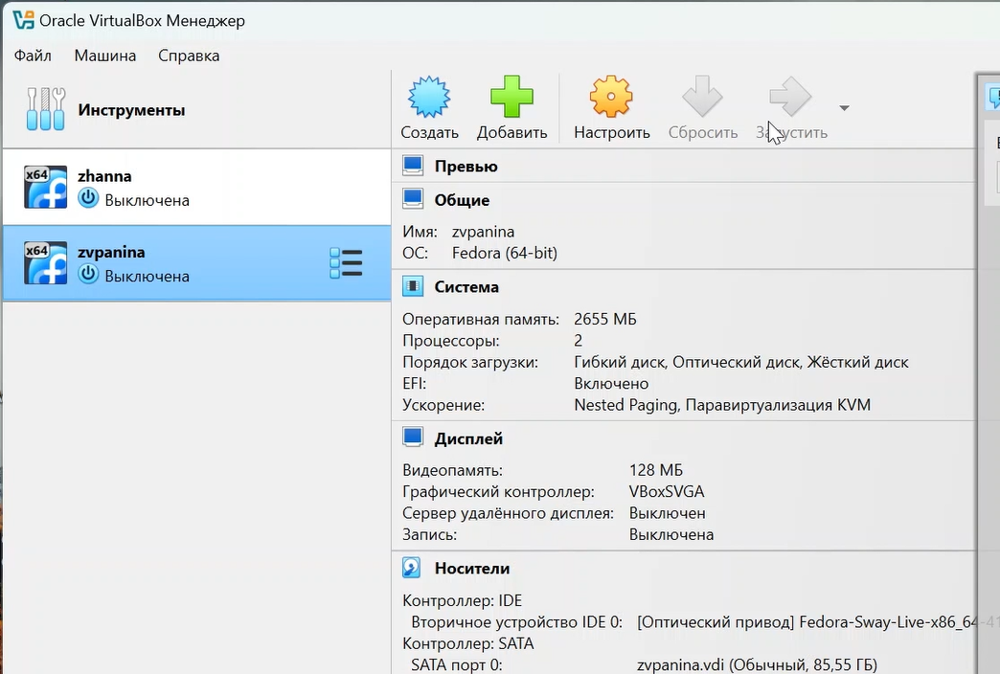{#fig:001 width=70%}

##

2. Производим установку операционной системы. 

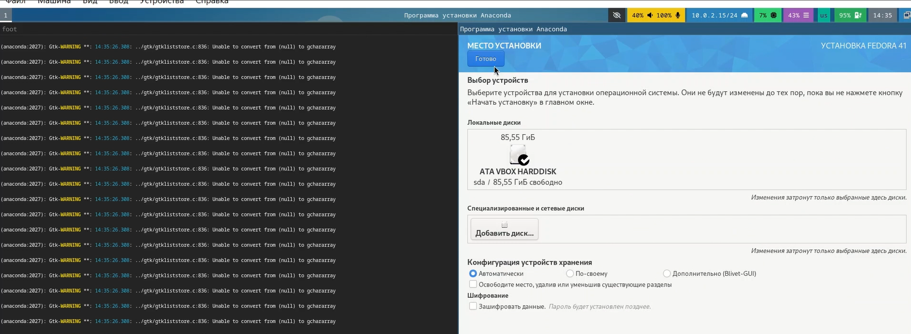{#fig:002 width=70%}

## После установки

1. Входим в ОС под своей учетной записью, открываем терминал, переключаемся на роль суперпользователя и производим установку обновлений.

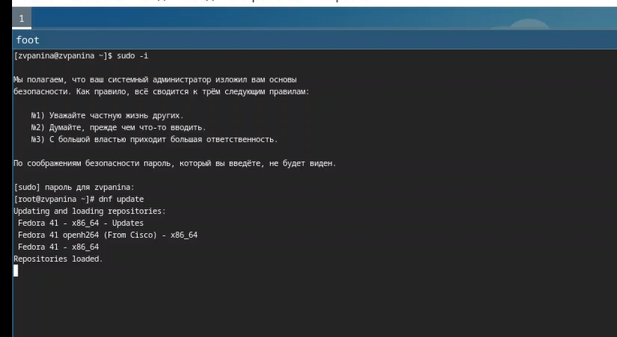{#fig:003 width=70%}

##

2. Устанавливаем ПО для автоматического обновления.

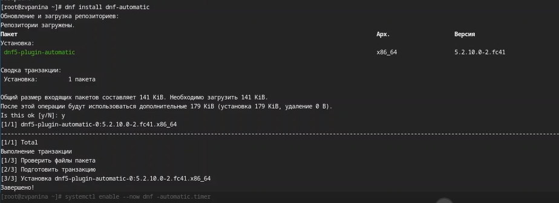{#fig:004 width=70%}

## Повышение комфорта работы. Отключение SELINUX

1. Открываем tmux; затем mc, в файле /etc/selinux/config заменяем значение SELINUX=enfotcing на SELINUX=permissive.

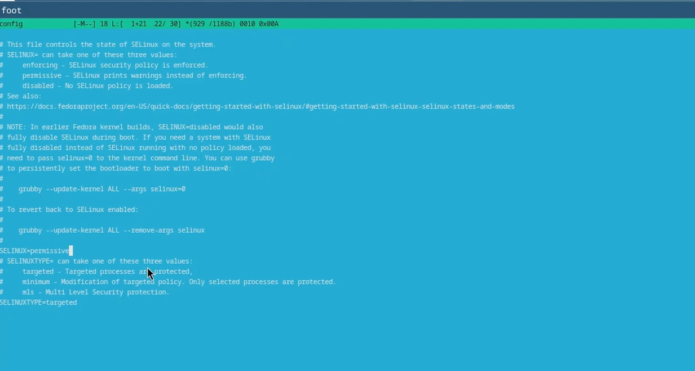{#fig:005 width=70%}

2. Перезагружаем машину командой reboot.

## Установка драйверов для VirtualBox

1. Устанавливаем пакет DKMS.

{#fig:006 width=70%}

##

2. В меню виртуальной машины подключаем образ диска дополнений гостевой ОС.

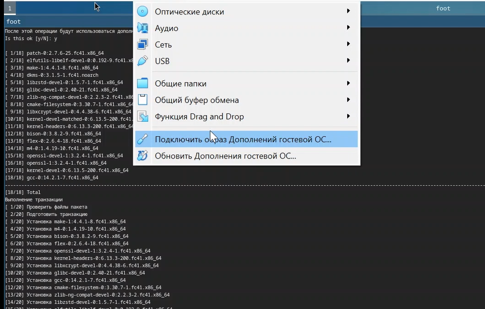{#fig:007 width=70%}

##

3. Подмонтируем диск и установим драйвера.

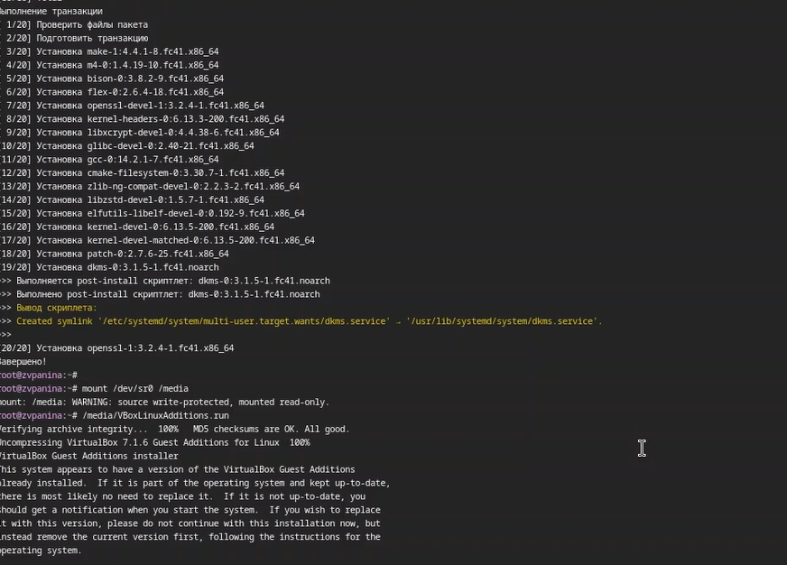{#fig:008 width=70%}

4. Перезагружаем машину.

## Настройка раскладки клавиатуры

1. Создаем конфигурационный файл и, переключившись на роль суперпользователя, редактируем его.

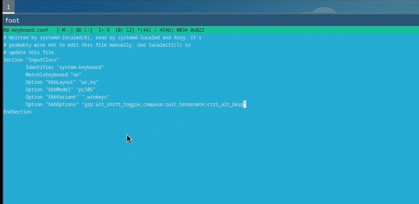{#fig:009 width=70%}

2. Перезагружаем машину.

## Установка необходимого ПО для создания документации

1. Скачиваем pandoc и pandoc-crossref из репозиториев GitHub, переносим необходимые файлы из архивов в каталог /usr/local/bin.

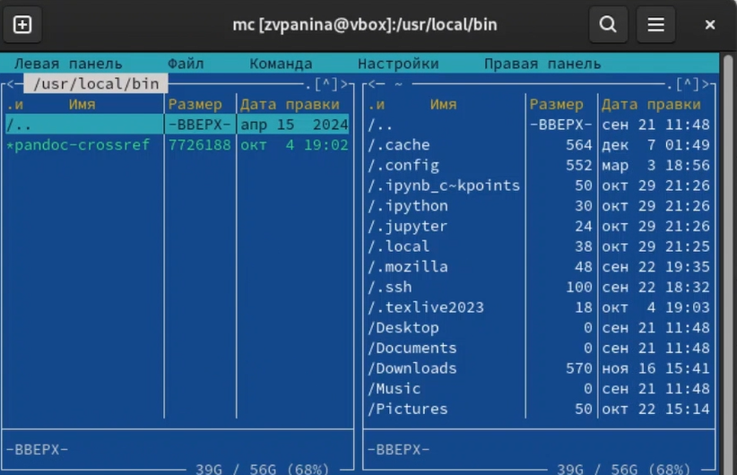{#fig:010 width=70%}

##

2. Устанавливаем дистрибутив TexLive.

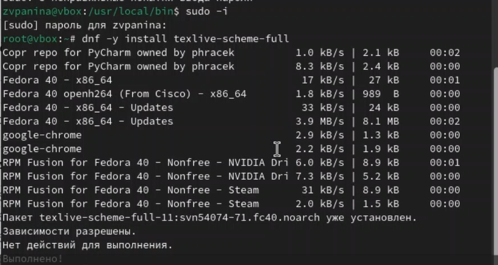{#fig:011 width=70%}

# Выполнение домашнего задания

1. Просмотрим порядок загрузки системы с помощью команды dmesg | less.

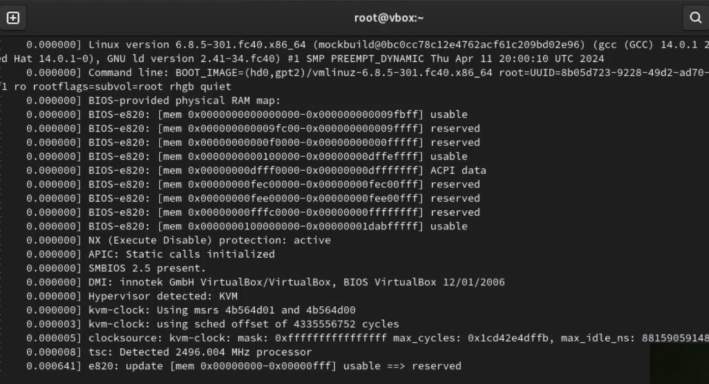{#fig:012 width=70%}

##

2. Получаем информацию о версии ядра, частоте процессора и его модели.

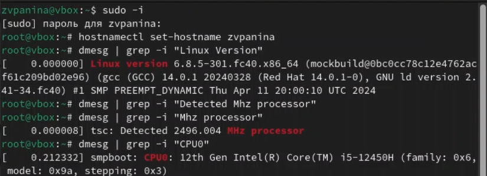{#fig:013 width=70%}

##

3. Получаем информацию об объёме доступной памяти и типе обнаруженного гипервизора.

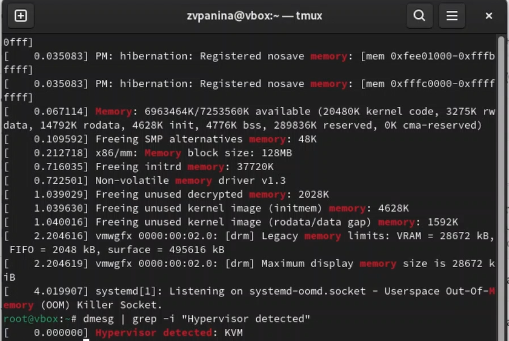{#fig:014 width=70%}

##

4. Получаем информацию о последовательности монтирования файловых систем и типе файловой системы корневого раздела.

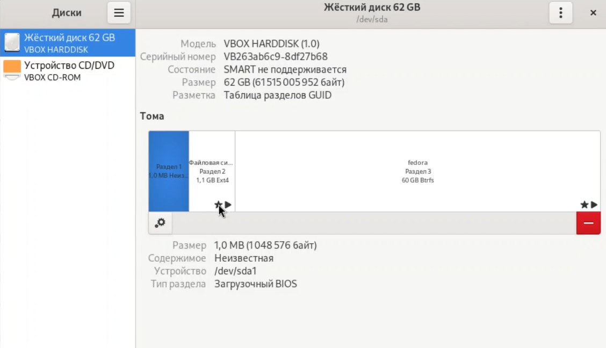{#fig:015 width=70%}

# Ответы на контрольные вопросы

1. Какую информацию содержит учетная запись пользователя?

Учётная запись пользователя содержит имя пользователя, зашифрованный пароль, идентификационный номер, идентификационный номер группы пользователя, домашний каталог и интерпретатор пользователя.

2. Укажите команды терминала и приведите примеры: 

Получение справки по команде:
man <название команды>
man cd

Перемещение по файловой системе:
cd <путь>
cd ~/Downloads

Просмотр содержимого каталога:
ls <путь>
ls ~/Downloads

Определение объёма каталога:
du <имя каталога>
du Downloads

Создание каталога:
mkdir <имя каталога>
mkdir ~/Downloads/newdir

Создание файла:
touch <имя файла>
touch newfile

Удаление каталога:
rm -r <имя каталога>
rm -r mydir

Удаление файла:
rm <имя файла>
rm test.txt

Задание прав на файл или каталог:
chmod +x <имя файла или каталога>
chmod +x text.txt

Просмотр истории команд:
history

3. Что такое файловая система? Приведите примеры с краткой характеристикой.

Файловая система - это часть операционной системы, назначение которой состоит в том, чтобы обеспечить пользователю удобный интерфейс при работе с данными, хранящимися на диске, и обеспечить совместное использование файлов несколькими пользователями и процессорами. Примеры файловых систем: Ext2, Ext3, Ext4 или Extended Felisystem - стандартная файловая система для Linux. NTFS (New Technology File System): Стандартная файловая система для Windows.

4. Как посмотреть, какие файловые системы подмонтированы в ОС?

с помощью команды mount

5. Как удалить зависший процесс?

с помощью команды kill

# Результаты

В ходе выполнения работы я приобрела практические навыки установки операционной системы на виртуальную машину, настройки минимально необходимых для дальнейшей работы сервисов.

# Список литературы{.unnumbered}

1) Кулябов Д. С. Введерние в операционную систему UNIX - Лекция.
2) Таненбаум Э., Бос Х. Современные операционные системы. - 4-е изд. -СПб. : Питер, 2015. - 1120 с.

::: {#refs}
:::

