---
## Front matter
title: "Отчёт по лабораторной работе №1"
subtitle: "Дисциплина: Операционные системы"
author: "Панина Жанна Валерьевна"

## Generic otions
lang: ru-RU
toc-title: "Содержание"

## Bibliography
bibliography: bib/cite.bib
csl: pandoc/csl/gost-r-7-0-5-2008-numeric.csl

## Pdf output format
toc: true # Table of contents
toc-depth: 2
lof: true # List of figures
lot: true # List of tables
fontsize: 12pt
linestretch: 1.5
papersize: a4
documentclass: scrreprt
## I18n polyglossia
polyglossia-lang:
  name: russian
  options:
	- spelling=modern
	- babelshorthands=true
polyglossia-otherlangs:
  name: english
## I18n babel
babel-lang: russian
babel-otherlangs: english
## Fonts
mainfont: PT Serif
romanfont: PT Serif
sansfont: PT Sans
monofont: PT Mono
mainfontoptions: Ligatures=TeX
romanfontoptions: Ligatures=TeX
sansfontoptions: Ligatures=TeX,Scale=MatchLowercase
monofontoptions: Scale=MatchLowercase,Scale=0.9
## Biblatex
biblatex: true
biblio-style: "gost-numeric"
biblatexoptions:
  - parentracker=true
  - backend=biber
  - hyperref=auto
  - language=auto
  - autolang=other*
  - citestyle=gost-numeric
## Pandoc-crossref LaTeX customization
figureTitle: "Рис."
tableTitle: "Таблица"
listingTitle: "Листинг"
lofTitle: "Список иллюстраций"
lotTitle: "Список таблиц"
lolTitle: "Листинги"
## Misc options
indent: true
header-includes:
  - \usepackage{indentfirst}
  - \usepackage{float} # keep figures where there are in the text
  - \floatplacement{figure}{H} # keep figures where there are in the text
---

# Цель работы

Целью данной работы является приобретение практических навыков установки операционной системы на виртуальную машину, настройки минимально необходимых для дальнейшей работы сервисов.

# Задание

1. Запуск VirtualBox и создание новой виртуальной машины (операционная система Linux, Fedora).
2. Настройка установки ОС.
3. Перезапуск виртуальной машины и установка драйверов для VirtualBox.
4. Подключение образа диска дополнений гостевой ОС.
5. Установка необходимого ПО для создания документации.
6. Выполнение домашнего задания.

# Теоретическое введение

Операционная система - это комплекс взаимосвязанных программ, который действует как интерфейс между приложениями и пользователями с одной стороны и аппаратурой компьютера с другой стороны. VirtualBox - это специальное средство для виртуализации, позволяющее запускать операционную систему внтури другой. С помощью VirtualBox мы можем также настраивать сеть, обмениваться файлами и делать многое другое.

# Выполнение лабораторной работы

## Создание виртуальной машины

1. Создаем новую виртуальную машину, указываем имя. Указываем размер основной памяти, задаем размер диска. Добавляем новый привод оптических дисков и выбираем образ операционной системы Fedora. (рис. @fig:001).

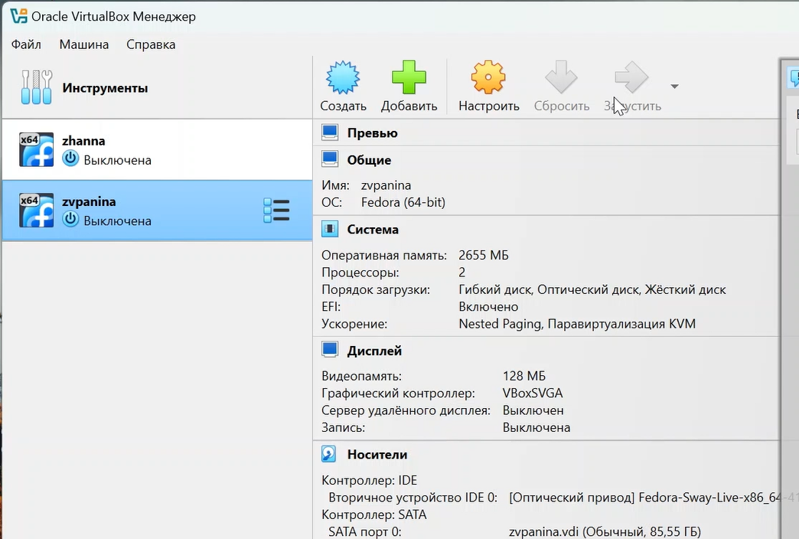{#fig:001 width=70%}

2. Производим установку операционной системы. (рис. @fig:002).

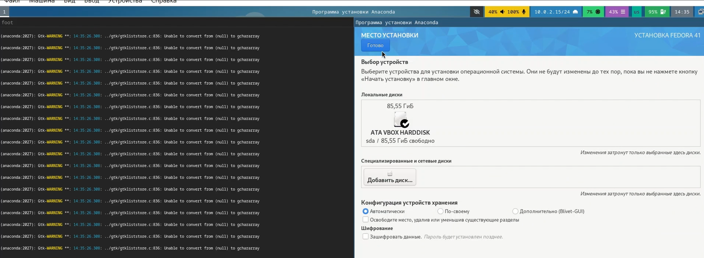{#fig:002 width=70%}

## После установки

1. Входим в ОС под своей учетной записью, открываем терминал, переключаемся на роль суперпользователя и производим установку обновлений (рис. @fig:003).

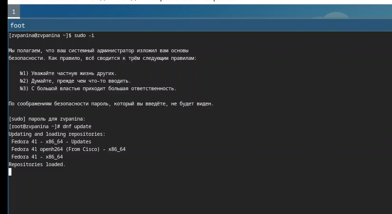{#fig:003 width=70%}

2. Устанавливаем ПО для автоматического обновления (рис. @fig:004).

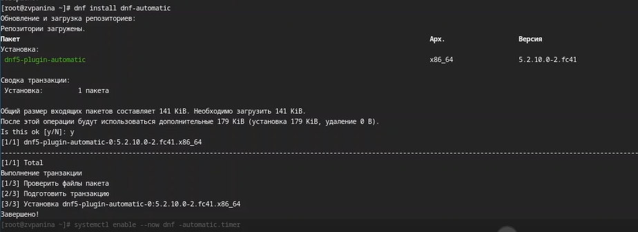{#fig:004 width=70%}

## Повышение комфорта работы. Отключение SELINUX

1. Открываем tmux; затем mc, в файле /etc/selinux/config заменяем значение SELINUX=enfotcing на SELINUX=permissive (рис. @fig:005).

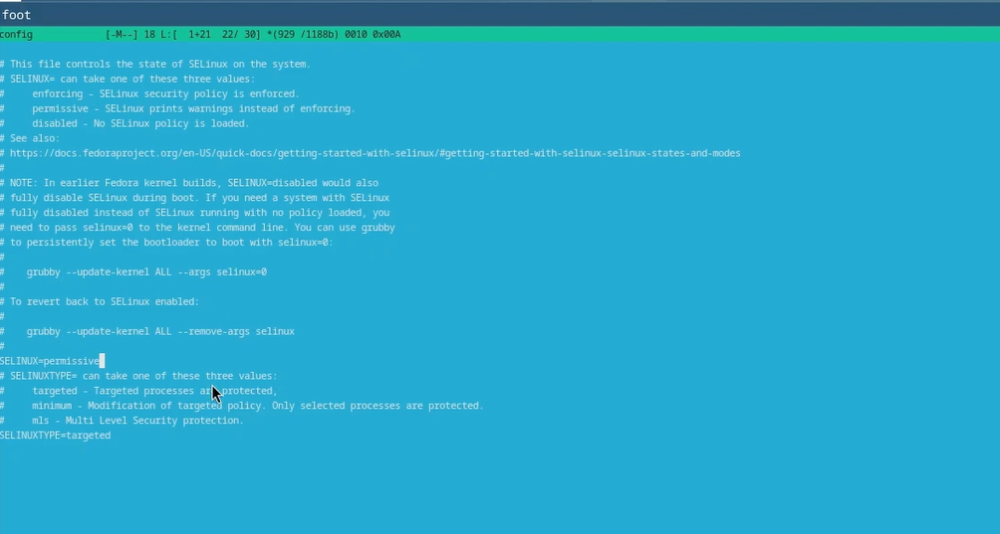{#fig:005 width=70%}

2. Перезагружаем машину командой reboot.

## Установка драйверов для VirtualBox

1. Устанавливаем пакет DKMS (рис. @fig:006).

{#fig:006 width=70%}

2. В меню виртуальной машины подключаем образ диска дополнений гостевой ОС (рис. @fig:007).

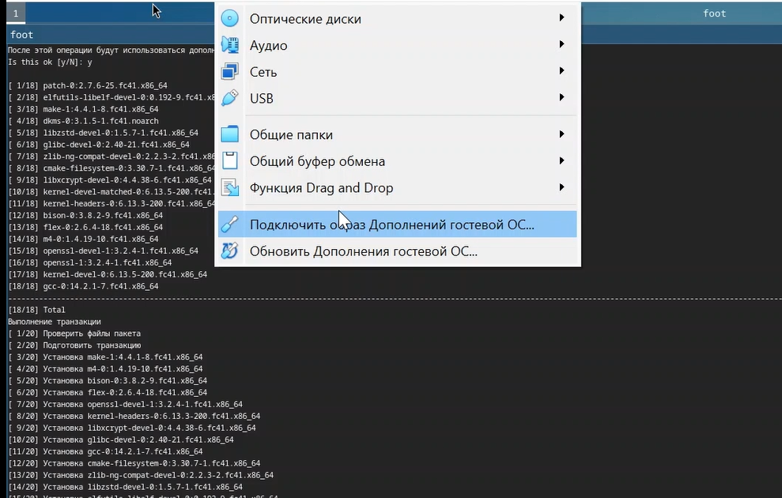{#fig:007 width=70%}

3. Подмонтируем диск и установим драйвера (рис. @fig:008).

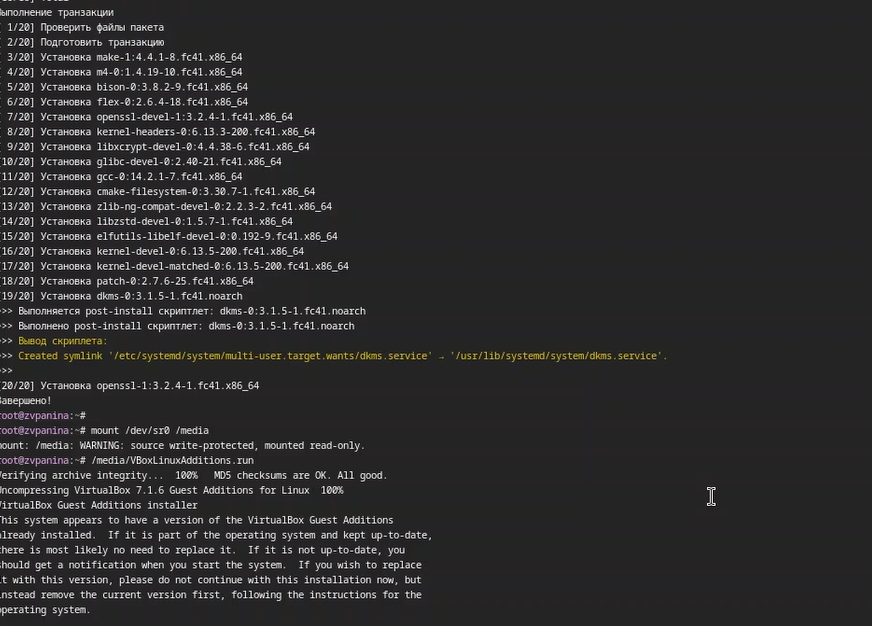{#fig:008 width=70%}

4. Перезагружаем машину.

## Настройка раскладки клавиатуры

1. Создаем конфигурационный файл и, переключившись на роль суперпользователя, редактируем его. (рис. @fig:009).

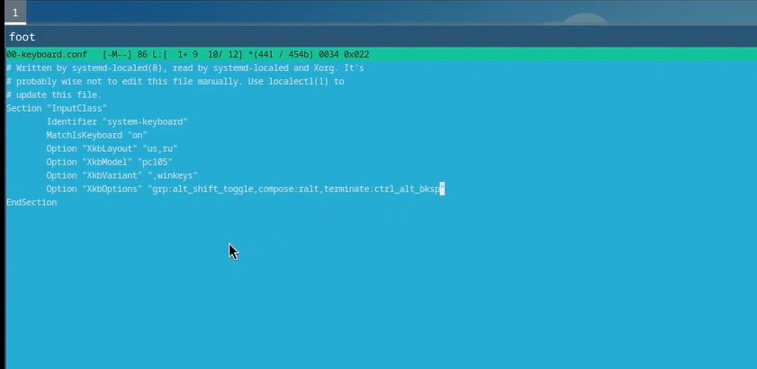{#fig:009 width=70%}

2. Перезагружаем машину.

## Установка необходимого ПО для создания документации

1. Скачиваем pandoc и pandoc-crossref из репозиториев GitHub, переносим необходимые файлы из архивов в каталог /usr/local/bin (рис. @fig:010).

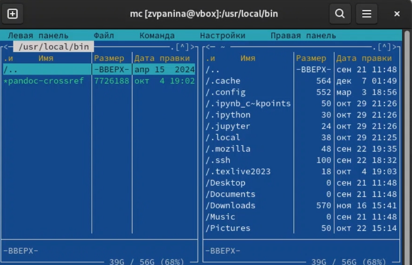{#fig:010 width=70%}

2. Устанавливаем дистрибутив TexLive. (рис. @fig:011).

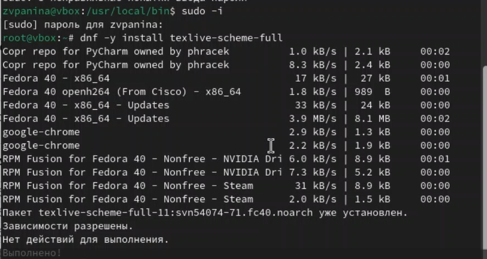{#fig:011 width=70%}

# Выполнение домашнего задания

1. Просмотрим порядок загрузки системы с помощью команды dmesg | less (рис. @fig:012).

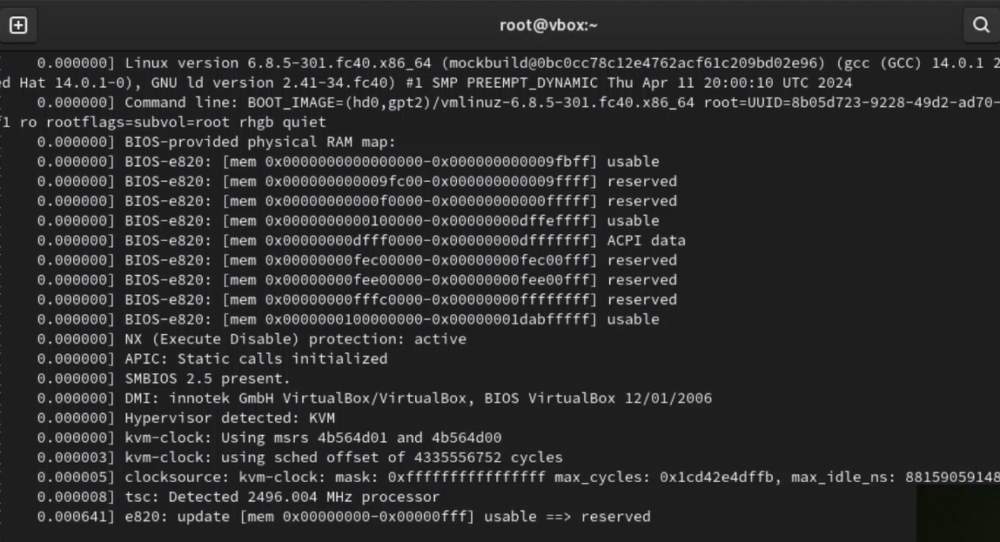{#fig:012 width=70%}

2. Получаем информацию о версии ядра, частоте процессора и его модели (рис. @fig:013).

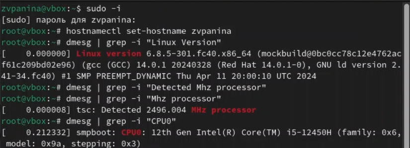{#fig:013 width=70%}

3. Получаем информацию об объёме доступной памяти и типе обнаруженного гипервизора (рис. @fig:014).

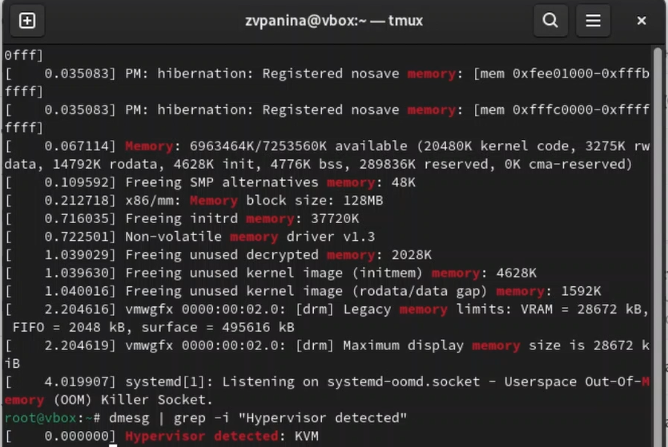{#fig:014 width=70%}

4. Получаем информацию о последовательности монтирования файловых систем и типе файловой системы корневого раздела (рис. @fig:015).

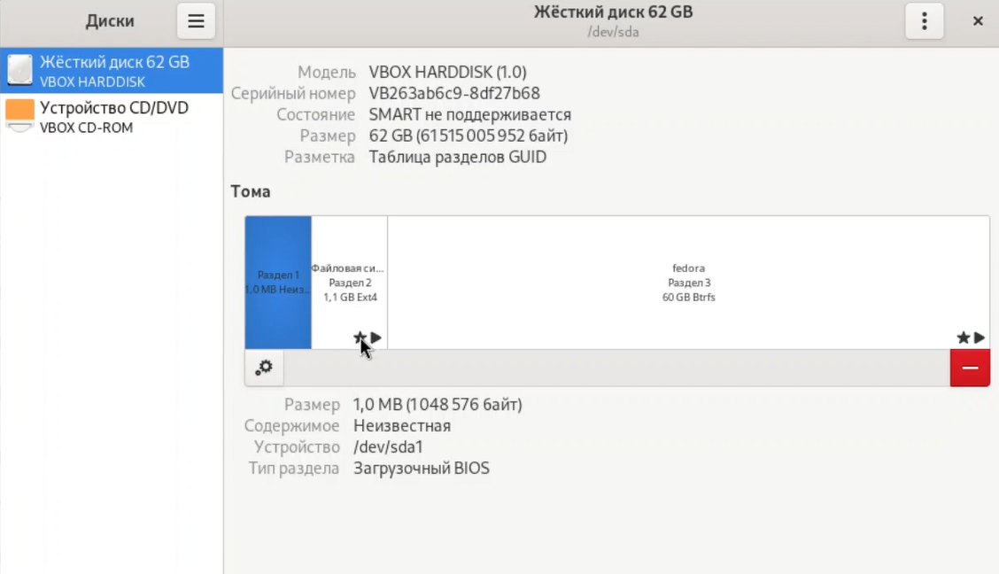{#fig:015 width=70%}

# Контрольные вопросы

1. Какую информацию содержит учетная запись пользователя?

Учётная запись пользователя содержит имя пользователя, зашифрованный пароль, идентификационный номер, идентификационный номер группы пользователя, домашний каталог и интерпретатор пользователя.

2. Укажите команды терминала и приведите примеры: 

Получение справки по команде:
man <название команды>
man cd

Перемещение по файловой системе:
cd <путь>
cd ~/Downloads

Просмотр содержимого каталога:
ls <путь>
ls ~/Downloads

Определение объёма каталога:
du <имя каталога>
du Downloads

Создание каталога:
mkdir <имя каталога>
mkdir ~/Downloads/newdir

Создание файла:
touch <имя файла>
touch newfile

Удаление каталога:
rm -r <имя каталога>
rm -r mydir

Удаление файла:
rm <имя файла>
rm test.txt

Задание прав на файл или каталог:
chmod +x <имя файла или каталога>
chmod +x text.txt

Просмотр истории команд:
history

3. Что такое файловая система? Приведите примеры с краткой характеристикой.

Файловая система - это часть операционной системы, назначение которой состоит в том, чтобы обеспечить пользователю удобный интерфейс при работе с данными, хранящимися на диске, и обеспечить совместное использование файлов несколькими пользователями и процессорами. Примеры файловых систем: Ext2, Ext3, Ext4 или Extended Felisystem - стандартная файловая система для Linux. NTFS (New Technology File System): Стандартная файловая система для Windows.

4. Как посмотреть, какие файловые системы подмонтированы в ОС?

с помощью команды mount

5) Как удалить зависший процесс?

с помощью команды kill

# Выводы

В ходе выполнения работы я приобрела практические навыки установки операционной системы на виртуальную машину, настройки минимально необходимых для дальнейшей работы сервисов.

# Список литературы{.unnumbered}

1) Кулябов Д. С. Введерние в операционную систему UNIX - Лекция.
2) Таненбаум Э., Бос Х. Современные операционные системы. - 4-е изд. -СПб. : Питер, 2015. - 1120 с.

::: {#refs}
:::
