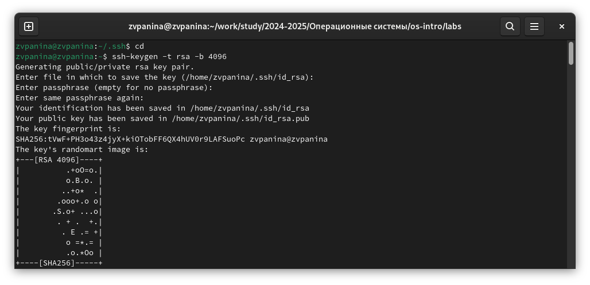
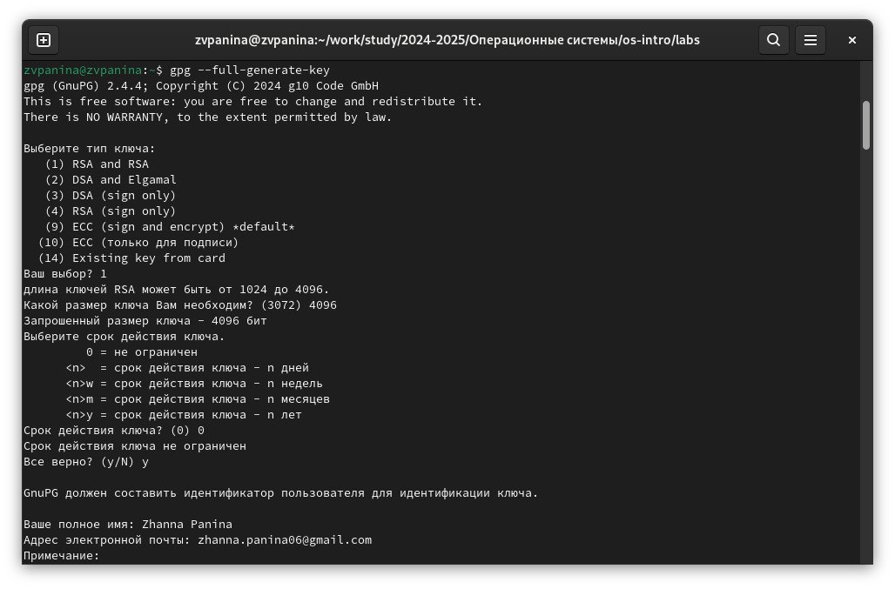
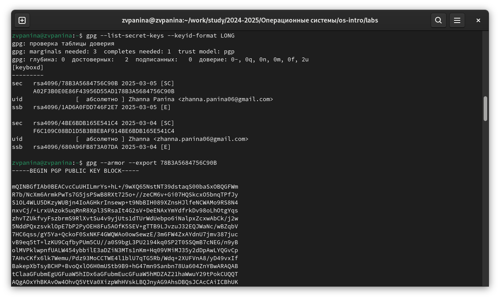
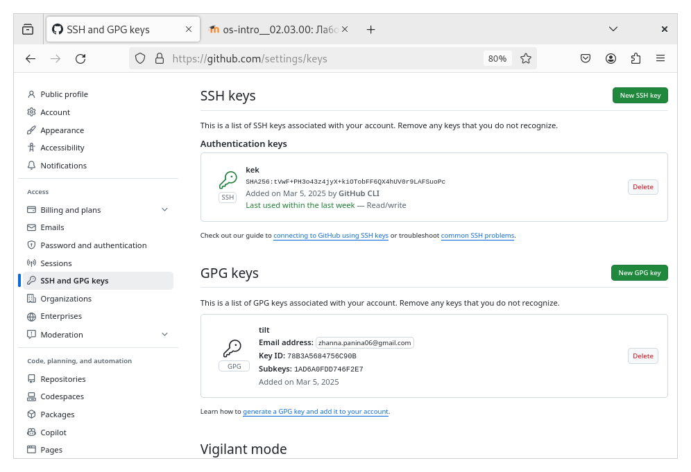
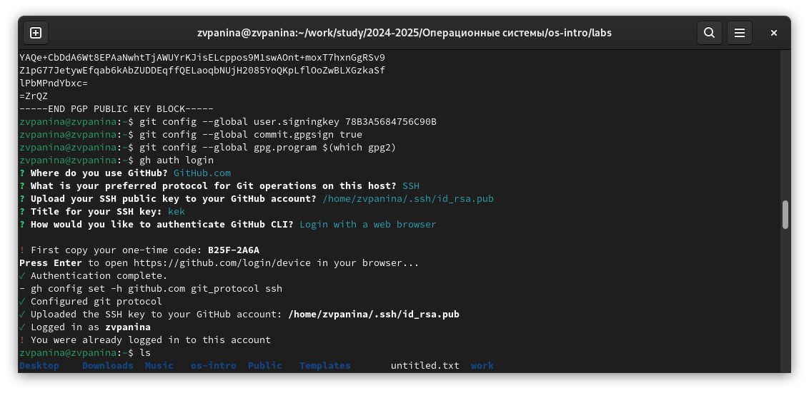
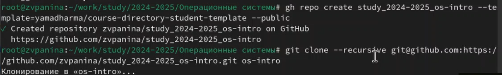
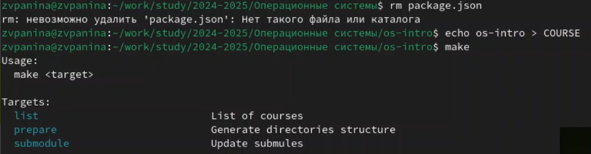
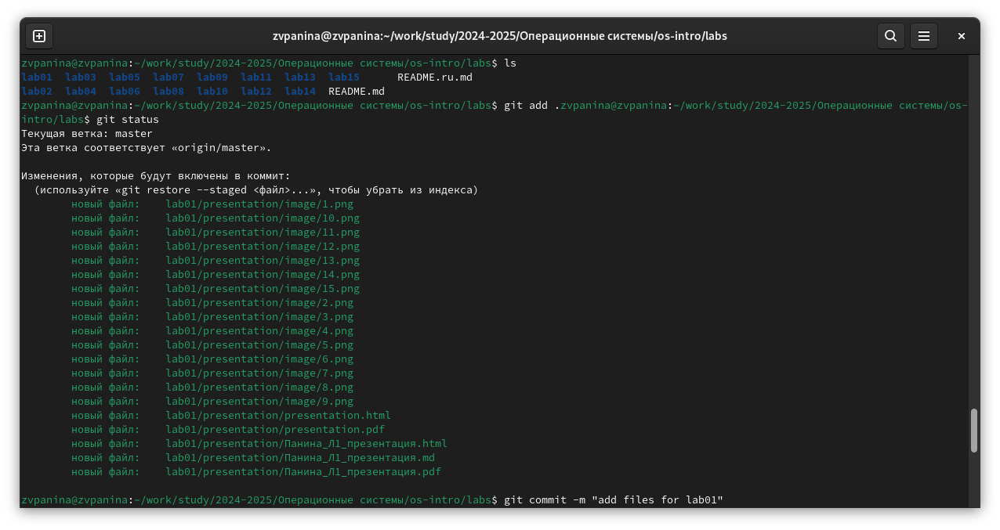
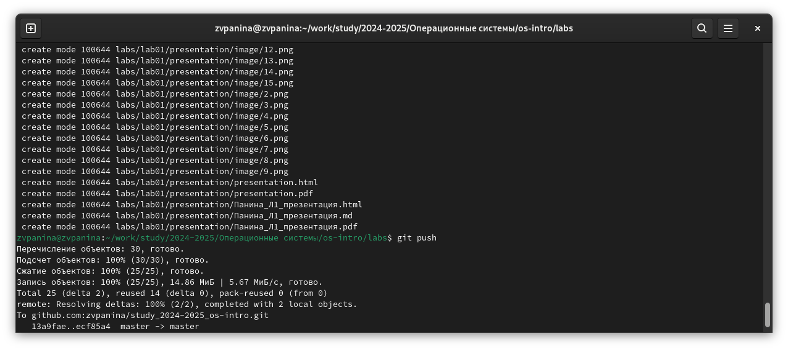

---
## Front matter
lang: ru-RU
title: Лабораторная работа №2
subtitle: Операционные системы
author:
  - Панина Ж. В.
institute:
  - Российский университет дружбы народов, Москва, Россия
date: 04 марта 2025

## i18n babel
babel-lang: russian
babel-otherlangs: english

## Formatting pdf
toc: false
toc-title: Содержание
slide_level: 2
aspectratio: 169
section-titles: true
theme: metropolis
header-includes:
 - \metroset{progressbar=frametitle,sectionpage=progressbar,numbering=fraction}
---

# Информация

## Докладчик

:::::::::::::: {.columns align=center}
::: {.column width="70%"}

  * Панина Жанна Валерьевна
  * НКАбд-02-24, студ. билет № 1132246710
  * студент направления "Компьютерные и информационные науки"
  * Российский университет дружбы народов
  * [1132246710@pfur.ru](mailto:1132246710@pfur.ru)
  * <https://github.com/zvpanina/study_2024-2025_os-intro>

:::
::::::::::::::

# Вводная часть

## Актуальность

В современном мире разработки программного обеспечения использование систем контроля версий стало неотъемлемой частью работы программистов. Git является одной из самых популярных и мощных распределённых систем контроля версий, обеспечивающей удобную совместную работу, отслеживание изменений в коде и автоматизацию процессов развертывания. Навыки работы с Git, а также использование SSH и GPG-ключей для безопасного взаимодействия с удалёнными репозиториями, являются важными для любого разработчика. Освоение этих инструментов повышает эффективность командной работы, обеспечивает безопасность кода и позволяет интегрироваться в профессиональные рабочие процессы.

## Объект и предмет исследования

### Объект исследования:
Система контроля версий Git и средства обеспечения безопасности при работе с репозиториями (SSH и GPG-ключи).

### Предмет исследования:
Методы управления версиями кода в Git, настройка и использование SSH и GPG-ключей для аутентификации и подписи коммитов, а также работа с удалёнными репозиториями.

## Цели и задачи

Цель работы - изучить идеологию и применения средств контроля версий, освоить умения по работе с git.

### Задачи:

1. Создать базовую конфигурацию для работы с git.
2. Зарегистрироваться на GitHub.
3. Создать ключ SSH.
4. Создать ключ GPG.
5. Настроить подписи git.
6. Создать локальный каталог для выполнения заданий по предмету.

## Материалы и методы

### Материалы:

- Операционная система (Fedora, установленная в VirtualBox)
- Git
- SSH-ключи для безопасного доступа к репозиторию
- GPG-ключи для подписи коммитов

### Методы:

- Установка и настройка Git
- Генерация и настройка SSH-ключей для аутентификации
- Генерация GPG-ключей и настройка подписи коммитов
- Клонирование удалённого репозитория
- Работа с ветками, коммитами и отправка изменений в удалённый репозиторий
- Проверка подписей коммитов и настройка доверенных ключей

# Теоретическое введение

Системы контроля версий (Version Control System, VCS) применяются при работе нескольких человек над одним проектом. Обычно основное дерево проекта хранится в локальном или удалённом репозитории, к которому настроен доступ для участников проекта. При внесении изменений в содержание проекта система контроля версий позволяет их фиксировать, совмещать изменения, произведённые разными участниками проекта, производить откат к любой более ранней версии проекта, если это требуется. В классических системах контроля версий используется централизованная модель, предполагающая наличие единого репозитория для хранения файлов. Выполнение большинства функций по управлению версиями осуществляется специальным сервером. Участник проекта (пользователь) перед началом работы посредством определённых команд получает нужную ему версию файлов.

##

После внесения изменений, пользователь размещает новую версию в хранилище. При этом предыдущие версии не удаляются из центрального хранилища и к ним можно вернуться в любой момент. Сервер может сохранять не полную версию изменённых файлов, а производить так называемую дельта-компрессию — сохранять только изменения между последовательными версиями, что позволяет уменьшить объём хранимых данных. Системы контроля версий поддерживают возможность отслеживания и разрешения конфликтов, которые могут возникнуть при работе нескольких человек над одним файлом.

# Выполнение лабораторной работы

## Создание ключа SSH

Поскольку я уже была зарегистрирована на GitHub в первом семестре, начинаю работу с создания ключа SSH.

{#fig:001 width=70%}

## Создание ключа GPG

1. Создаю ключ GPG, указав необходимые параметры.

{#fig:002 width=70%}

##

2. Вывожу список ключей и копирую отпечаток приватного ключа. Копирую сгенерированный ключ GPG.

{#fig:003 width=70%}

##

3. Перехожу в настройки GitHub, вставляю ключ.

{#fig:004 width=70%}

## Настройка подписей Git

Используя введённый email, указываю Git применять его при подписи коммитов, авторизуюсь.

{#fig:005 width=70%}

## Создание локального каталога

1. Создаю каталог "Операционные системы", перехожу в него и клонирую репозиторий.

{#fig:006 width=70%}

##

2. Удаляю лишние файлы, создаю необходимые каталоги.

{#fig:007 width=70%}

##

3. Отправка файлов на сервер. Команды git add . и git commit -m

{#fig:008 width=70%}

##

4. Команда git push

{#fig:009 width=70%}

# Ответы на контрольные вопросы

1. Что такое системы контроля версий (VCS) и для решения каких задач они предназначаются?
- Система контроля версий — программное обеспечение для облегчения работы с изменяющейся информацией. Система управления версиями позволяет хранить несколько версий одного и того же документа, при необходимости возвращаться к более ранним версиям, определять, кто и когда сделал то или иное изменение, и многое другое. Системы контроля версий (Version Control System, VCS) применяются для:
- Хранение полной истории изменений
- причин всех производимых изменений
- Откат изменений, если что-то пошло не так
- Поиск причины и ответственного за появления ошибок в программе
- Совместная работа группы над одним проектом
- Возможность изменять код, не мешая работе других пользователей

##

2. Объясните следующие понятия VCS и их отношения: хранилище, commit, история, рабочая копия
- Репозиторий - хранилище версий - в нем хранятся все документы вместе с историей их изменения и другой служебной информацией.
- Commit — отслеживание изменений
- Рабочая копия - копия проекта, связанная с репозиторием (текущее состояние файлов проекта, основанное на версии из хранилища (обычно на последней)
- История хранит все изменения в проекте и позволяет при необходимости обратиться к нужным данным.

##

3. Что представляют собой и чем отличаются централизованные и децентрализованные VCS? Приведите примеры VCS каждого вида
- Централизованные VCS (Subversion; CVS; TFS; VAULT; AccuRev):
- Одно основное хранилище всего проекта
- Каждый пользователь копирует себе необходимые ему файлы из этого репозитория, изменяет и, затем, добавляет свои изменения обратно Децентрализованные VCS (Git; Mercurial; Bazaar):
- У каждого пользователя свой вариант (возможно не один) репозитория
- Присутствует возможность добавлять и забирать изменения из любого репозитория . В классических системах контроля версий используется централизованная модель, предполагающая наличие единого репозитория для хранения файлов. Выполнение большинства функций по управлению версиями осуществляется специальным сервером. В отличие от классических, в распределённых системах контроля версий центральный репозиторий не является обязательным.

##

4. Опишите действия с VCS при единоличной работе с хранилищем.
- Сначала создаем и подключаем удаленный репозиторий. Затем по мере изменения проекта отправлять эти изменения на сервер.

5. Опишите порядок работы с общим хранилищем VCS.
- Участник проекта (пользователь) перед началом работы посредством определённых команд получает нужную ему версию файлов. После внесения изменений, пользователь размещает новую версию в хранилище. При этом предыдущие версии не удаляются из центрального хранилища и к ним можно вернуться в любой момент.

6. Каковы основные задачи, решаемые инструментальным средством git?
- Первая — хранить информацию о всех изменениях в вашем коде, начиная с самой первой строчки, а вторая — обеспечение удобства командной работы над кодом.

##

7. Назовите и дайте краткую характеристику командам git.
 Наиболее часто используемые команды git: 
- создание основного дерева репозитория: git init 
- получение обновлений (изменений) текущего дерева из центрального репозитория: git pull 
- отправка всех произведённых изменений локального дерева в центральный репозиторий: git push 
- просмотр списка изменённых файлов в текущей директории: git status 
- просмотр текущих изменения: git diff 
- сохранение текущих изменений: – добавить все изменённые и/или созданные файлы и/или каталоги: git add. – добавить конкретные изменённые и/или созданные файлы и/или каталоги: git add имена_файлов 
- удалить файл и/или каталог из индекса репозитория (при этом файл и/или каталог остаётся в локальной директории): git rm имена_файлов 

##

- сохранение добавленных изменений: – сохранить все добавленные изменения и все изменённые файлы: git commit -am ‘Описание коммита’ – сохранить добавленные изменения с внесением комментария через встроенный редактор git commit 
- создание новой ветки, базирующейся на текущей: git checkout -b имя_ветки 
- переключение на некоторую ветку: git checkout имя_ветки (при переключении на ветку, которой ещё нет в локальном репозитории, она будет создана и связана с удалённой) 
- отправка изменений конкретной ветки в центральный репозиторий: git push origin имя_ветки 
- слияние ветки с текущим деревом: git merge –no-ff имя_ветки 
- удаление ветки: – удаление локальной уже слитой с основным деревом ветки: git branch -d имя_ветки – принудительное удаление локальной ветки: git branch -D имя_ветки – удаление ветки с центрального репозитория: git push origin :имя_ветки

##

8. Приведите примеры использования при работе с локальным и удалённым репозиториями.
- git push –all (push origin master/любой branch)

9. Что такое и зачем могут быть нужны ветви (branches)?
- Ветвление («ветка», branch) — один из параллельных участков истории в одном хранилище, исходящих из одной версии (точки ветвления).
- Обычно есть главная ветка (master), или ствол (trunk). 
- Между ветками, то есть их концами, возможно слияние. Используются для разработки новых функций.

##

10. Как и зачем можно игнорировать некоторые файлы при commit?
- Во время работы над проектом так или иначе могут создаваться файлы, которые не требуется добавлять в последствии в репозиторий. Например, временные файлы, создаваемые редакторами, или объектные файлы, создаваемые компиляторами. Можно прописать шаблоны игнорируемых при добавлении в репозиторий типов файлов в файл .gitignore с помощью сервисов.

# Результаты

Во время выполнения работы я изучила идеологию и применения средств контроля версий, освоила умения по работе с git.
