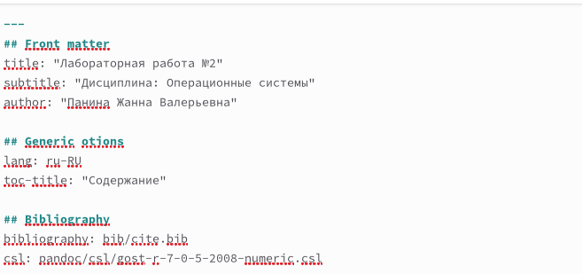
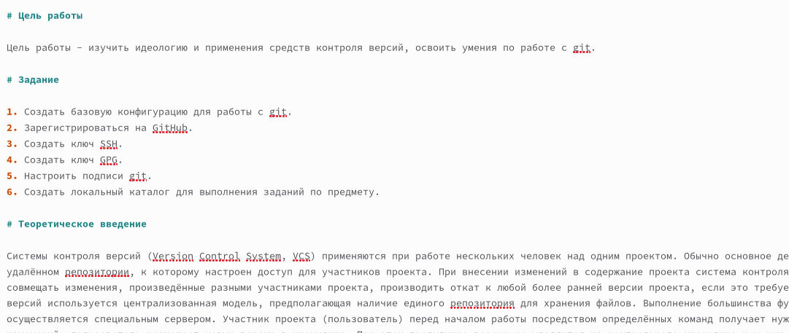
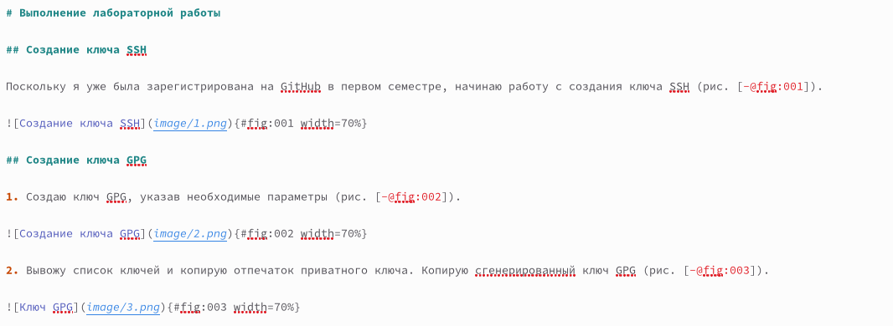
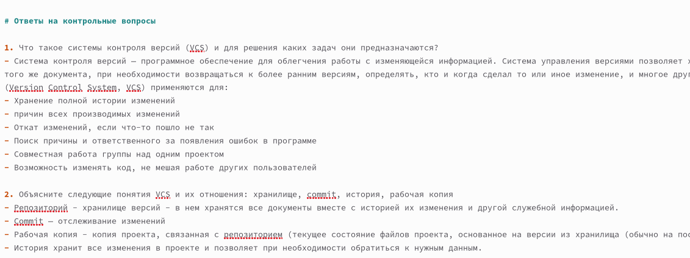
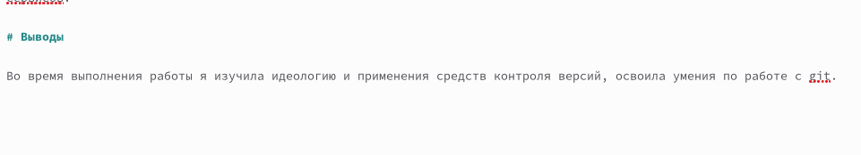
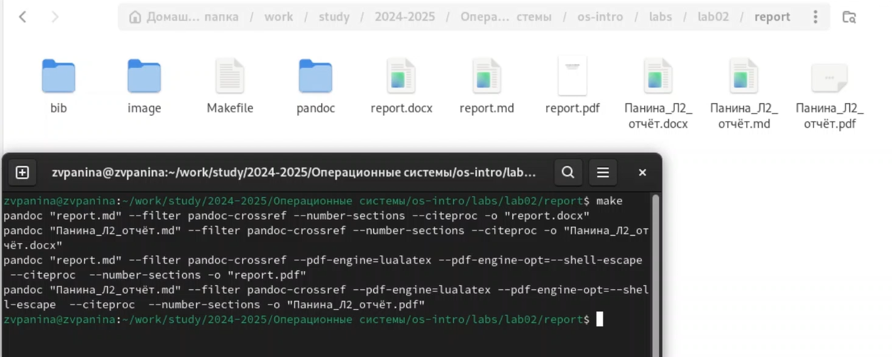

---
## Front matter
lang: ru-RU
title: Лабораторная работа №3
subtitle: Операционные системы
author:
  - Панина Ж. В.
institute:
  - Российский университет дружбы народов, Москва, Россия
date: 04 марта 2025

## i18n babel
babel-lang: russian
babel-otherlangs: english

## Formatting pdf
toc: false
toc-title: Содержание
slide_level: 2
aspectratio: 169
section-titles: true
theme: metropolis
header-includes:
 - \metroset{progressbar=frametitle,sectionpage=progressbar,numbering=fraction}
---

# Информация

## Докладчик

:::::::::::::: {.columns align=center}
::: {.column width="70%"}

  * Панина Жанна Валерьевна
  * НКАбд-02-24, студ. билет № 1132246710
  * студент направления "Компьютерные и информационные науки"
  * Российский университет дружбы народов
  * [1132246710@pfur.ru](mailto:1132246710@pfur.ru)
  * <https://github.com/zvpanina/study_2024-2025_os-intro>

:::
::::::::::::::

# Вводная часть

## Актуальность

В современных IT-сферах ведение технической документации является важной частью работы разработчиков, системных администраторов и исследователей. Markdown — это удобный и широко используемый легковесный язык разметки, который позволяет легко создавать структурированные и читаемые документы, включая отчёты, README-файлы и технические статьи. Навыки работы с Markdown актуальны для написания документации в репозиториях, ведения вики-страниц и публикации контента в блогах или системах управления проектами.

## Объект и предмет исследования

### Объект исследования:
Легковесный язык разметки Markdown и его применение для оформления технической документации.

### Предмет исследования:
Методы разметки и форматирования текста в Markdown, вставка изображений и ссылок, а также оформление отчётов в соответствии с требованиями.

## Цели и задачи

Цель работы - научиться оформлять отчёты с помощью легковесного языка разметки Markdown. 

### Задачи:

1. Сделать отчёт по предыдущей лабораторной работе в формате Markdown.
2. В качестве отчёта предоставить отчёты в 3 форматах: pdf, docx и md (в архиве, поскольку он должен содержать скриншоты, Makefile и т.д.)

## Материалы и методы

### Материалы:

- Операционная система (Fedora, установленная в VirtualBox)
- Редактор с поддержкой Markdown 
- Фотографии и изображения для иллюстрации отчёта
- Хостинг изображений или локальные файлы для вставки ссылок

### Методы:

- Изучение базового синтаксиса Markdown
- Практическое оформление отчёта с использованием заголовков, списков, таблиц и выделения текста
- Вставка изображений и ссылок на них
- Проверка итогового оформления отчёта в разных Markdown-редакторах или репозиториях
- Сохранение и публикация отчёта в GitHub

# Теоретическое введение

Чтобы создать заголовок, используется знак ( # ).
Чтобы задать для текста полужирное начертание, нужно заключить его в двойные звездочки.
Чтобы задать для текста курсивное начертание, нужно заключить его в одинарные звездочки.
Чтобы задать для текста полужирное и курсивное начертание, заключаем его в тройные звездочки.
Блоки цитирования создаются с помощью символа >.
Неупорядоченный (маркированный) список можно отформатировать с помощью звездочек или тире.
Чтобы вложить один список в другой, добавьте отступ для элементов дочернего списка.
Упорядоченный список можно отформатировать с помощью соответствующих цифр.
Чтобы вложить один список в другой, нужно добавить отступ для элементов дочернего списка.
Синтаксис Markdown для встроенной ссылки состоит из части [link text] , представляющей текст гиперссылки, и части (file-name.md) – URL-адреса или имени файла, на который дается ссылка.

##

Markdown поддерживает как встраивание фрагментов кода в предложение, так и их размещение между предложениями в виде отдельных огражденных блоков. Огражденные блоки кода — это простой способ выделить синтаксис для фрагментов кода. 
Внутритекстовые формулы делаются аналогично формулам LaTeX. 
Для обработки файлов в формате Markdown будем использовать Pandoc. Конкретно, нам понадобится программа pandoc, pandoc-citeproc https://github.com/jgm/pandoc/releases, pandoc-crossref
https://github.com/lierdakil/pandoc-crossref/releases.
Преобразовать файл README.md можно следующим образом:
1 pandoc README.md -o README.pdf
или так
1 pandoc README.md -o README.docx
Можно использовать следующий Makefile
1 FILES = $(patsubst %.md, %.docx, $(wildcard *.md))
2 FILES += $(patsubst %.md, %.pdf, $(wildcard *.md))

# Выполнение лабораторной работы

## Создание отчёта по предыдущей лабораторной работе 

1. Открываю шаблон отчёта формата .md, меняю в нём ФИО автора, изменяю название, добавляю свои данные.

{#fig:001 width=70%}

## 

2. Пишу цель работы, задание и теоретическое введение.

{#fig:002 width=70%}

## 

3. Заполняю основную часть работы: прописываю шаги выполнения работы, добавляю ссылки на иллюстрации и подписи к ним.

{#fig:003 width=70%}

##

4. Отвечаю на контрольные вопросы к лабораторной работе.

{#fig:004 width=70%}

##

5. Прописываю вывод о работе.

{#fig:005 width=70%}

## Генерация отчёта в терминале

С помощью команды make создаю отчёт в форматах .docx и .pdf.

{#fig:006 width=70%}

# Результаты

В ходе выполнения лабораторной работы я научилась оформлять отчёты с помощью легковесного языка разметки Markdown.

## Список литературы{.unnumbered}

Руководство по оформлению Markdown файлов. [Электронный ресурс]. GitHub Gist URL: https://gist.github.com/Jekins/2bf2d0638163f1294637 

::: {#refs}
:::
