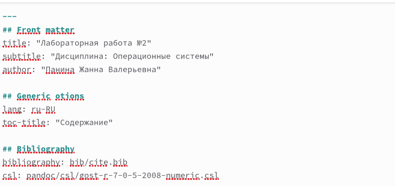
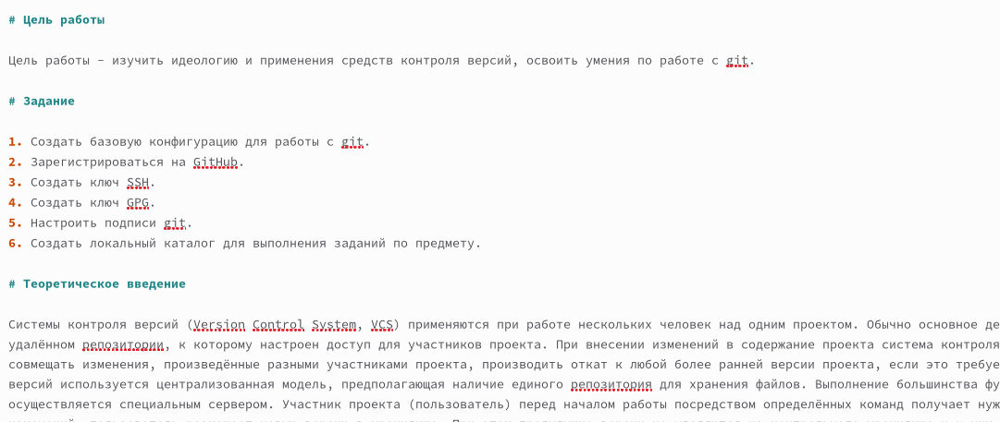
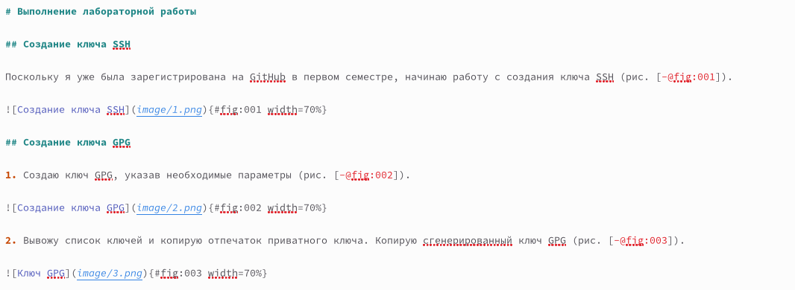
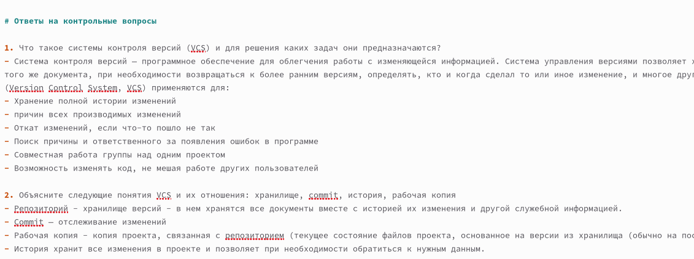
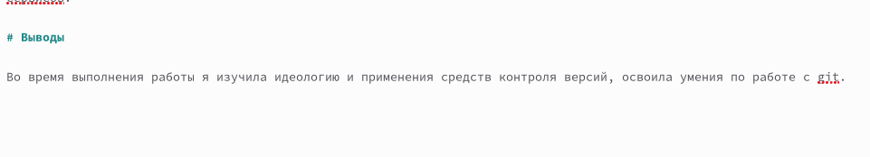
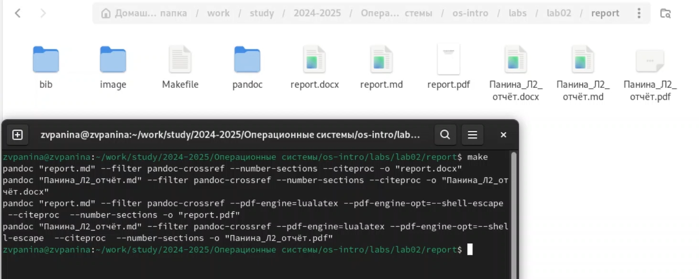

---
## Front matter
lang: ru-RU
title: Отчёт по лабораторной работе №3
subtitle: "Дисциплина: Операционные системы"
author: "Панина Жанна Валерьевна"

## Generic otions
lang: ru-RU
toc-title: "Содержание"

## Bibliography
bibliography: bib/cite.bib
csl: pandoc/csl/gost-r-7-0-5-2008-numeric.csl

## Pdf output format
toc: true # Table of contents
toc-depth: 2
lof: true # List of figures
lot: true # List of tables
fontsize: 12pt
linestretch: 1.5
papersize: a4
documentclass: scrreprt
## I18n polyglossia
polyglossia-lang:
  name: russian
  options:
	- spelling=modern
	- babelshorthands=true
polyglossia-otherlangs:
  name: english
## I18n babel
babel-lang: russian
babel-otherlangs: english
## Fonts
mainfont: IBM Plex Serif
romanfont: IBM Plex Serif
sansfont: IBM Plex Sans
monofont: IBM Plex Mono
mathfont: STIX Two Math
mainfontoptions: Ligatures=Common,Ligatures=TeX,Scale=0.94
romanfontoptions: Ligatures=Common,Ligatures=TeX,Scale=0.94
sansfontoptions: Ligatures=Common,Ligatures=TeX,Scale=MatchLowercase,Scale=0.94
monofontoptions: Scale=MatchLowercase,Scale=0.94,FakeStretch=0.9
mathfontoptions:
## Biblatex
biblatex: true
biblio-style: "gost-numeric"
biblatexoptions:
  - parentracker=true
  - backend=biber
  - hyperref=auto
  - language=auto
  - autolang=other*
  - citestyle=gost-numeric
## Pandoc-crossref LaTeX customization
figureTitle: "Рис."
tableTitle: "Таблица"
listingTitle: "Листинг"
lofTitle: "Список иллюстраций"
lotTitle: "Список таблиц"
lolTitle: "Листинги"
## Misc options
indent: true
header-includes:
  - \usepackage{indentfirst}
  - \usepackage{float} # keep figures where there are in the text
  - \floatplacement{figure}{H} # keep figures where there are in the text
---

# Цель работы

Научиться оформлять отчёты с помощью легковесного языка разметки Markdown. 

# Теоретическое введение

Чтобы создать заголовок, используется знак ( # ).
Чтобы задать для текста полужирное начертание, нужно заключить его в двойные звездочки.
Чтобы задать для текста курсивное начертание, нужно заключить его в одинарные звездочки.
Чтобы задать для текста полужирное и курсивное начертание, заключаем его в тройные звездочки.
Блоки цитирования создаются с помощью символа >.
Неупорядоченный (маркированный) список можно отформатировать с помощью звездочек или тире.
Чтобы вложить один список в другой, добавьте отступ для элементов дочернего списка.
Упорядоченный список можно отформатировать с помощью соответствующих цифр.
Чтобы вложить один список в другой, нужно добавить отступ для элементов дочернего списка.
Синтаксис Markdown для встроенной ссылки состоит из части [link text] , представляющей текст гиперссылки, и части (file-name.md) – URL-адреса или имени файла, на который дается ссылка.
Markdown поддерживает как встраивание фрагментов кода в предложение, так и их размещение между предложениями в виде отдельных огражденных блоков. Огражденные блоки кода — это простой способ выделить синтаксис для фрагментов кода. 
Внутритекстовые формулы делаются аналогично формулам LaTeX. 
Для обработки файлов в формате Markdown будем использовать Pandoc. Конкретно, нам понадобится программа pandoc, pandoc-citeproc https://github.com/jgm/pandoc/releases, pandoc-crossref
https://github.com/lierdakil/pandoc-crossref/releases.
Преобразовать файл README.md можно следующим образом:
1 pandoc README.md -o README.pdf
или так
1 pandoc README.md -o README.docx
Можно использовать следующий Makefile
1 FILES = $(patsubst %.md, %.docx, $(wildcard *.md))
2 FILES += $(patsubst %.md, %.pdf, $(wildcard *.md))

# Выполнение лабораторной работы

## Создание отчёта по предыдущей лабораторной работе 

1. Открываю шаблон отчёта формата .md, меняю в нём ФИО автора, изменяю название, добавляю свои данные (рис. [-@fig:001]).

{#fig:001 width=70%} 

2. Пишу цель работы, задание и теоретическое введение (рис. [-@fig:002]).

{#fig:002 width=70%}

3. Заполняю основную часть работы: прописываю шаги выполнения работы, добавляю ссылки на иллюстрации и подписи к ним (рис. [-@fig:003]).

{#fig:003 width=70%}

4. Отвечаю на контрольные вопросы к лабораторной работе (рис. [-@fig:004]).

{#fig:004 width=70%}

5. Прописываю вывод о работе (рис. [-@fig:005]).

{#fig:005 width=70%}

## Генерация отчёта в терминале

С помощью команды make создаю отчёт в форматах .docx и .pdf (рис. [-@fig:006]).

{#fig:006 width=70%}

# Выводы

В ходе выполнения лабораторной работы я научилась оформлять отчёты с помощью легковесного языка разметки Markdown.

## Список литературы{.unnumbered}

Руководство по оформлению Markdown файлов. [Электронный ресурс]. GitHub Gist URL: <https://gist.github.com/Jekins/2bf2d0638163f1294637>

::: {#refs}
:::
