---
## Front matter
lang: ru-RU
title: Лабораторная работа №4
subtitle: Операционные системы
author:
  - Панина Ж. В.
institute:
  - Российский университет дружбы народов, Москва, Россия
date: 07 марта 2025

## i18n babel
babel-lang: russian
babel-otherlangs: english

## Formatting pdf
toc: false
toc-title: Содержание
slide_level: 2
aspectratio: 169
section-titles: true
theme: metropolis
header-includes:
 - \metroset{progressbar=frametitle,sectionpage=progressbar,numbering=fraction}
---

# Информация

## Докладчик

:::::::::::::: {.columns align=center}
::: {.column width="70%"}

  * Панина Жанна Валерьевна
  * НКАбд-02-24, студ. билет № 1132246710
  * студент направления "Компьютерные и информационные науки"
  * Российский университет дружбы народов
  * [1132246710@pfur.ru](mailto:1132246710@pfur.ru)
  * <https://github.com/zvpanina/study_2024-2025_os-intro>

:::
::::::::::::::

# Вводная часть

## Актуальность

В современной разработке программного обеспечения использование систем контроля версий, таких как Git, является неотъемлемой частью процесса. Однако, для эффективной работы в команде и поддержания порядка в кодовой базе, важно не только владеть базовыми навыками работы с Git, но и уметь применять более продвинутые методологии, такие как Git-flow и Conventional Commits. Эти подходы позволяют упростить управление ветками, улучшить читаемость истории коммитов и облегчить процесс выпуска версий. Освоение этих инструментов особенно актуально для студентов и начинающих разработчиков, так как они широко используются в индустрии.

## Объект и предмет исследования

### Объект исследования:

- Процесс управления версиями в проекте с использованием системы контроля версий Git
- Применение методологий Git-flow и Conventional Commits для организации рабочего процесса.

### Предмет исследования:

- Методология Git-flow и её применение для управления ветками в Git.
- Стандарт Conventional Commits и его использование для создания структурированной и понятной истории коммитов.
- Практические навыки работы с Git, включая создание репозитория, управление ветками, слияние изменений и разрешение конфликтов.

## Цели и задачи

Цель работы - получение навыков правильной работы с репозиториями git.

### Задачи:

1. Выполнить работу для тестового репозитория.
2. Преобразовать рабочий репозиторий в репозиторий с git-flow и conventional commits.

## Материалы и методы

- Локальный репозиторий Git.
- Документация по Git, Git-flow и Conventional Commits.
- Инструменты для работы с Git (GitHub).

# Теоретическое введение

Gitflow Workflow опубликована и популяризована Винсентом Дриссеном. Gitflow Workflow предполагает выстраивание строгой модели ветвления с учётом выпуска проекта. Данная модель отлично подходит для организации рабочего процесса на основе релизов.v Работа по модели Gitflow включает создание отдельной ветки для исправлений ошибок в рабочей среде. 

Семантическое версионирование описывается в манифесте семантического версионирования. Кратко его можно описать следующим образом: Версия задаётся в виде кортежа МАЖОРНАЯ_ВЕРСИЯ.МИНОРНАЯ_ВЕРСИЯ.ПАТЧ. Номер версии следует увеличивать: МАЖОРНУЮ версию, когда сделаны обратно несовместимые изменения API. МИНОРНУЮ версию, когда вы добавляете новую функциональность, не нарушая обратной совместимости. ПАТЧ-версию, когда вы делаете обратно совместимые исправления. Дополнительные обозначения для предрелизных и билд-метаданных возможны как дополнения к МАЖОРНАЯ.МИНОРНАЯ.ПАТЧ формату.

Спецификация Conventional Commits: Соглашение о том, как нужно писать сообщения commit'ов. Совместимо с SemVer. Даже вернее сказать, сильно связано с семантическим версионированием. Регламентирует структуру и основные типы коммитов.

# Выполнение лабораторной работы

## Установка программного обеспечения

### Установка git-flow

Устанавливаю git-flow из коллекции репозиториев Copr
1. Выполняю команду dnf copr enable elegos/gitflow в режиме суперпользователя.

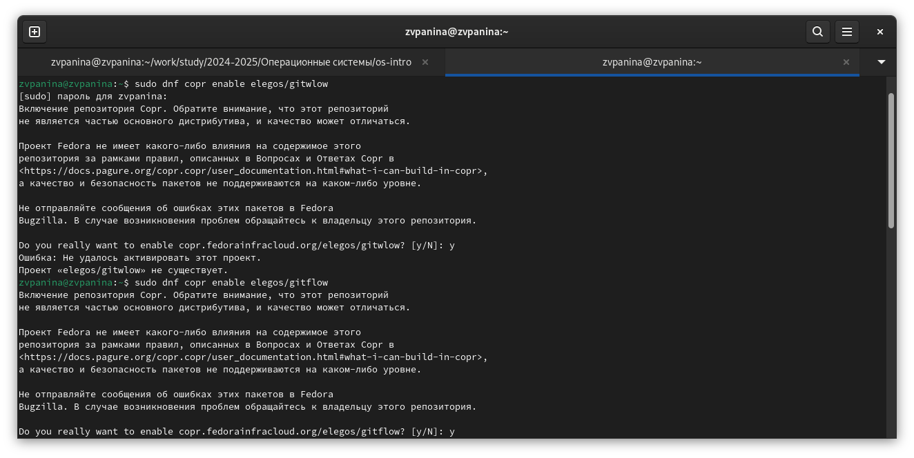{#fig:001 width=70%}

##

2. Выполняю команду dnf install gitflow.

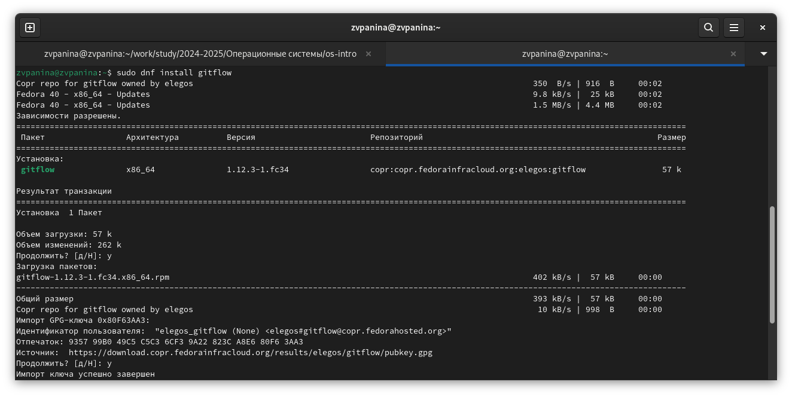{#fig:002 width=70%}

##

### Установка Node.js

1. Выполняю команду dnf install nodejs в режиме суперпользователя.

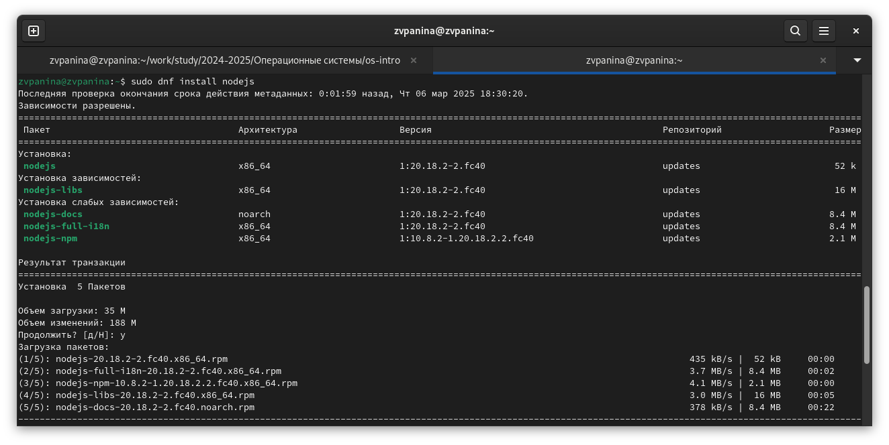{#fig:003 width=70%}

##

2. Выполняю команду dnf install pnpm.

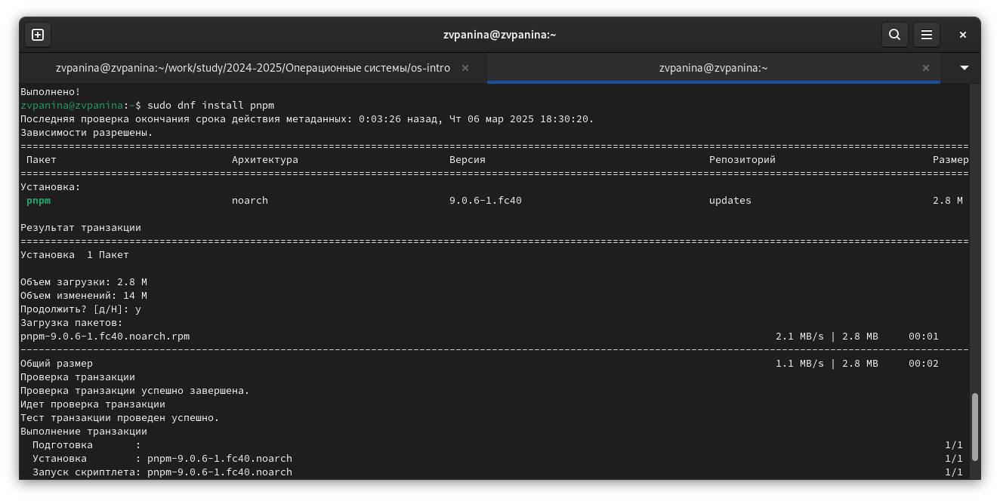{#fig:004 width=70%}

##

### Настройка Node.js

Для работы с Node.js добавляю каталог с исполняемыми файлами, устанавливаемыми в yarn, в переменную PATH.

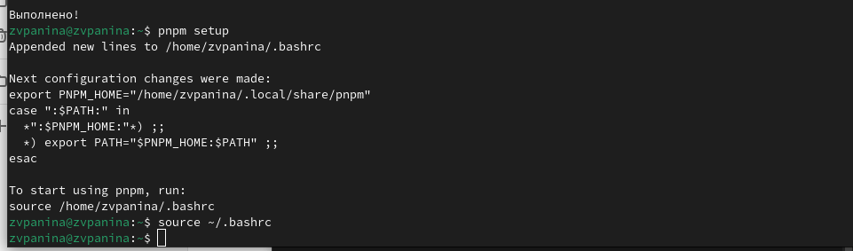{#fig:005 width=70%}

##

### Общепринятые коммиты

1. Данная программа используется для помощи в форматировании коммитов.

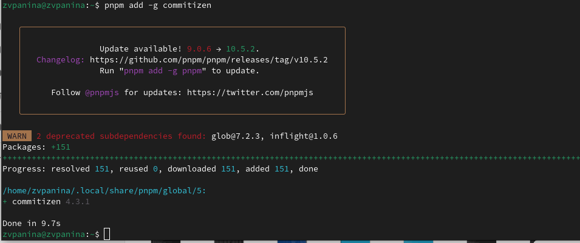{#fig:006 width=70%}

##

2. Данная программа используется для помощи в создании логов.

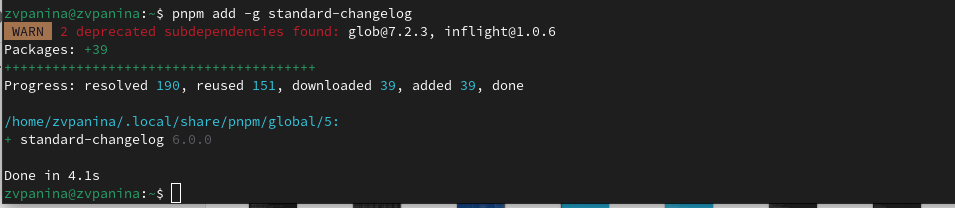{#fig:007 width=70%}

## Практический сценарий использования git

### Создание репозитория git

1. Создаю репозиторий на GitHub и называю его git-extended.

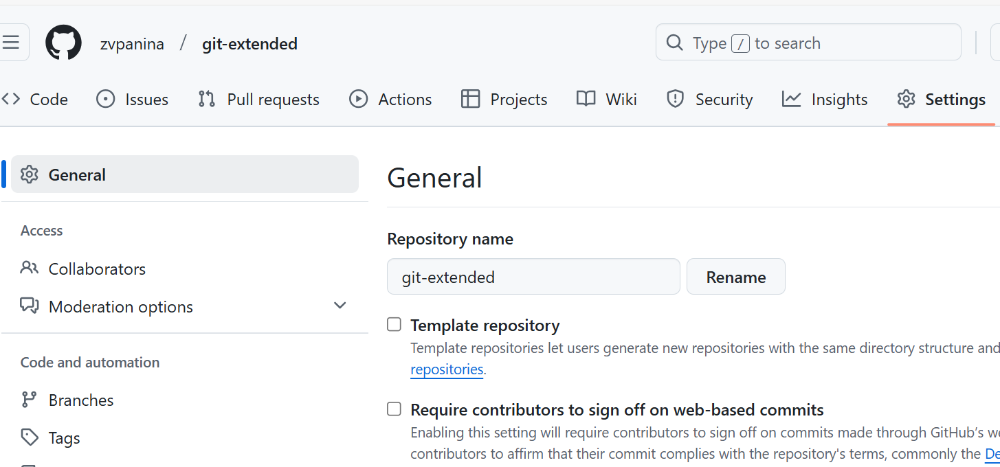{#fig:008 width=70%}

##

2. Клонирую репозиторий, перехожу в него и создаю файл README.md, чтобы закоммитить его. С помощью команд git add., git commit, git push делаю первый коммит и выкладываю его на GitHub.

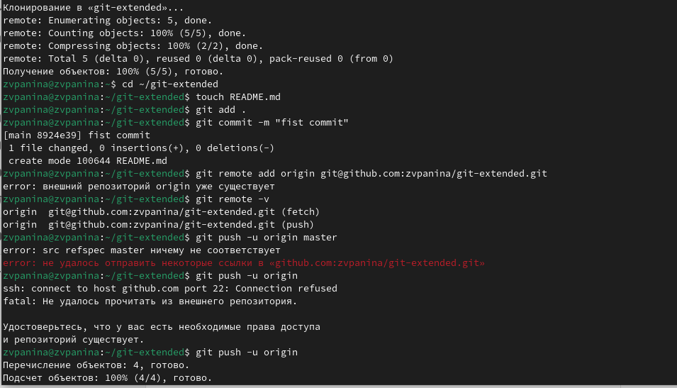{#fig:009 width=70%}

##

3. Создаю конфигурацию для пакетов Node.js и открываю файл git-extended в mc.

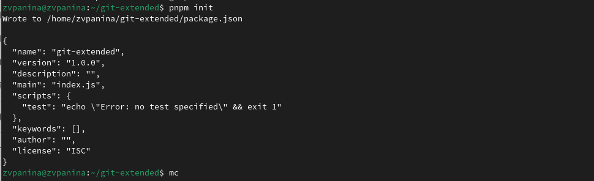{#fig:010 width=70%}

##

4. Заполняю несколько параметров пакета (название, лицензия, конфигурация пакета коммитов), чтобы файл выглядел вот так:

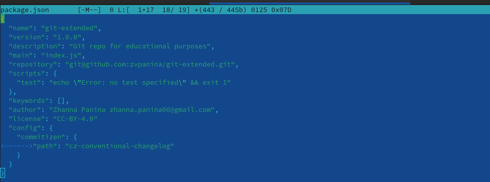{#fig:011 width=70%}

##

5. С помощью следующих команд добавляю новые файлы, выполняю коммит, выкладываю на GitHub.

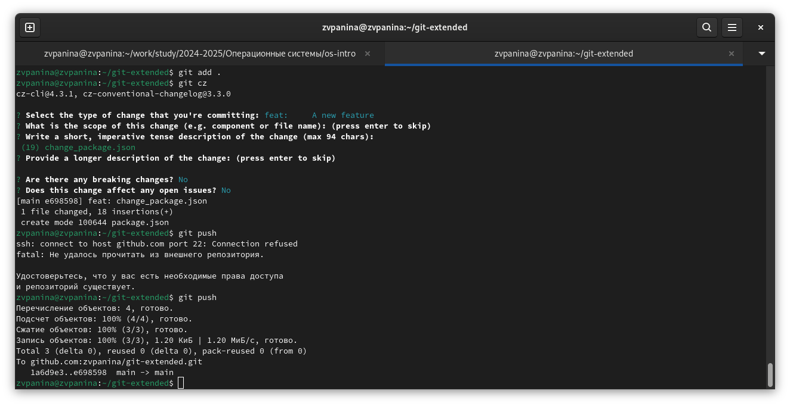{#fig:012 width=70%}

##

6. Инициализирую git-flow (Префикс для ярлыков устанавливаю в v); проверяю, что я на ветке develop; загружаю весь репозиторий в хранилище; устанавливаю внешнюю ветку как вышестоящую для этой ветки.

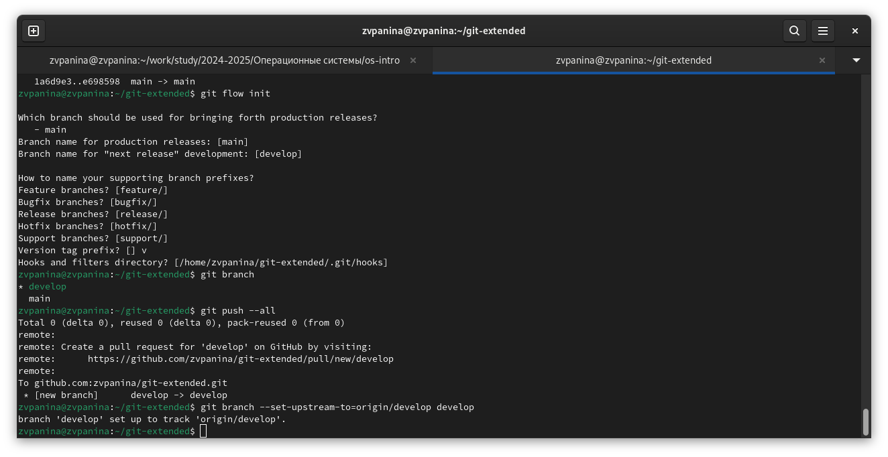{#fig:013 width=70%}

##

7. Создаю релиз с версией 1.0.0 , создаю журнал изменений.

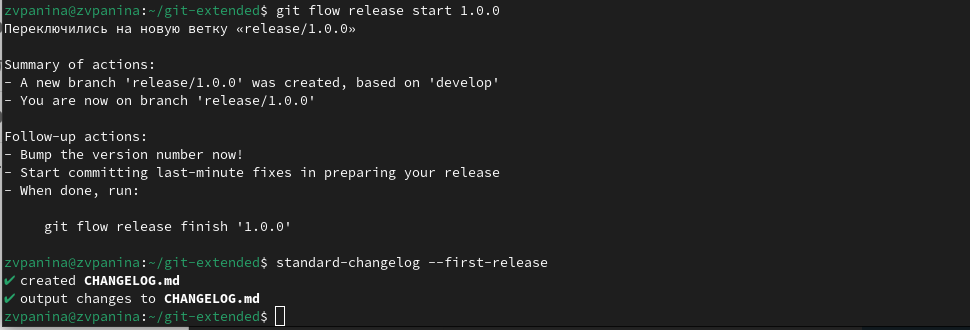{#fig:014 width=70%}

##

После этой команды всплывает окно, где нужно написать сообщение для коммита.

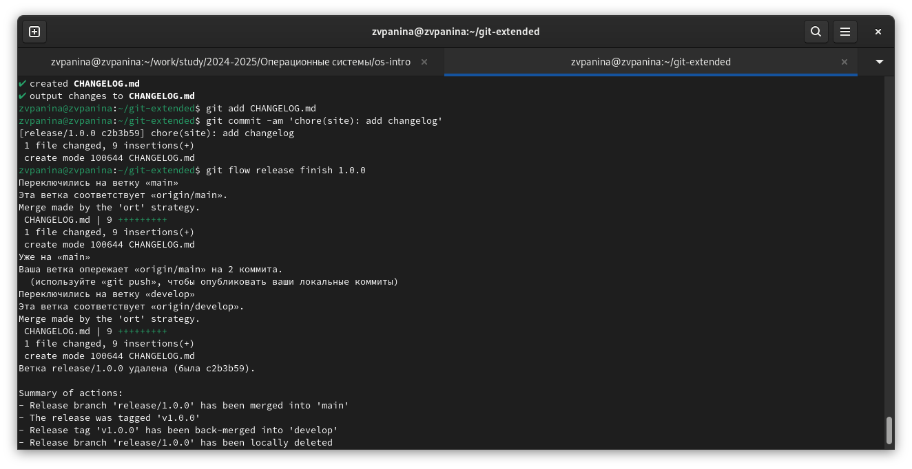{#fig:015 width=70%}

##

8. Заливаю релизную ветку в основную ветку.

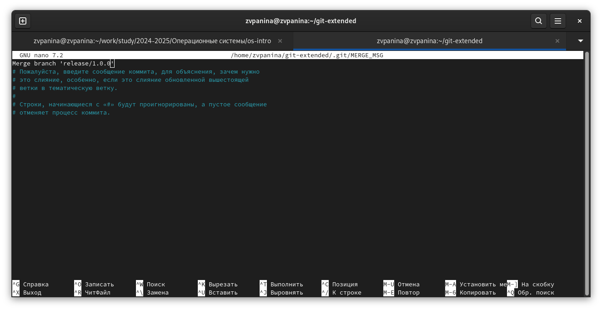{#fig:016 width=70%}

##

9. Отправляю данные на github.

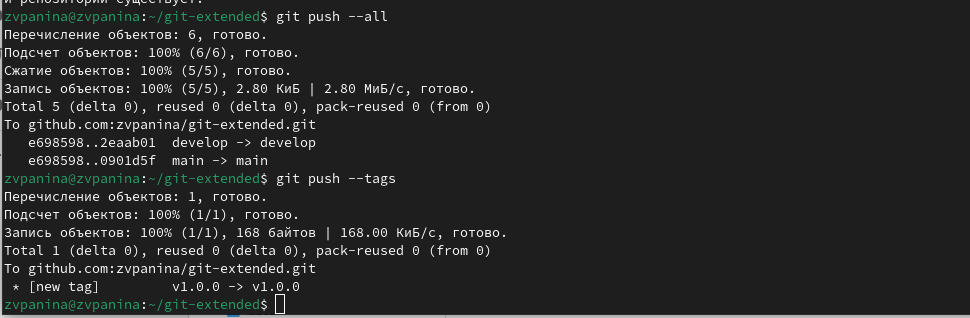{#fig:017 width=70%}

10. Создаю релиз на github. Для этого использую утилиты работы с github (Первая команда на рисунке 4.18) .

##

### Работа с репозиторием git 

1. Создаю ветку для новой функциональности. Объединяю ветку feature_branch с develop.

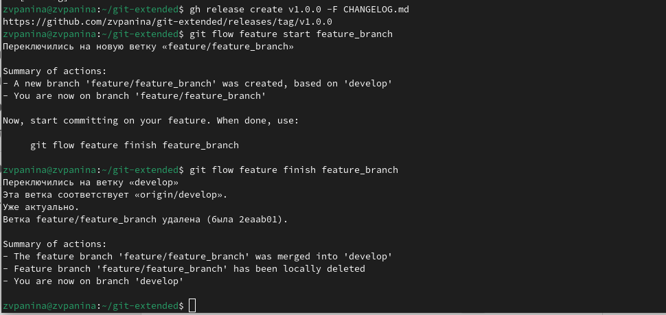{#fig:018 width=70%}

##

2. Создаю релиз с версией 1.2.3 и открываю файл package_json в mc.

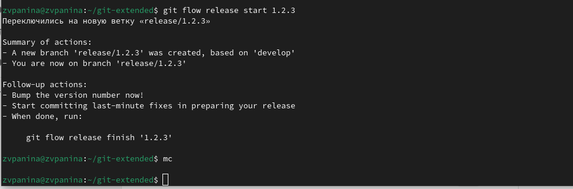{#fig:019 width=70%}

##

3. В файле устанавливаю номер версии в 1.2.3.

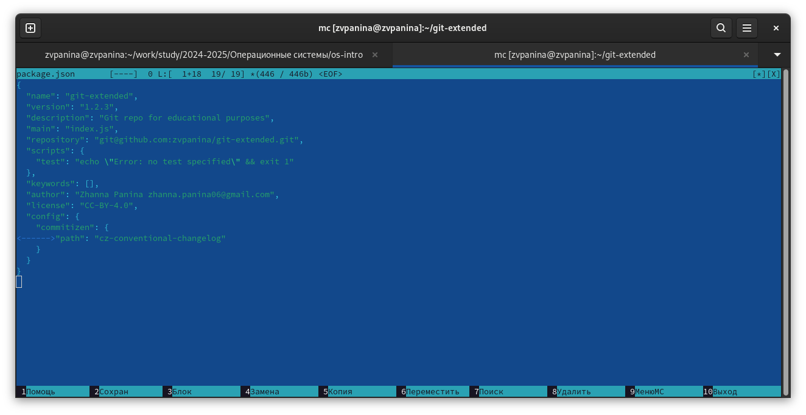{#fig:020 width=70%}

##

4. Создаю журнал изменений, добавляю его в индекс.

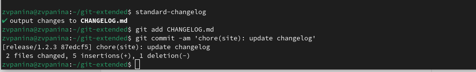{#fig:021 width=70%}

##

5. В всплывающем окне пришу сообщение для коммита.

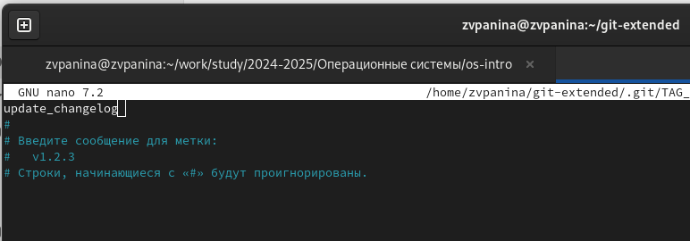{#fig:022 width=70%}

##

6. Заливаю релизную ветку в основную ветку.

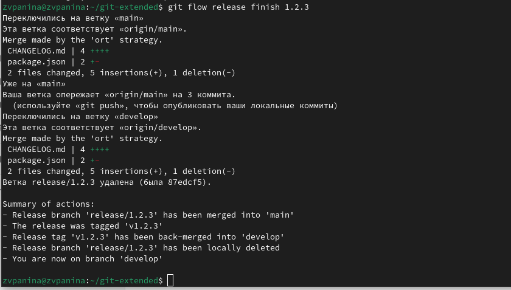{#fig:023 width=70%}

##

7. Отправляю данные на github. Создаю релиз на github с комментарием из журнала изменений.

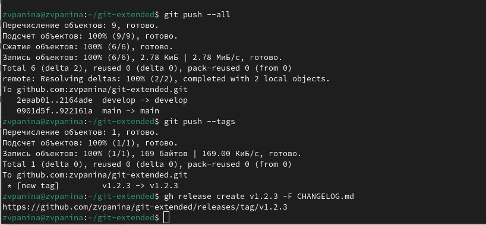{#fig:024 width=70%}

## Результаты

В ходе выполнения лабораторной работы я приобрела навыки правильной работы с репозиториями git. Выполнила работу для тестового репозитория, преобразовала рабочий репозиторий в репозиторий с git-flow и conventional commits.

## Список литературы{.unnumbered}

Рабочий процесс с Gitflow(электронный ресурс) URL: <https://yamadharma.github.io/ru/post/2021/04/18/gitflow-workflow/>

::: {#refs}
:::

