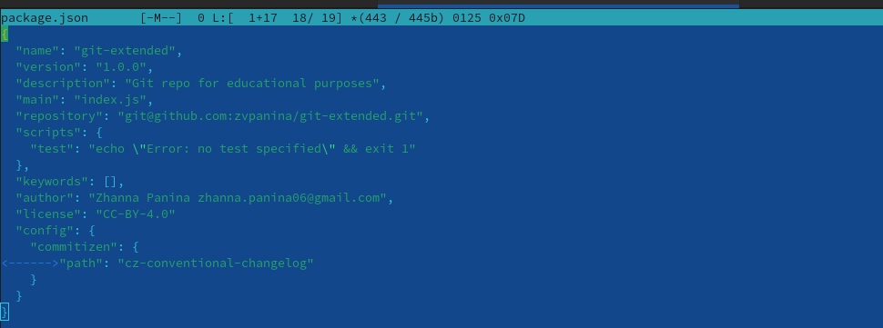

---
## Front matter
title: "Лабораторная работа №4"
subtitle: "Дисциплина: Операционные системы"
author: "Панина Жанна Валерьевна"

## Generic otions
lang: ru-RU
toc-title: "Содержание"

## Bibliography
bibliography: bib/cite.bib
csl: pandoc/csl/gost-r-7-0-5-2008-numeric.csl

## Pdf output format
toc: true # Table of contents
toc-depth: 2
lof: true # List of figures
lot: true # List of tables
fontsize: 12pt
linestretch: 1.5
papersize: a4
documentclass: scrreprt
## I18n polyglossia
polyglossia-lang:
  name: russian
  options:
	- spelling=modern
	- babelshorthands=true
polyglossia-otherlangs:
  name: english
## I18n babel
babel-lang: russian
babel-otherlangs: english
## Fonts
mainfont: IBM Plex Serif
romanfont: IBM Plex Serif
sansfont: IBM Plex Sans
monofont: IBM Plex Mono
mathfont: STIX Two Math
mainfontoptions: Ligatures=Common,Ligatures=TeX,Scale=0.94
romanfontoptions: Ligatures=Common,Ligatures=TeX,Scale=0.94
sansfontoptions: Ligatures=Common,Ligatures=TeX,Scale=MatchLowercase,Scale=0.94
monofontoptions: Scale=MatchLowercase,Scale=0.94,FakeStretch=0.9
mathfontoptions:
## Biblatex
biblatex: true
biblio-style: "gost-numeric"
biblatexoptions:
  - parentracker=true
  - backend=biber
  - hyperref=auto
  - language=auto
  - autolang=other*
  - citestyle=gost-numeric
## Pandoc-crossref LaTeX customization
figureTitle: "Рис."
tableTitle: "Таблица"
listingTitle: "Листинг"
lofTitle: "Список иллюстраций"
lotTitle: "Список таблиц"
lolTitle: "Листинги"
## Misc options
indent: true
header-includes:
  - \usepackage{indentfirst}
  - \usepackage{float} # keep figures where there are in the text
  - \floatplacement{figure}{H} # keep figures where there are in the text
---

# Цель работы

Получение навыков правильной работы с репозиториями git.

# Задание

1. Выполнить работу для тестового репозитория.
2. Преобразовать рабочий репозиторий в репозиторий с git-flow и conventional commits.

# Теоретическое введение

Gitflow Workflow опубликована и популяризована Винсентом Дриссеном. Gitflow Workflow предполагает выстраивание строгой модели ветвления с учётом выпуска проекта. Данная модель отлично подходит для организации рабочего процесса на основе релизов.v Работа по модели Gitflow включает создание отдельной ветки для исправлений ошибок в рабочей среде. 

Семантическое версионирование описывается в манифесте семантического версионирования. Кратко его можно описать следующим образом: Версия задаётся в виде кортежа МАЖОРНАЯ_ВЕРСИЯ.МИНОРНАЯ_ВЕРСИЯ.ПАТЧ. Номер версии следует увеличивать: МАЖОРНУЮ версию, когда сделаны обратно несовместимые изменения API. МИНОРНУЮ версию, когда вы добавляете новую функциональность, не нарушая обратной совместимости. ПАТЧ-версию, когда вы делаете обратно совместимые исправления. Дополнительные обозначения для предрелизных и билд-метаданных возможны как дополнения к МАЖОРНАЯ.МИНОРНАЯ.ПАТЧ формату.

Спецификация Conventional Commits: Соглашение о том, как нужно писать сообщения commit'ов. Совместимо с SemVer. Даже вернее сказать, сильно связано с семантическим версионированием. Регламентирует структуру и основные типы коммитов.

# Выполнение лабораторной работы

## Установка программного обеспечения

### Установка git-flow

Устанавливаю git-flow из коллекции репозиториев Copr
1. Выполняю команду dnf copr enable elegos/gitflow в режиме суперпользователя (рис. [-@fig:001]).

{#fig:001 width=70%}

2. Выполняю команду dnf install gitflow (рис. [-@fig:002]).

{#fig:002 width=70%}

### Установка Node.js

1. Выполняю команду dnf install nodejs в режиме суперпользователя (рис. [-@fig:003]).

{#fig:003 width=70%}

2. Выполняю команду dnf install pnpm (рис. [-@fig:004]).

{#fig:004 width=70%}

### Настройка Node.js

Для работы с Node.js добавляю каталог с исполняемыми файлами, устанавливаемыми в yarn, в переменную PATH (рис. [-@fig:005]).

{#fig:005 width=70%}

### Общепринятые коммиты

1. Данная программа используется для помощи в форматировании коммитов (рис. [-@fig:006]).

{#fig:006 width=70%}

2. Данная программа используется для помощи в создании логов (рис. [-@fig:007]).

{#fig:007 width=70%}

## Практический сценарий использования git

### Создание репозитория git

1. Создаю репозиторий на GitHub и называю его git-extended (рис. [-@fig:008]).

{#fig:008 width=70%}

2. Клонирую репозиторий, перехожу в него и создаю файл README.md, чтобы закоммитить его. С помощью команд git add., git commit, git push делаю первый коммит и выкладываю его на GitHub (рис. [-@fig:009]).

{#fig:009 width=70%}

3. Создаю конфигурацию для пакетов Node.js и открываю файл git-extended в mc (рис. [-@fig:010]).

{#fig:010 width=70%}

4. Заполняю несколько параметров пакета (название, лицензия, конфигурация пакета коммитов), чтобы файл выглядел вот так (рис. [-@fig:011]).

{#fig:011 width=70%}

5. С помощью следующих команд добавляю новые файлы, выполняю коммит, выкладываю на GitHub (рис. [-@fig:012]).

{#fig:012 width=70%}

6. Инициализирую git-flow (Префикс для ярлыков устанавливаю в v); проверяю, что я на ветке develop; загружаю весь репозиторий в хранилище; устанавливаю внешнюю ветку как вышестоящую для этой ветки (рис. [-@fig:013]).

{#fig:013 width=70%}

7. Создаю релиз с версией 1.0.0 , создаю журнал изменений (рис. [-@fig:014]).

{#fig:014 width=70%}

После этой команды всплывает окно, где нужно написать сообщение для коммита (рис. [-@fig:015]).

{#fig:015 width=70%}

8. Заливаю релизную ветку в основную ветку (рис. [-@fig:016]).

{#fig:016 width=70%}

9. Отправляю данные на github (рис. [-@fig:017]).

{#fig:017 width=70%}

10. Создаю релиз на github. Для этого использую утилиты работы с github (Первая команда на рисунке 4.18) .

### Работа с репозиторием git 

1. Создаю ветку для новой функциональности. Объединяю ветку feature_branch с develop (рис. [-@fig:018]).

{#fig:018 width=70%}

2. Создаю релиз с версией 1.2.3 и открываю файл package_json в mc (рис. [-@fig:019]).

{#fig:019 width=70%}

3. В файле устанавливаю номер версии в 1.2.3 (рис. [-@fig:020]).

{#fig:020 width=70%}

4. Создаю журнал изменений, добавляю его в индекс (рис. [-@fig:021]).

{#fig:021 width=70%}

5. В всплывающем окне пришу сообщение для коммита (рис. [-@fig:022]).

{#fig:022 width=70%}

6. Заливаю релизную ветку в основную ветку (рис. [-@fig:023]).

{#fig:023 width=70%}

7. Отправляю данные на github. Создаю релиз на github с комментарием из журнала изменений (рис. [-@fig:024]).

{#fig:024 width=70%}

# Выводы

В ходе выполнения лабораторной работы я приобрела навыки правильной работы с репозиториями git.

# Список литературы{.unnumbered}

Рабочий процесс с Gitflow(электронный ресурс) URL: <https://yamadharma.github.io/ru/post/2021/04/18/gitflow-workflow/>

::: {#refs}
:::
