---
## Front matter
lang: ru-RU
title: Лабораторная работа №5
subtitle: Операционные системы
author:
  - Панина Ж. В.
institute:
  - Российский университет дружбы народов, Москва, Россия
date: 14 марта 2025

## i18n babel
babel-lang: russian
babel-otherlangs: english

## Formatting pdf
toc: false
toc-title: Содержание
slide_level: 2
aspectratio: 169
section-titles: true
theme: metropolis
header-includes:
 - \metroset{progressbar=frametitle,sectionpage=progressbar,numbering=fraction}
---

# Информация

## Докладчик

:::::::::::::: {.columns align=center}
::: {.column width="70%"}

  * Панина Жанна Валерьевна
  * НКАбд-02-24, студ. билет № 1132246710
  * студент направления "Компьютерные и информационные науки"
  * Российский университет дружбы народов
  * [1132246710@pfur.ru](mailto:1132246710@pfur.ru)
  * <https://github.com/zvpanina/study_2024-2025_os-intro>

:::
::::::::::::::

# Вводная часть

## Актуальность

В современном мире безопасность данных играет ключевую роль, особенно при хранении и управлении паролями. Утилиты pass, gopass, native messaging и chezmoi позволяют безопасно управлять конфиденциальной информацией, автоматизировать процесс конфигурирования и синхронизировать данные с системами контроля версий. Изучение этих инструментов актуально для повышения уровня кибербезопасности и оптимизации рабочего процесса.

## Объект и предмет исследования

### Объект исследования:

Методы управления паролями и конфигурационными файлами в операционных системах на базе Linux.

### Предмет исследования:

Утилиты pass, gopass, native messaging, chezmoi и их интеграция с системой контроля версий git.

## Цели и задачи

Цель работы - познакомиться с pass, gopass, native messaging, chezmoi. Научиться пользоваться этими утилитами, синхронизировать их с git.

### Задачи:

1. Установить дополнительное ПО
2. Установить и настроить pass
3. Настроить интерфейс с браузером
4. Сохранить пароль
5. Установить и настроить chezmoi
6. Настроить chezmoi на новой машине
7. Выполнить ежедневные операции с chezmoi

## Материалы и методы

Используемое программное обеспечение: Fedora, VirtualBox, утилиты pass, gopass, chezmoi, git.
Методы исследования: изучение документации, практическое тестирование утилит, настройка синхронизации с git, анализ работы инструментов и их взаимодействия.

# Теоретическое введение

Менеджер паролей pass — программа, сделанная в рамках идеологии Unix. Также носит название стандартного менеджера паролей для Unix (The standard Unix password manager).
* Основные свойства
    Данные хранятся в файловой системе в виде каталогов и файлов.
    Файлы шифруются с помощью GPG-ключа.
* Структура базы паролей
    Структура базы может быть произвольной, если Вы собираетесь использовать её напрямую, без промежуточного программного обеспечения. Тогда семантику структуры базы данных Вы держите в своей голове.
    Если же необходимо использовать дополнительное программное обеспечение, необходимо семантику заложить в структуру базы паролей.
    
##
    
chezmoi используется для управления файлами конфигурации домашнего каталога пользователя. 
Конфигурация chezmoi
- Рабочие файлы
    Состояние файлов конфигурации сохраняется в каталоге ~/.local/share/chezmoi. Он является клоном вашего репозитория dotfiles.
    Файл конфигурации ~/.config/chezmoi/chezmoi.toml (можно использовать также JSON или YAML) специфичен для локальной машины.
    Файлы, содержимое которых одинаково на всех ваших машинах, дословно копируются из исходного каталога.
    Файлы, которые варьируются от машины к машине, выполняются как шаблоны, обычно с использованием данных из файла конфигурации локальной машины для настройки конечного содержимого, специфичного для локальной машины.

# Выполнение лабораторной работы

## Менеджер паролей pass

### Установка

1. Выполняю установку pass.

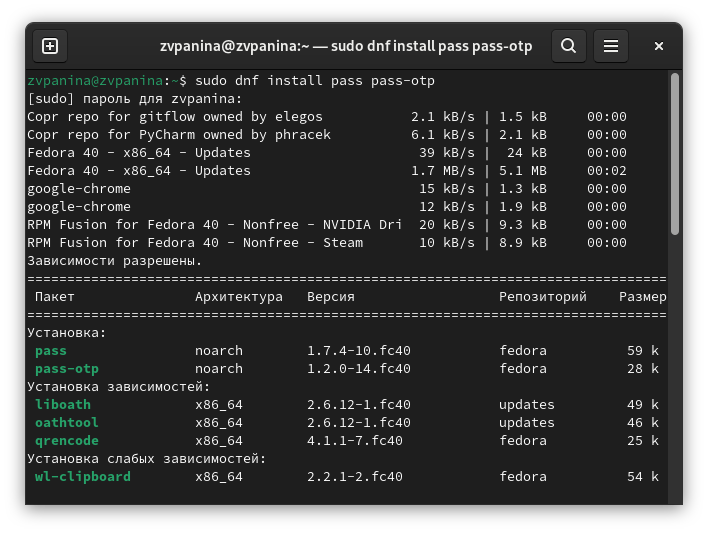{#fig:001 width=70%}

##

2. Выполняю установку gopass.

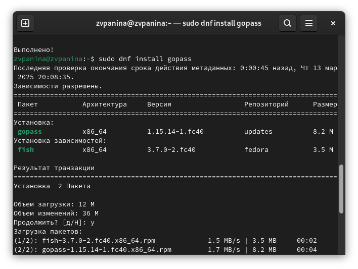{#fig:002 width=70%}

##

### Настройка

1. Просматриваю список ключей GPG, инициализирую хранилище с помощью id ключа и создаю структуру git. Задам адрес репозитория git-extended (ранее созданного) на хостинге.

{#fig:003 width=70%}

##

2. Для синхронизации выполняю следующие команды: pass git pull.

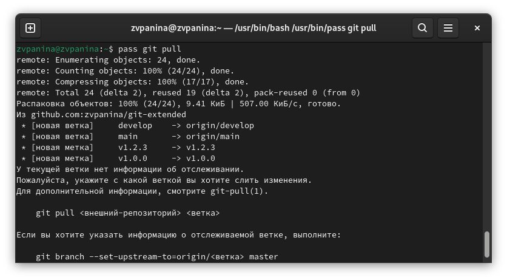{#fig:004 width=70%}

##

pass git push.

{#fig:005 width=70%}

##

3. Если изменения сделаны непосредственно на файловой системе, необходимо вручную закоммитить и выложить изменения. Проверяю статус синхронизации командой git status.

{#fig:006 width=70%}

##

### Настройка интерфейса с браузером

1. Захожу в репозиторий browserpass-extension.

{#fig:007 width=70%}

##

2. Скачиваю плагин для браузера Firefox.

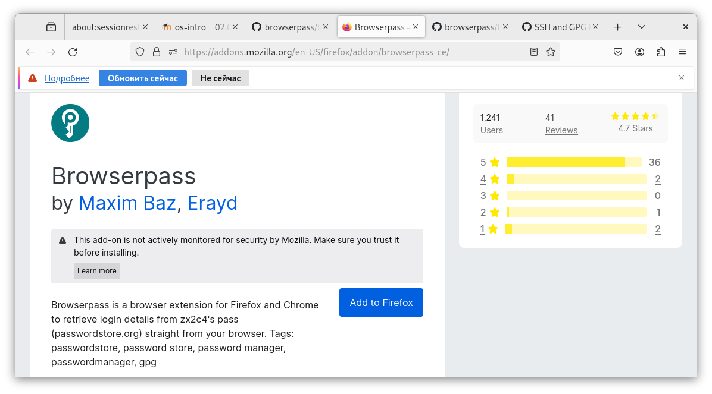{#fig:008 width=70%}

##

3. Подключаю интерфейс для взаимодействия с браузером.

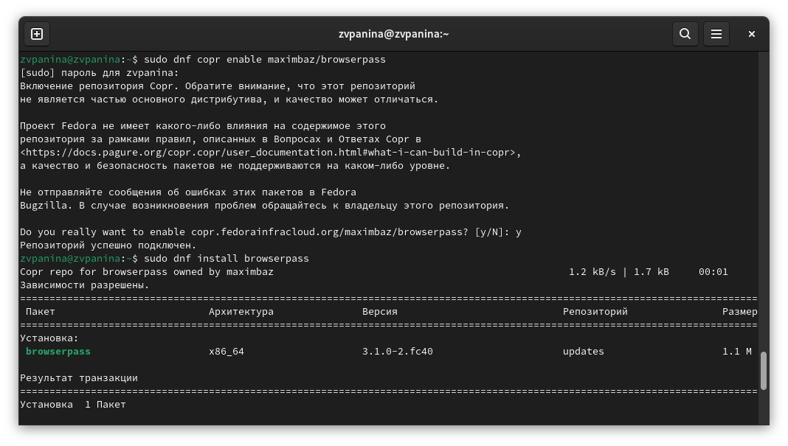{#fig:009 width=70%}

##

### Сохранение пароля

1. Добавляю новый пароль.

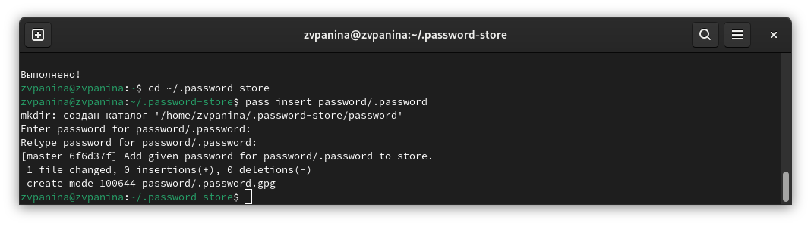{#fig:010 width=70%}

##

2. Отображаю пароль для указанного имени файла и заменяю существующий пароль.

{#fig:011 width=70%}

## Управление файлами конфигурации

### Дополнительное программное обеспечение

1. Устанавливаю дополнительное программное обеспечение.

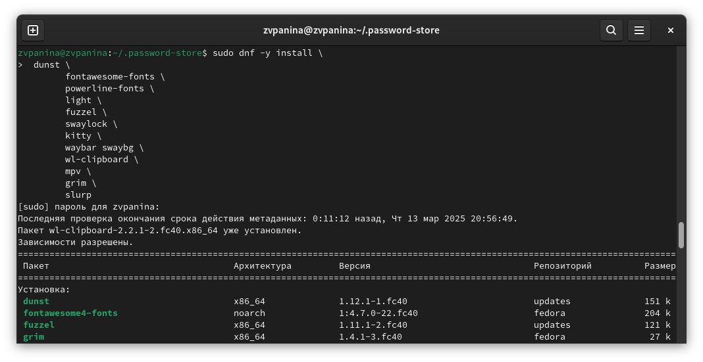{#fig:012 width=70%}

##

2. Устанавливаю шрифты.

{#fig:013 width=70%}

##

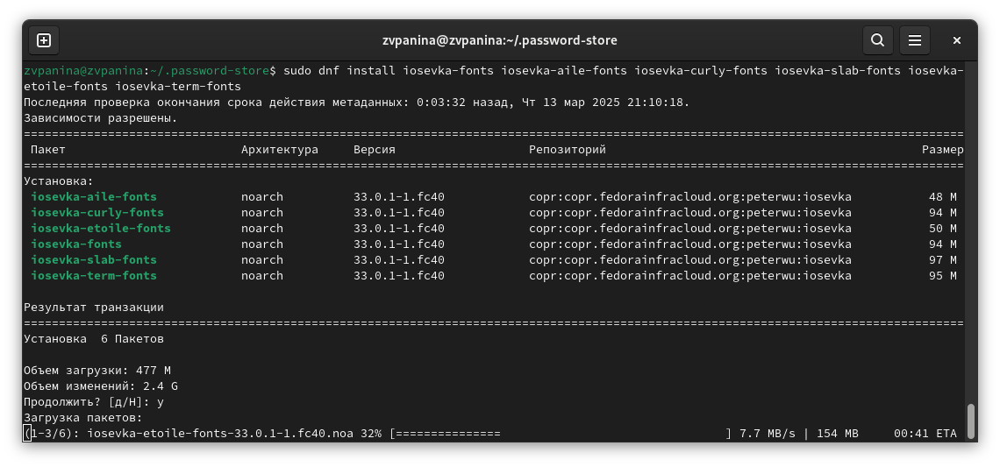{#fig:014 width=70%}

##

3. Устанавливаю бинарный файл с помощью wget. Скрипт определяет архитектуру процессора и операционную систему и скачивает необходимый файл.

{#fig:015 width=70%}

##

### Создание собственного репозитория с помощью утилит

Создаю свой репозиторий для конфигурационных файлов на основе шаблона.

{#fig:016 width=70%}

##

### Подключение репозитория к своей системе

1. Инициализирую chezmoi со своим репозиторием dotfiles.

{#fig:017 width=70%}

##

2. Проверяю, какие изменения внесёт chezmoi в домашний каталог.

{#fig:018 width=70%}

##

3. Изменения меня устраивают, поэтому применяю их.

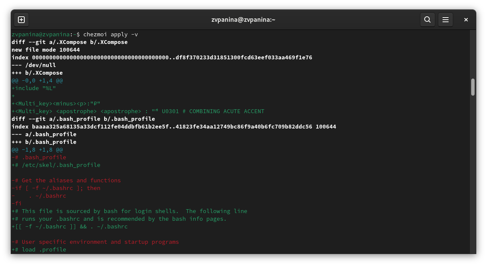{#fig:019 width=70%}

##

### Использование chezmoi на нескольких машинах

На второй машине инициализирую chezmoi со своим репозиторием dotfiles.

{#fig:020 width=70%}

##

### Настройка новой машины с помощью одной команды

Устанавливаю свои dotfiles на новую машину с помощью одной команды.

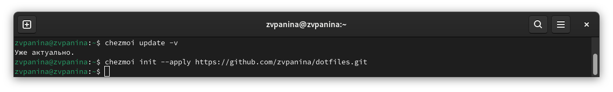{#fig:021 width=70%}

##

### Ежедневные операции с chezmoi

1. Первой командой извлекаю последние изменения из репозитория и применяю их. Второй командой извлекаю последние изменения из своего репозитория и смотрю, что изменится, фактически не применяя изменения. Ничего не изменилось. Применяю изменения.

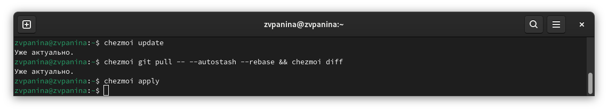{#fig:022 width=70%}

##

2. Можно автоматически фиксировать и отправлять изменения в исходный каталог в репозиторий. Открываю в mc файл конфигурации ~/.config/chezmoi/chezmoi.toml и добавляю в него следующее.

{#fig:023 width=70%}

## Результаты

В ходе выполнения лабораторной работы я познакомилась с pass, gopass, native messaging, chezmoi. Научилась пользоваться этими утилитами, синхронизировать их с git.

# Список литературы{.unnumbered}

Настройка электронной среды. (электронный ресурс) URL: <https://yamadharma.github.io/ru/teaching/os-intro/lab/lab-work-environment-setup/>

::: {#refs}
:::

