---
## Front matter
title: "Отчёт по лабораторной работе №5"
subtitle: "Дисциплина: Операционные системы"
author: "Панина Жанна Валерьевна"

## Generic otions
lang: ru-RU
toc-title: "Содержание"

## Bibliography
bibliography: bib/cite.bib
csl: pandoc/csl/gost-r-7-0-5-2008-numeric.csl

## Pdf output format
toc: true # Table of contents
toc-depth: 2
lof: true # List of figures
lot: true # List of tables
fontsize: 12pt
linestretch: 1.5
papersize: a4
documentclass: scrreprt
## I18n polyglossia
polyglossia-lang:
  name: russian
  options:
	- spelling=modern
	- babelshorthands=true
polyglossia-otherlangs:
  name: english
## I18n babel
babel-lang: russian
babel-otherlangs: english
## Fonts
mainfont: IBM Plex Serif
romanfont: IBM Plex Serif
sansfont: IBM Plex Sans
monofont: IBM Plex Mono
mathfont: STIX Two Math
mainfontoptions: Ligatures=Common,Ligatures=TeX,Scale=0.94
romanfontoptions: Ligatures=Common,Ligatures=TeX,Scale=0.94
sansfontoptions: Ligatures=Common,Ligatures=TeX,Scale=MatchLowercase,Scale=0.94
monofontoptions: Scale=MatchLowercase,Scale=0.94,FakeStretch=0.9
mathfontoptions:
## Biblatex
biblatex: true
biblio-style: "gost-numeric"
biblatexoptions:
  - parentracker=true
  - backend=biber
  - hyperref=auto
  - language=auto
  - autolang=other*
  - citestyle=gost-numeric
## Pandoc-crossref LaTeX customization
figureTitle: "Рис."
tableTitle: "Таблица"
listingTitle: "Листинг"
lofTitle: "Список иллюстраций"
lotTitle: "Список таблиц"
lolTitle: "Листинги"
## Misc options
indent: true
header-includes:
  - \usepackage{indentfirst}
  - \usepackage{float} # keep figures where there are in the text
  - \floatplacement{figure}{H} # keep figures where there are in the text
---

# Цель работы

Познакомиться с pass, gopass, native messaging, chezmoi. Научиться пользоваться этими утилитами, синхронизировать их с git.

# Задание

1. Установить дополнительное ПО
2. Установить и настроить pass
3. Настроить интерфейс с браузером
4. Сохранить пароль
5. Установить и настроить chezmoi
6. Настроить chezmoi на новой машине
7. Выполнить ежедневные операции с chezmoi

# Теоретическое введение

Менеджер паролей pass — программа, сделанная в рамках идеологии Unix. Также носит название стандартного менеджера паролей для Unix (The standard Unix password manager).
* Основные свойства
    Данные хранятся в файловой системе в виде каталогов и файлов.
    Файлы шифруются с помощью GPG-ключа.
* Структура базы паролей
    Структура базы может быть произвольной, если Вы собираетесь использовать её напрямую, без промежуточного программного обеспечения. Тогда семантику структуры базы данных Вы держите в своей голове.
    Если же необходимо использовать дополнительное программное обеспечение, необходимо семантику заложить в структуру базы паролей.
chezmoi используется для управления файлами конфигурации домашнего каталога пользователя. 
Конфигурация chezmoi
- Рабочие файлы
    Состояние файлов конфигурации сохраняется в каталоге ~/.local/share/chezmoi. Он является клоном вашего репозитория dotfiles.
    Файл конфигурации ~/.config/chezmoi/chezmoi.toml (можно использовать также JSON или YAML) специфичен для локальной машины.
    Файлы, содержимое которых одинаково на всех ваших машинах, дословно копируются из исходного каталога.
    Файлы, которые варьируются от машины к машине, выполняются как шаблоны, обычно с использованием данных из файла конфигурации локальной машины для настройки конечного содержимого, специфичного для локальной машины.

# Выполнение лабораторной работы

## Менеджер паролей pass

### Установка

1. Выполняю установку pass (рис. [-@fig:001]).

{#fig:001 width=70%}

2. Выполняю установку gopass (рис. [-@fig:002]).

{#fig:002 width=70%}

### Настройка

1. Просматриваю список ключей GPG, инициализирую хранилище с помощью id ключа и создаю структуру git. Задам адрес репозитория git-extended (ранее созданного) на хостинге (рис. [-@fig:003]).

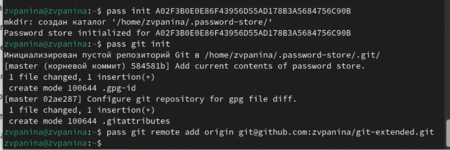{#fig:003 width=70%}

2. Для синхронизации выполняю следующие команды: pass git pull (рис. [-@fig:004]).

{#fig:004 width=70%}

pass git push (рис. [-@fig:005]).

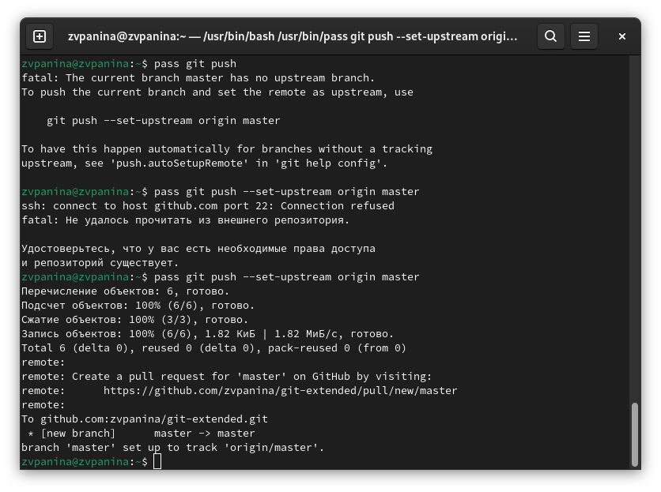{#fig:005 width=70%}

3. Если изменения сделаны непосредственно на файловой системе, необходимо вручную закоммитить и выложить изменения (рис. [-@fig:006]). Проверяю статус синхронизации командой git status.

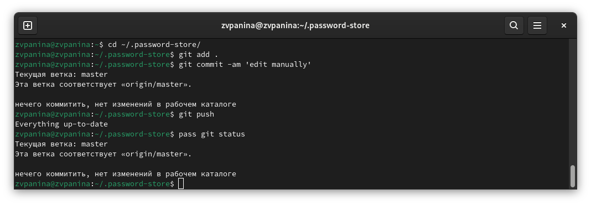{#fig:006 width=70%}

### Настройка интерфейса с браузером

1. Захожу в репозиторий browserpass-extension (рис. [-@fig:007]).

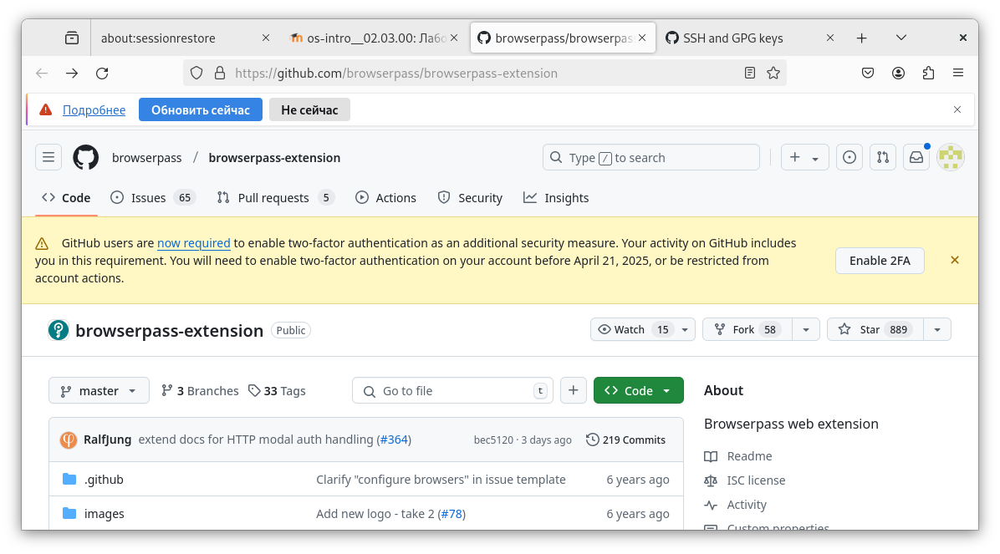{#fig:007 width=70%}

2. Скачиваю плагин для браузера Firefox (рис. [-@fig:008]).

{#fig:008 width=70%}

3. Подключаю интерфейс для взаимодействия с браузером (рис. [-@fig:009]).

{#fig:009 width=70%}

### Сохранение пароля

1. Добавляю новый пароль (рис. [-@fig:010]).

{#fig:010 width=70%}

2. Отображаю пароль для указанного имени файла и заменяю существующий пароль (рис. [-@fig:011]).

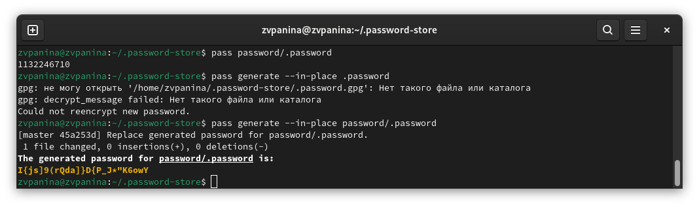{#fig:011 width=70%}

## Управление файлами конфигурации

### Дополнительное программное обеспечение

1. устанавливаю дополнительное программное обеспечение (рис. [-@fig:012]).

{#fig:012 width=70%}

2. Устанавливаю шрифты (рис. [-@fig:013]), (рис. [-@fig:014]).

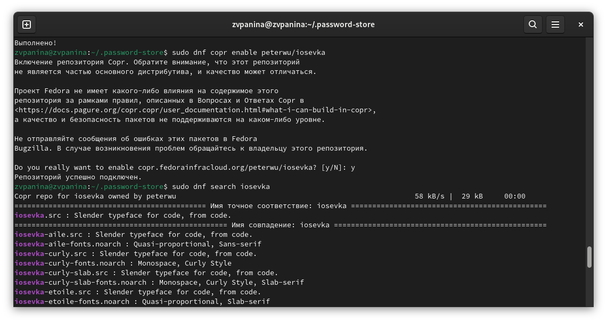{#fig:013 width=70%}

{#fig:014 width=70%}

3. Устанавливаю бинарный файл с помощью wget (рис. [-@fig:015]). Скрипт определяет архитектуру процессора и операционную систему и скачивает необходимый файл.

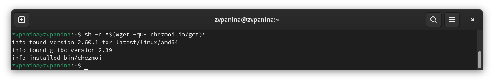{#fig:015 width=70%}

### Создание собственного репозитория с помощью утилит

Создаю свой репозиторий для конфигурационных файлов на основе шаблона (рис. [-@fig:016]).

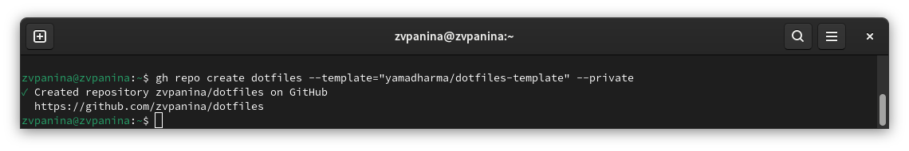{#fig:016 width=70%}

### Подключение репозитория к своей системе

1. Инициализирую chezmoi со своим репозиторием dotfiles (рис. [-@fig:017]).

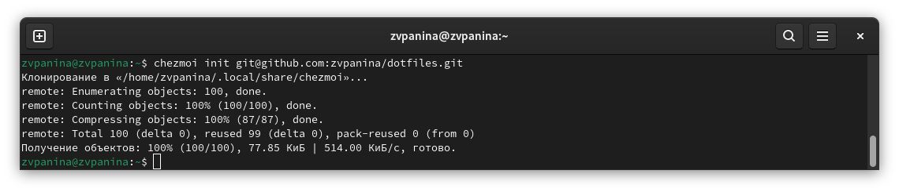{#fig:017 width=70%}

2. Проверяю, какие изменения внесёт chezmoi в домашний каталог (рис. [-@fig:018]).

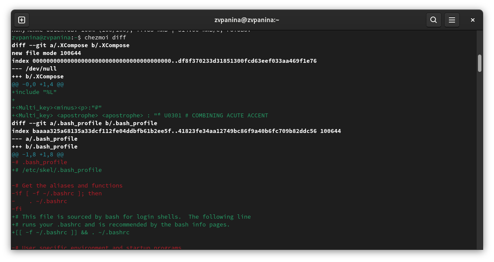{#fig:018 width=70%}

3. Изменения меня устраивают, поэтому применяю их (рис. [-@fig:019]).

{#fig:019 width=70%}

### Использование chezmoi на нескольких машинах

На второй машине инициализирую chezmoi со своим репозиторием dotfiles (рис. [-@fig:020]).

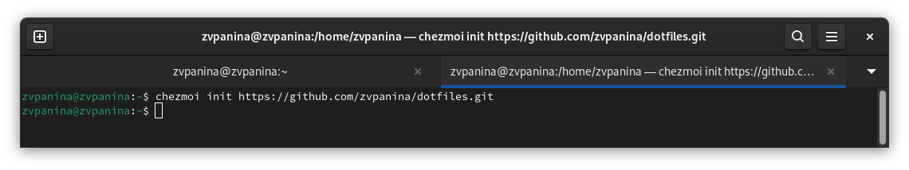{#fig:020 width=70%}

### Настройка новой машины с помощью одной команды

Устанавливаю свои dotfiles на новую машину с помощью одной команды (рис. [-@fig:021]).

{#fig:021 width=70%}

### Ежедневные операции с chezmoi

1. Первой командой извлекаю последние изменения из репозитория и применяю их (рис. [-@fig:022]). Второй командой извлекаю последние изменения из своего репозитория и смотрю, что изменится, фактически не применяя изменения. Ничего не изменилось. Применяю изменения.

{#fig:022 width=70%}

2. Можно автоматически фиксировать и отправлять изменения в исходный каталог в репозиторий. Открываю в mc файл конфигурации ~/.config/chezmoi/chezmoi.toml и добавляю в него следующее (рис. [-@fig:023]).

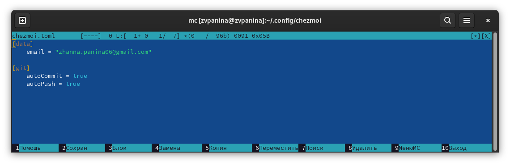{#fig:023 width=70%}

# Вывод

В ходе выполнения лабораторной работы я познакомилась с pass, gopass, native messaging, chezmoi. Научилась пользоваться этими утилитами, синхронизировать их с git.

# Список литературы{.unnumbered}

Настройка электронной среды. (электронный ресурс) URL: <https://yamadharma.github.io/ru/teaching/os-intro/lab/lab-work-environment-setup/>

::: {#refs}
:::
