---
## Front matter
lang: ru-RU
title: Лабораторная работа №7
subtitle: Операционные системы
author:
  - Панина Ж. В.
institute:
  - Российский университет дружбы народов, Москва, Россия
date: 26 марта 2025

## i18n babel
babel-lang: russian
babel-otherlangs: english

## Formatting pdf
toc: false
toc-title: Содержание
slide_level: 2
aspectratio: 169
section-titles: true
theme: metropolis
header-includes:
 - \metroset{progressbar=frametitle,sectionpage=progressbar,numbering=fraction}
---

# Информация

## Докладчик

:::::::::::::: {.columns align=center}
::: {.column width="70%"}

  * Панина Жанна Валерьевна
  * НКАбд-02-24, студ. билет № 1132246710
  * студент направления "Компьютерные и информационные науки"
  * Российский университет дружбы народов
  * [1132246710@pfur.ru](mailto:1132246710@pfur.ru)
  * <https://github.com/zvpanina/study_2024-2025_os-intro>

:::
::::::::::::::

# Вводная часть

## Актуальность

Изучение файловой системы Linux и команд для работы с ней является важным аспектом подготовки специалистов в области информационных технологий, системного администрирования и DevOps. Современные IT-инфраструктуры часто развертываются на Linux-серверах, и понимание принципов работы файловой системы, управления процессами и обслуживания дискового пространства критически необходимо для эффективного администрирования серверов и оптимизации работы с данными.

## Объект и предмет исследования

### Объект исследования:

Файловая система Linux, её структура и управление процессами.

### Предмет исследования:

Команды для работы с файлами, каталогами, процессами и дисковым пространством в Linux.

## Цели и задачи

Цель работы - ознакомление с файловой системой Linux, её структурой, именами и содержанием каталогов. Приобретение практических навыков по применению команд для работы с файлами и каталогами, по управлению процессами (и работами), по проверке использования диска и обслуживанию файловой системы.

### Задачи:

1. Выполните все примеры, приведённые в первой части описания лабораторной работы.
2. Выполните следующие действия, зафиксировав в отчёте по лабораторной работе используемые при этом команды и результаты их выполнения:
- Скопируйте файл /usr/include/sys/io.h в домашний каталог и назовите его equipment.
- В домашнем каталоге создайте директорию ~/ski.plases.
- Переместите файл equipment в каталог ~/ski.plases.
- Переименуйте файл ~/ski.plases/equipment в ~/ski.plases/equiplist.
- Создайте в домашнем каталоге файл abc1 и скопируйте его в каталог ~/ski.plases, назовите его equiplist2.

##

- Создайте каталог с именем equipment в каталоге ~/ski.plases.
- Переместите файлы ~/ski.plases/equiplist и equiplist2 в каталог ~/ski.plases/equipment.
- Создайте и переместите каталог ~/newdir в каталог ~/ski.plases и назовите его plans.
3. Определите опции команды chmod, необходимые для того, чтобы присвоить перечисленным ниже файлам выделенные права доступа, считая, что в начале таких прав нет:
- drwxr--r-- ... australia
- drwx--x--x ... play
- -r-xr--r-- ... my_os
- -rw-rw-r-- ... feathers
При необходимости создайте нужные файлы.

##

4. Проделайте приведённые ниже упражнения, записывая в отчёт по лабораторной работе используемые при этом команды:
- Просмотрите содержимое файла /etc/password.
- Скопируйте файл ~/feathers в файл ~/file.old.
- Переместите файл ~/file.old в каталог ~/play.
- Скопируйте каталог ~/play в каталог ~/fun.
- Переместите каталог ~/fun в каталог ~/play и назовите его games.
- Лишите владельца файла ~/feathers права на чтение.

##

- Что произойдёт, если вы попытаетесь просмотреть файл ~/feathers командой cat?
- Что произойдёт, если вы попытаетесь скопировать файл ~/feathers?
- Дайте владельцу файла ~/feathers право на чтение.
- Лишите владельца каталога ~/play права на выполнение.
- Перейдите в каталог ~/play. Что произошло?
- Дайте владельцу каталога ~/play право на выполнение.
5. Прочитайте man по командам mount, fsck, mkfs, kill и кратко их охарактеризуйте, приведя примеры.

## Материалы и методы

### Материалы:

* Операционная система Linux
* Терминал и встроенные утилиты (ls, cd, mkdir, rm, ps, kill, df, du, mount, fsck и др.).
* Документация по командам (man, --help).

### Методы:

- Анализ структуры файловой системы – изучение стандартных каталогов (/bin, /etc, /home, /var и др.).
- Практическое применение команд для:
* Навигации по файловой системе (cd, pwd, ls).
* Управления файлами и каталогами (mkdir, touch, cp, mv, rm).
* Работы с правами доступа (chmod, chown).
* Управления процессами (ps, top, kill, jobs, bg, fg).
* Обслуживания файловой системы (mount, umount, fsck).
- Выполнение заданий, фиксация результатов, анализ ошибок.

# Теоретическое введение

Файловая система в Linux состоит из фалов и каталогов. Каждому физическому носителю соответствует своя файловая система. Существует несколько типов файловых систем. Перечислим наиболее часто встречающиеся типы:
- ext2fs (second extended filesystem);
- ext2fs (third extended file system);
- ext4 (fourth extended file system);
- ReiserFS;
- xfs;
- fat (file allocation table);
- ntfs (new technology file system).
Для просмотра используемых в операционной системе файловых систем можно воспользоваться командой mount без параметров.

# Выполнение лабораторной работы

1. Выполняю все примеры, приведённые в первой части описания лабораторной работы. Создаю файл abc1, копирую abc1 в april и в may.

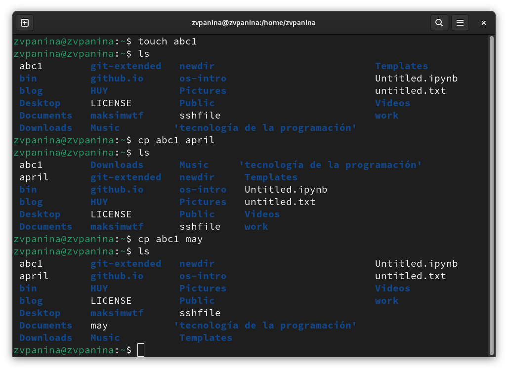{#fig:001 width=70%}

##

Создаю каталог monthly, копирую april и may в monthly, копирую monthly/may в monthly/june и проверяю содержимое monthly.

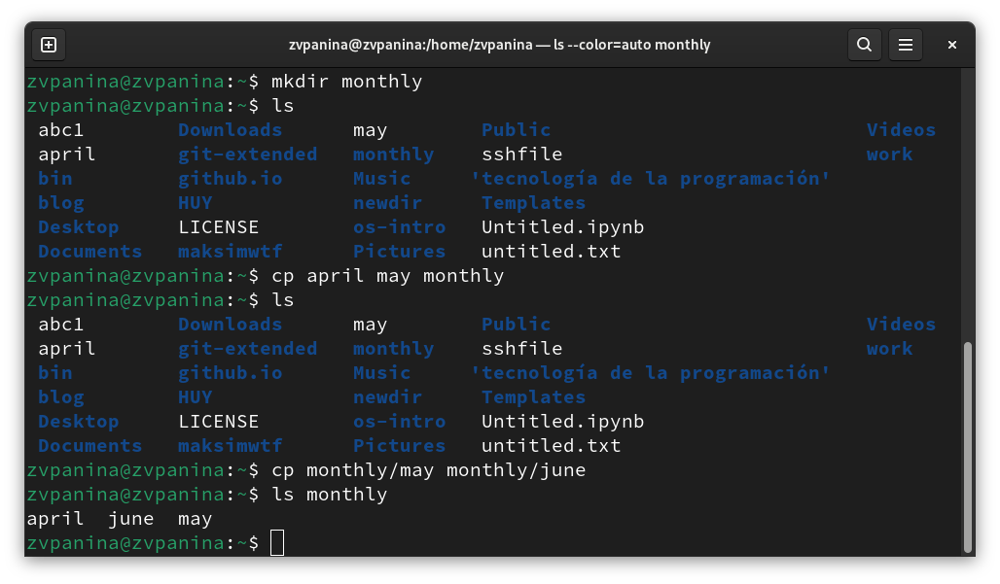{#fig:002 width=70%}

##

Создаю директорию monthly.00 и рекурсивно копирую в неё monthly, далее копирую monthly.00 в /tmp, проверяю содержимое /tmp.

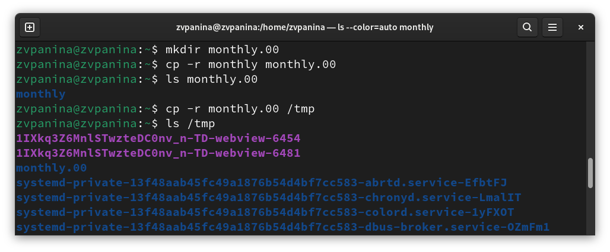{#fig:003 width=70%}

##

Переименовываю april в july и перемещаю его в monthly.00. Переименовываю monthly.00 в monthly.01, создаю директорию reports. Перемещаю директорию monthly.01 в reports и переименовываю её в monthly, проверяю.

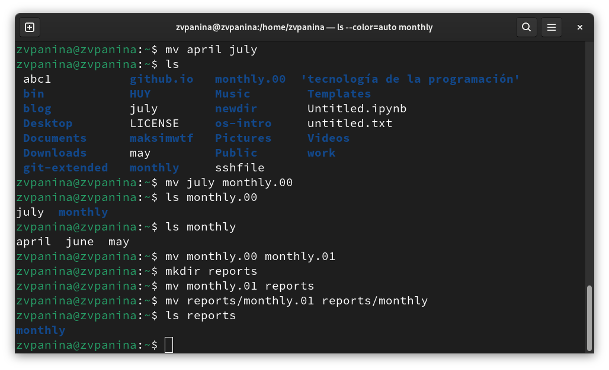{#fig:004 width=70%}

##

Создаю файл may, проверяю права доступа. Добавляю владельцу право на выполнение файла. Проверяю изменения, потом лишаю владельца права на выполнение, проверяю. Для каталога monthly меняю права доступа: лишаю участников группы и остальных права на чтение.

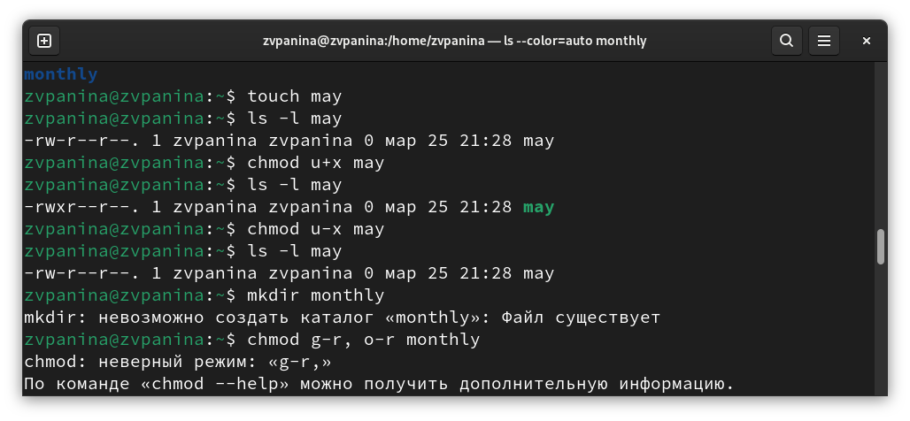{#fig:005 width=70%}

##

Проверяю права доступа для каталога monthly.

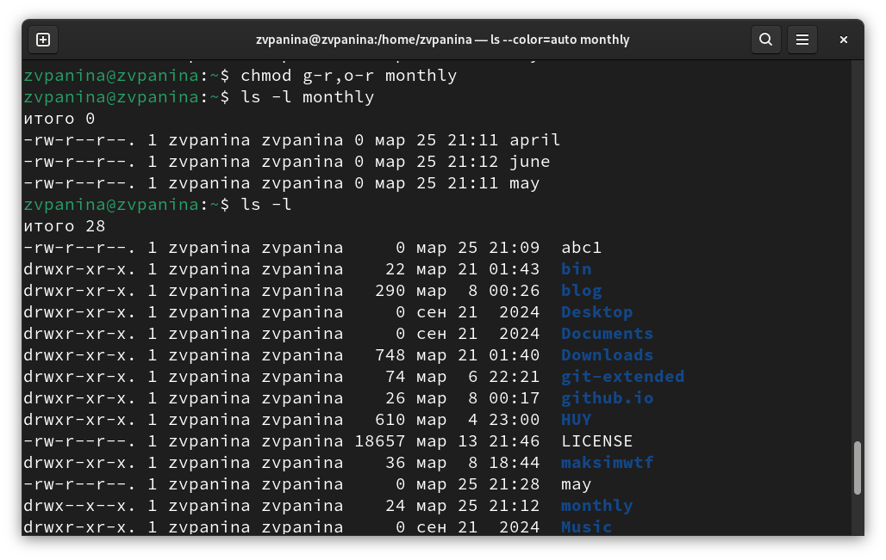{#fig:006 width=70%}

##

Создаю файл abc1, для него добавляю членам группы право на изменение файла, проверяю.

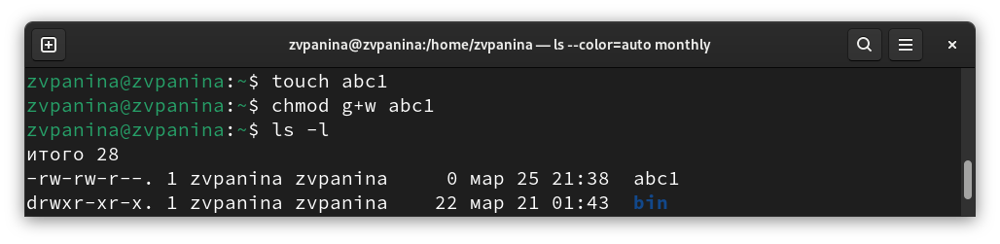{#fig:007 width=70%}

##

2. Копирую файл /usr/include/sys/io.h в домашний каталог и переименовываю его в equipment.

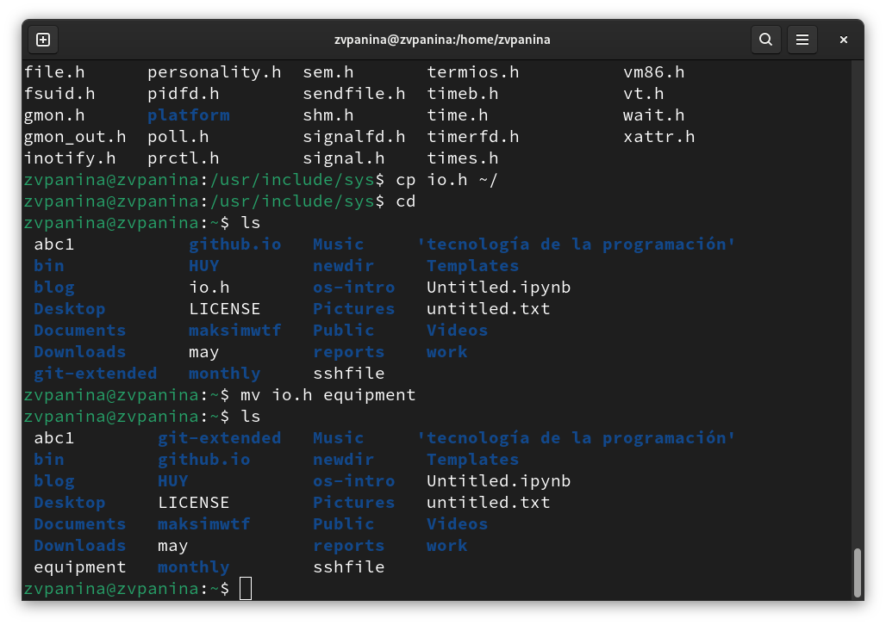{#fig:008 width=70%}

##

В домашнем каталоге создаю директорию ~/ski.plases. Перемещаю файл equipment в каталог ~/ski.plases. Переименовываю файл ~/ski.plases/equipment в ~/ski.plases/equiplist. Создаю в домашнем каталоге файл abc1 и копирую его в каталог ~/ski.plases, называю его equiplist2.

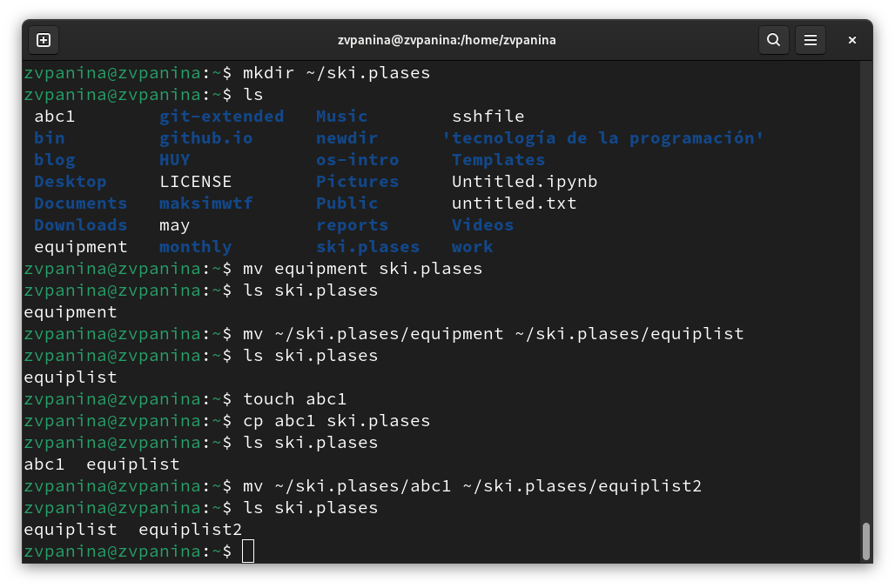{#fig:009 width=70%}

##

Создаю каталог с именем equipment в каталоге ~/ski.plases. Перемещаю файлы ~/ski.plases/equiplist и equiplist2 в каталог ~/ski.plases/equipment. Создаю и перемещаю каталог ~/newdir в каталог ~/ski.plases и называю его plans.

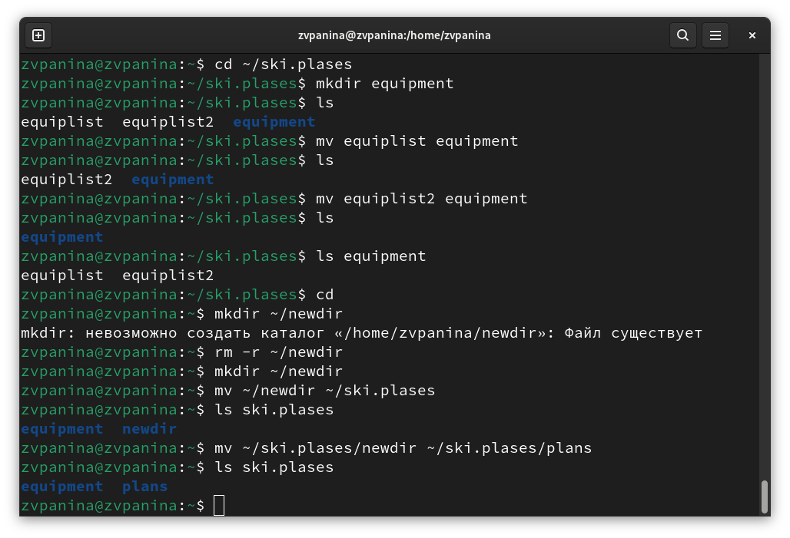{#fig:010 width=70%}

##

3. Создаю необходимые файлы и директории и изменяю права доступа для них.

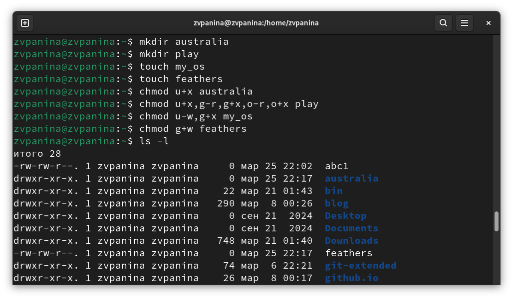{#fig:011 width=70%}

##

Для удобства я создала каталог vacation, куда переместила используемые файлы и каталоги, и проверила права доступа к ним. После этого я вернула их обратно в домашнюю папку и удалила каталог vacation.

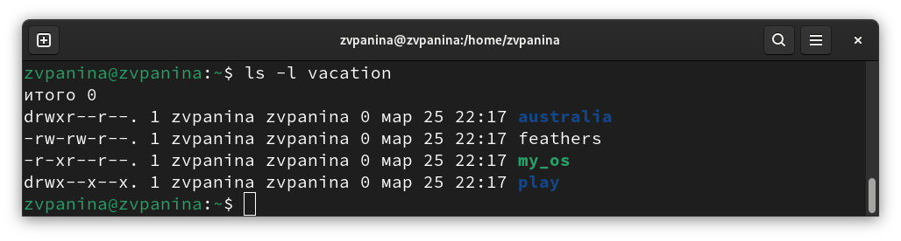{#fig:012 width=70%}

##

4. Перехожу в каталог /etc и вижу, что у меня нет файла password. Он называется passwd.

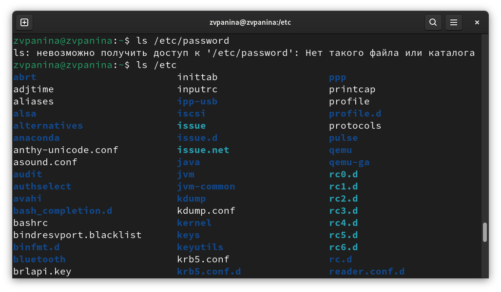{#fig:013 width=70%}

##

Просматриваю содержимое файла /etc/passwd.

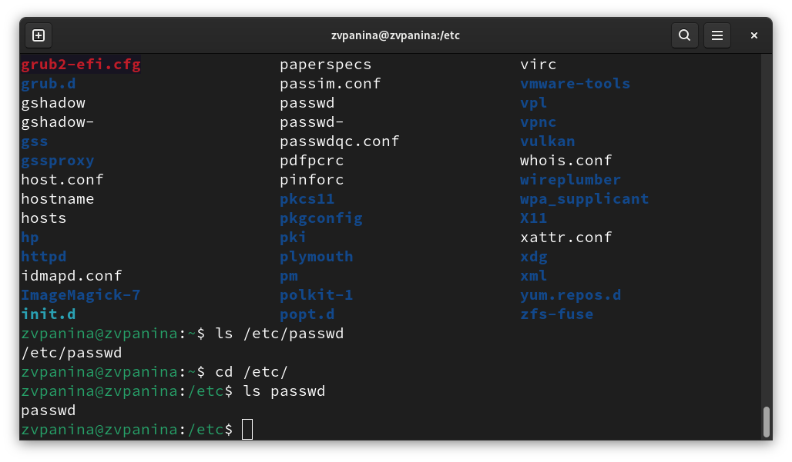{#fig:014 width=70%}

##

Копирую файл ~/feathers в файл ~/file.old. Перемещаю файл ~/file.old в каталог ~/play. Копирую каталог ~/play в каталог ~/fun, проверяю.

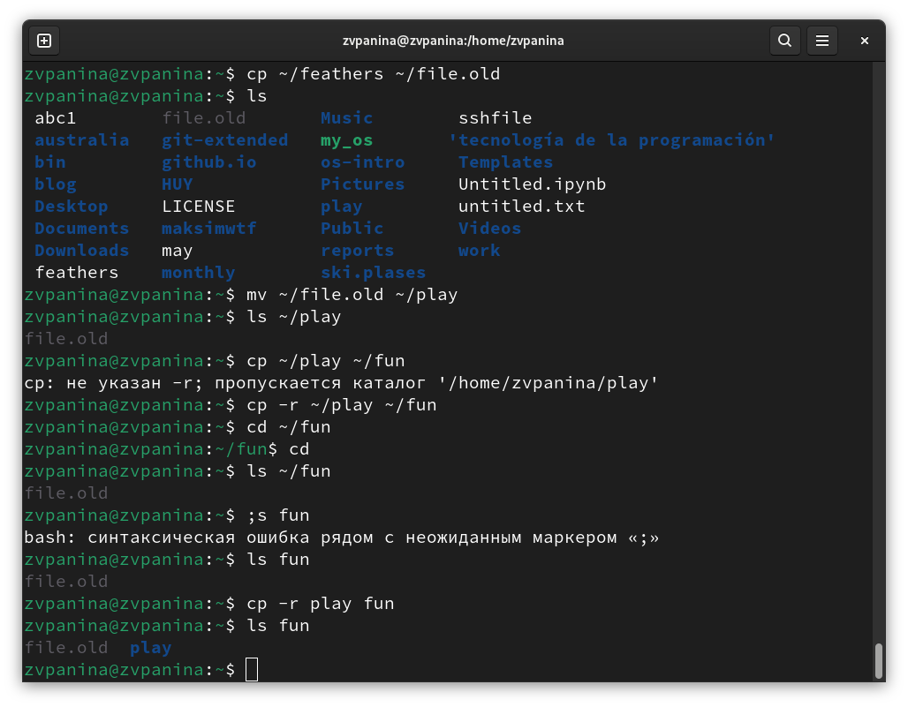{#fig:015 width=70%}

##

Перемещаю каталог ~/fun в каталог ~/play и называю его games. Лишаю владельца файла ~/feathers права на чтение. Пытаюсь просмотреть файл ~/feathers командой cat, мне отказано в доступе, т.к. я только что лишила себя права на чтение. Пытаюсь скопировать файл ~/feathers, например, в ~/play, мне отказано в доступе по той же причине. Снова даю владельцу файла ~/feathers право на чтение. Лишаю владельца каталога ~/play права на выполнение. Перехожу в каталог ~/play. Отказано в доступе, т.к. я лишила себя права на выполнение. Возвращаю владельцу каталога ~/play право на выполнение.

##

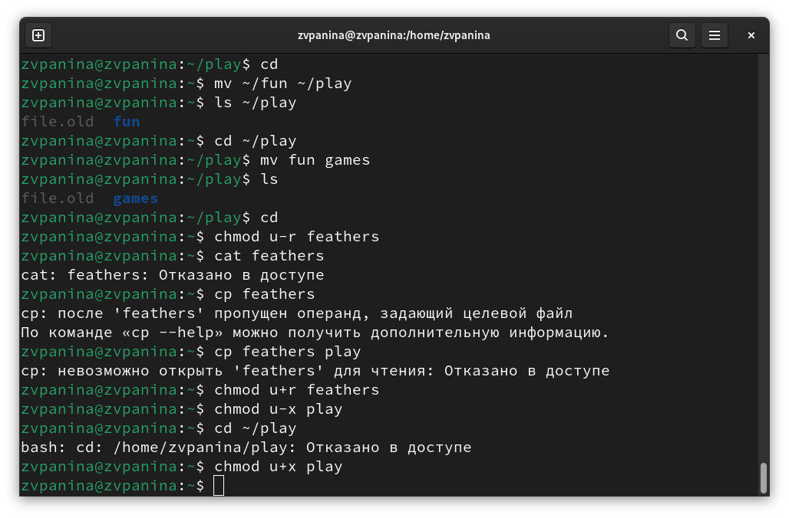{#fig:016 width=70%}

##

5. Читаю man по командам: 

### mount

Назначение: Подключение файловых систем к указанным точкам монтирования.
Ключевые опции:
- -t — тип файловой системы (ext4, ntfs, nfs).
- -o — дополнительные параметры (например, ro для только чтения);

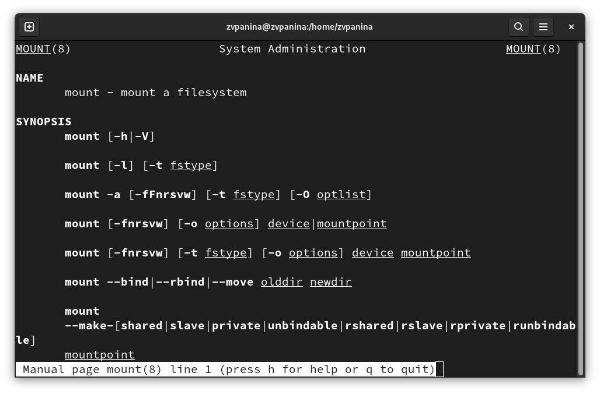{#fig:017 width=70%}

##

### fsck

Назначение: Проверка и исправление ошибок файловой системы. 
Ключевые опции:
- -y — автоматическое исправление ошибок.
- -f — принудительная проверка.
- -C — вывод прогресса;

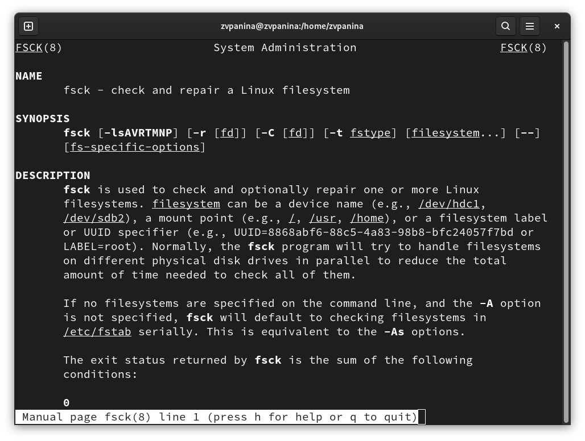{#fig:018 width=70%}

##

### kill

Назначение: Отправка сигналов процессам (по умолчанию — SIGTERM для завершения).
Ключевые сигналы:
- -9 (SIGKILL) — немедленное завершение.
- -15 (SIGTERM) — корректное завершение (по умолчанию).
- -1 (SIGHUP) — перезапуск процесса;

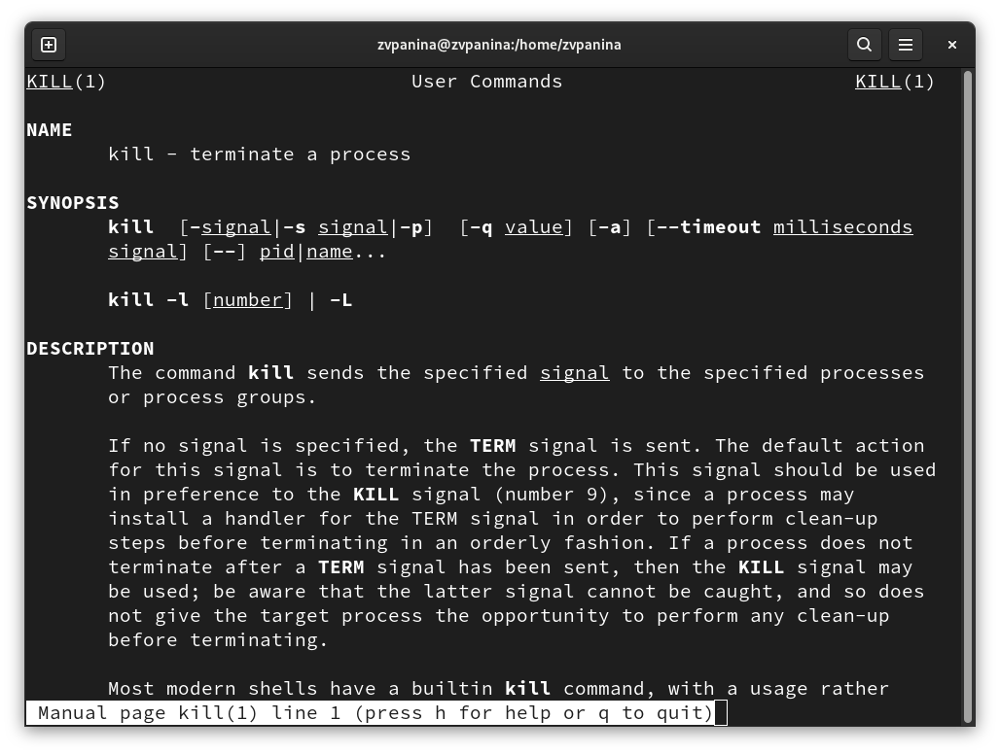{#fig:019 width=70%}

##

### mkfs

Назначение: Создание файловой системы на устройстве.
Ключевые опции:
- -t — тип файловой системы (ext4, xfs, vfat).
- -L — задает метку тома.

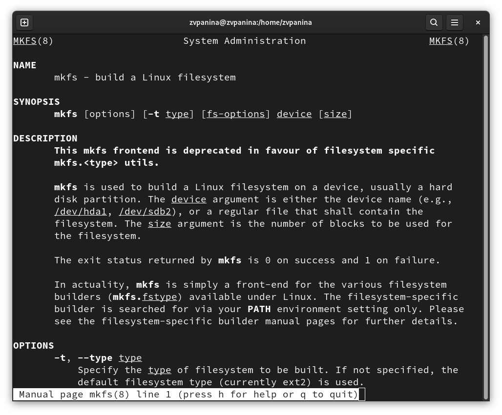{#fig:020 width=70%}

# Ответы на контрольные вопросы

1. Дайте характеристику каждой файловой системе, существующей на жёстком диске компьютера, на котором вы выполняли лабораторную работу.
- Ext2, Ext3, Ext4 или Extended Filesystem - это стандартная файловая система для Linux. Она была разработана еще для Minix. Она самая стабильная из всех существующих, кодовая база изменяется очень редко и эта файловая система содержит больше всего функций. Версия ext2 была разработана уже именно для Linux и получила много улучшений. В 2001 году вышла ext3, которая добавила еще больше стабильности благодаря использованию журналирования. В 2006 была выпущена версия ext4, которая используется во всех дистрибутивах Linux до сегодняшнего дня. В ней было внесено много улучшений, в том числе увеличен максимальный размер раздела до одного экзабайта. NTFS — это файловая система по умолчанию, используемая операционными системами на базе Windows NT, начиная с 1993 года с Windows NT 3.1 и вплоть до Windows 11 включительно. Она предлагает расширенные функции, такие как права доступа к файлам, шифрование, сжатие и ведение журнала.

##

2. Приведите общую структуру файловой системы и дайте характеристику каждой директории первого уровня этой структуры.

- / — root каталог. Содержит в себе всю иерархию системы;
- /bin — здесь находятся двоичные исполняемые файлы. Основные общие команды, хранящиеся отдельно от других программ в системе (прим.: pwd, ls, cat, ps);
- /boot — тут расположены файлы, используемые для загрузки системы (образ initrd, ядро vmlinuz);
- /dev — в данной директории располагаются файлы устройств (драйверов). С помощью этих файлов можно взаимодействовать с устройствами. К примеру, если это жесткий диск, можно подключить его к файловой системе. В файл принтера же можно написать напрямую и отправить задание на печать;
- /etc — в этой директории находятся файлы конфигураций программ. Эти файлы позволяют настраивать системы, сервисы, скрипты системных демонов;
- /home — каталог, аналогичный каталогу Users в Windows. Содержит домашние каталоги учетных записей пользователей (кроме root). При создании нового пользователя здесь 

##

создается одноименный каталог с аналогичным именем и хранит личные файлы этого пользователя;
- /lib — содержит системные библиотеки, с которыми работают программы и модули ядра;
- /lost+found — содержит файлы, восстановленные после сбоя работы системы. Система проведет проверку после сбоя и найденные файлы можно будет посмотреть в данном каталоге;
- /media — точка монтирования внешних носителей. Например, когда вы вставляете диск в дисковод, он будет автоматически смонтирован в директорию /media/cdrom;
- /mnt — точка временного монтирования. Файловые системы подключаемых устройств обычно монтируются в этот каталог для временного использования;
- /opt — тут расположены дополнительные (необязательные) приложения. Такие программы обычно не подчиняются принятой иерархии и хранят свои файлы в одном подкаталоге (бинарные, библиотеки, конфигурации);
- /proc — содержит файлы, хранящие информацию о запущенных процессах и о состоянии ядра ОС;

##

- /root — директория, которая содержит файлы и личные настройки суперпользователя;
- /run — содержит файлы состояния приложений. Например, PID-файлы или UNIX-сокеты;
- /sbin — аналогично /bin содержит бинарные файлы. Утилиты нужны для настройки и администрирования системы суперпользователем;
- /srv — содержит файлы сервисов, предоставляемых сервером (прим. FTP или Apache HTTP);
- /sys — содержит данные непосредственно о системе. Тут можно узнать информацию о ядре, драйверах и устройствах;
- /tmp — содержит временные файлы. Данные файлы доступны всем пользователям на чтение и запись. Стоит отметить, что данный каталог очищается при перезагрузке;
- /usr — содержит пользовательские приложения и утилиты второго уровня, используемые пользователями, а не системой. Содержимое доступно только для чтения (кроме root). Каталог имеет вторичную иерархию и похож на корневой;

##

- /var — содержит переменные файлы. Имеет подкаталоги, отвечающие за отдельные переменные. Например, логи будут храниться в /var/log, кэш в /var/cache, очереди заданий в /var/spool/ и так далее.
3. Какая операция должна быть выполнена, чтобы содержимое некоторой файловой системы было доступно операционной системе? 
- Монтирование тома.

4. Назовите основные причины нарушения целостности файловой системы. Как устранить повреждения файловой системы? 
- Отсутствие синхронизации между образом файловой системы в памяти и ее данными на диске в случае аварийного останова может привести к появлению следующих ошибок:
* Один блок адресуется несколькими mode (принадлежит нескольким файлам).

##

* Блок помечен как свободный, но в то же время занят (на него ссылается onode).
* Блок помечен как занятый, но в то же время свободен (ни один inode на него не ссылается).
* Неправильное число ссылок в inode (недостаток или избыток ссылающихся записей в каталогах).
* Несовпадение между размером файла и суммарным размером адресуемых inode блоков.
* Недопустимые адресуемые блоки (например, расположенные за пределами файловой системы).
* "Потерянные" файлы (правильные inode, на которые не ссылаются записи каталогов).
* Недопустимые или неразмещенные номера inode в записях каталогов.

##

5. Как создаётся файловая система?
- mkfs - позволяет создать файловую систему Linux.

6. Дайте характеристику командам для просмотра текстовых файлов.
- Cat - выводит содержимое файла на стандартное устройство вывода

7. Приведите основные возможности команды cp в Linux.
- cp – копирует или перемещает директорию, файлы.

##

8. Приведите основные возможности команды mv в Linux.
- mv - переименовать или переместить файл или директорию

9. Что такое права доступа? Как они могут быть изменены?
- Права доступа к файлу или каталогу можно изменить, воспользовавшись командой chmod. Сделать это может владелец файла (или каталога) или пользователь с правами администратора.

# Результаты

В ходе выполнения лабораторной работы я ознакомилась с файловой системой Linux, её структурой, именами и содержанием каталогов. Приобрела практические навыки по применению команд для работы с файлами и каталогами, по управлению процессами (и работами), по проверке использования диска и обслуживанию файловой системы.

# Список литературы{.unnumbered}

::: {#refs}
:::

