---
## Front matter
lang: ru-RU
title: Лабораторная работа №8
subtitle: Операционные системы
author:
  - Панина Ж. В.
institute:
  - Российский университет дружбы народов, Москва, Россия
date: 4 апреля 2025

## i18n babel
babel-lang: russian
babel-otherlangs: english

## Formatting pdf
toc: false
toc-title: Содержание
slide_level: 2
aspectratio: 169
section-titles: true
theme: metropolis
header-includes:
 - \metroset{progressbar=frametitle,sectionpage=progressbar,numbering=fraction}
---

# Информация

## Докладчик

:::::::::::::: {.columns align=center}
::: {.column width="70%"}

  * Панина Жанна Валерьевна
  * НКАбд-02-24, студ. билет № 1132246710
  * студент направления "Компьютерные и информационные науки"
  * Российский университет дружбы народов
  * [1132246710@pfur.ru](mailto:1132246710@pfur.ru)
  * <https://github.com/zvpanina/study_2024-2025_os-intro>

:::
::::::::::::::

# Вводная часть

## Актуальность

Современные операционные системы предоставляют мощные инструменты для поиска файлов, обработки текстовых данных, управления процессами и мониторинга состояния файловых систем. Умение эффективно использовать эти инструменты позволяет администраторам и пользователям оптимизировать работу системы, ускорять поиск информации, а также повышать уровень безопасности и надежности данных. В условиях роста объемов данных и увеличения сложности информационных систем, навыки работы с файловыми системами и процессами являются необходимыми для эффективного управления ресурсами.

## Объект и предмет исследования

### Объект исследования:

Операционная система и ее встроенные инструменты для управления файлами, процессами и дисковым пространством.

### Предмет исследования:

Методы и утилиты для поиска файлов, фильтрации текстовых данных, управления процессами и проверки состояния дисковой системы в операционных системах семейства Unix/Linux.

## Цели и задачи

Цель работы - ознакомление с инструментами поиска файлов и фильтрации текстовых данных. Приобретение практических навыков: по управлению процессами (и заданиями), по проверке использования диска и обслуживанию файловых систем.

### Задачи:

1. Осуществите вход в систему, используя соответствующее имя пользователя.
2. Запишите в файл file.txt названия файлов, содержащихся в каталоге /etc. Допишите в этот же файл названия файлов, содержащихся в вашем домашнем каталоге.
3. Выведите имена всех файлов из file.txt, имеющих расширение .conf, после чего запишите их в новый текстовой файл conf.txt.
4. Определите, какие файлы в вашем домашнем каталоге имеют имена, начинавшиеся с символа c? Предложите несколько вариантов, как это сделать.
5. Выведите на экран (по странично) имена файлов из каталога /etc, начинающиеся с символа h.

##

6. Запустите в фоновом режиме процесс, который будет записывать в файл ~/logfile файлы, имена которых начинаются с log.
7. Удалите файл ~/logfile.
8. Запустите из консоли в фоновом режиме редактор gedit.
9. Определите идентификатор процесса gedit, используя команду ps, конвейер и фильтр grep. Как ещё можно определить идентификатор процесса?
10. Прочтите справку (man) команды kill, после чего используйте её для завершения процесса gedit.
11. Выполните команды df и du, предварительно получив более подробную информацию об этих командах, с помощью команды man.
12. Воспользовавшись справкой команды find, выведите имена всех директорий, имеющихся в вашем домашнем каталоге.

## Материалы и методы

### Материалы:

Операционная система (Linux, Fedora), документация к системным утилитам, виртуальная среда для тестирования (VirtualBox).

### Методы:

- Использование команд find, grep для поиска и обработки текстовых данных.
- Управление процессами с помощью команд ps, kill.
- Мониторинг использования диска с помощью df, du.
- Практическое тестирование в виртуальной среде для анализа работы инструментов.

# Теоретическое введение

В системе по умолчанию открыто три специальных потока:
- stdin — стандартный поток ввода (по умолчанию: клавиатура), файловый дескриптор 0;
- stdout — стандартный поток вывода (по умолчанию: консоль), файловый дескриптор 1;
- stderr — стандартный поток вывод сообщений об ошибках (по умолчанию: консоль), файловый дескриптор 2.
Большинство используемых в консоли команд и программ записывают результаты своей работы в стандартный поток вывода stdout. Например, команда ls выводит в стандартный поток вывода (консоль) список файлов в текущей директории. Потоки вывода и ввода можно перенаправлять на другие файлы или устройства. Проще всего это делается с помощью символов >, >>, <, <<. Конвейер (pipe) служит для объединения простых команд или утилит в цепочки, в которых результат работы предыдущей команды передаётся последующей. Команда find используется для поиска и отображения на экран имён файлов, соответствующих заданной строке символов.

# Выполнение лабораторной работы

1. Записываю в файл file.txt названия файлов, содержащихся в каталоге /etc.

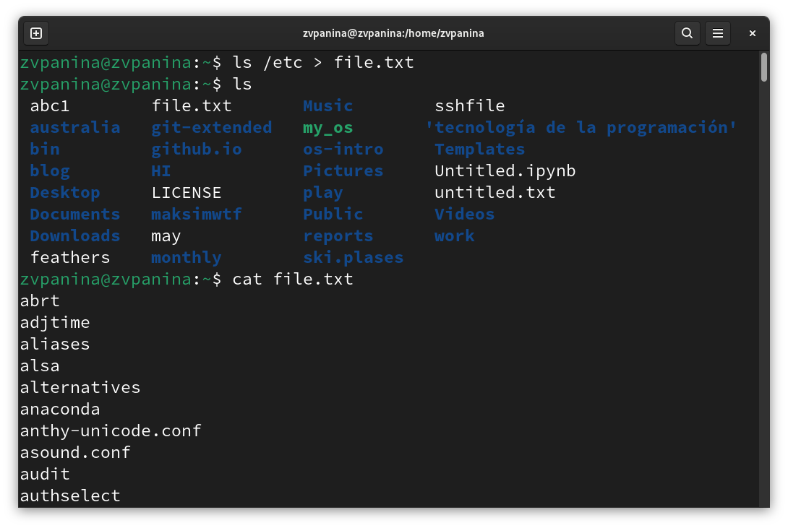{#fig:001 width=70%}

##

Дописываю в этот же файл названия файлов, содержащихся в моём домашнем каталоге.

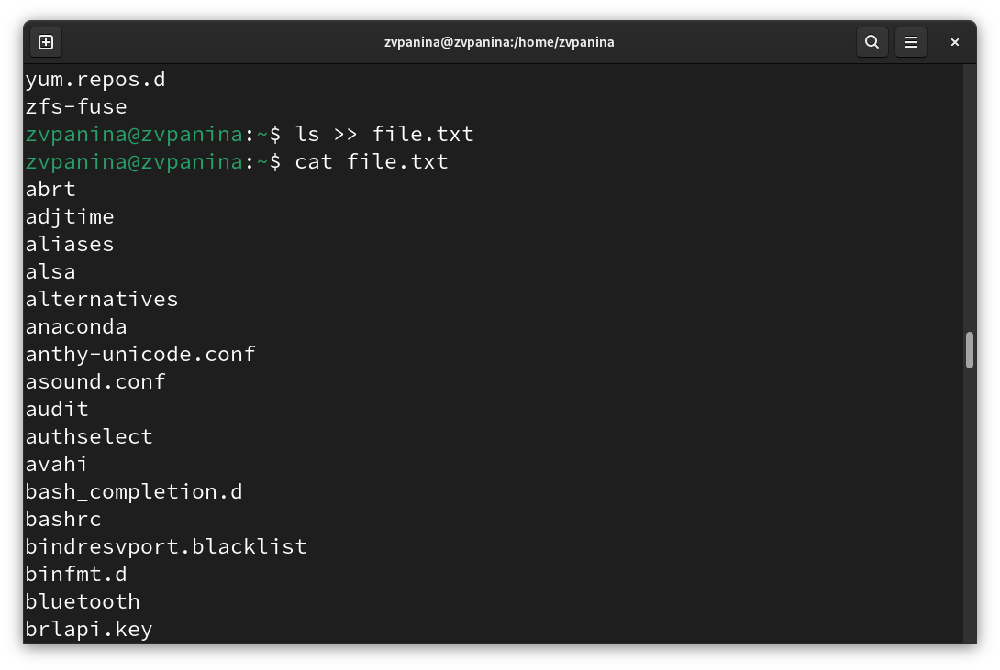{#fig:002 width=70%}

##

2. Вывожу имена всех файлов из file.txt, имеющих расширение .conf.

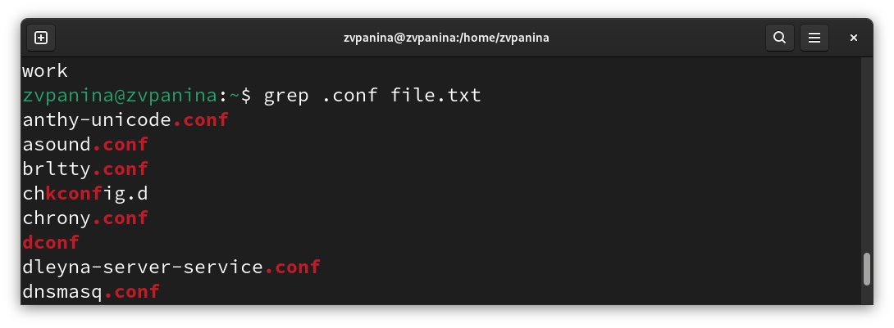{#fig:003 width=70%}

##

Записываю их в новый текстовый файл conf.txt.

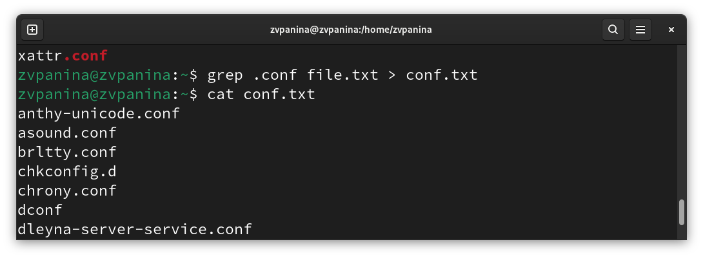{#fig:004 width=70%}

##

3. Определяю, какие файлы в моём домашнем каталоге имеют имена, начинавшиеся с символа c.

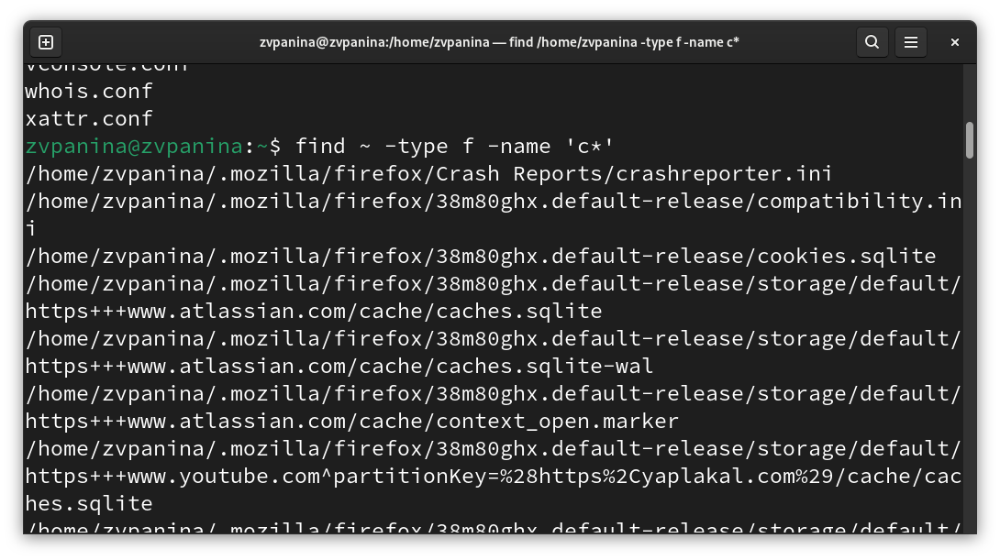{#fig:005 width=70%}

##

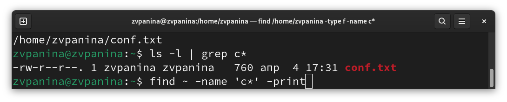{#fig:006 width=70%}

##

4. Вывожу на экран имена файлов из каталога /etc, начинающиеся с символа h.

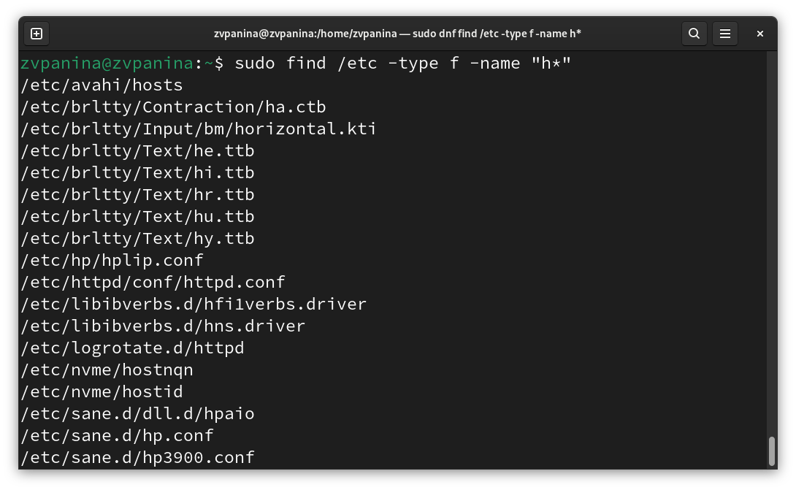{#fig:007 width=70%}

##

5. Запускаю в фоновом режиме процесс, который будет записывать в файл ~/logfile.txt файлы, имена которых начинаются с log.

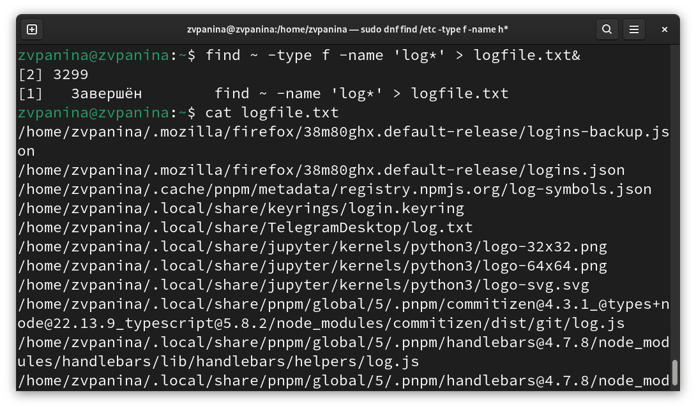{#fig:008 width=70%}

##

6. Удаляю файл ~/logfile.txt.

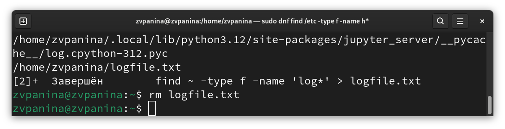{#fig:009 width=70%}

##

7. Запускаю из консоли в фоновом режиме редактор gedit. Определяю идентификатор процесса gedit, используя команду ps, конвейер и фильтр grep. Прочитав справку (man) команды kill, использую её для завершения процесса gedit.

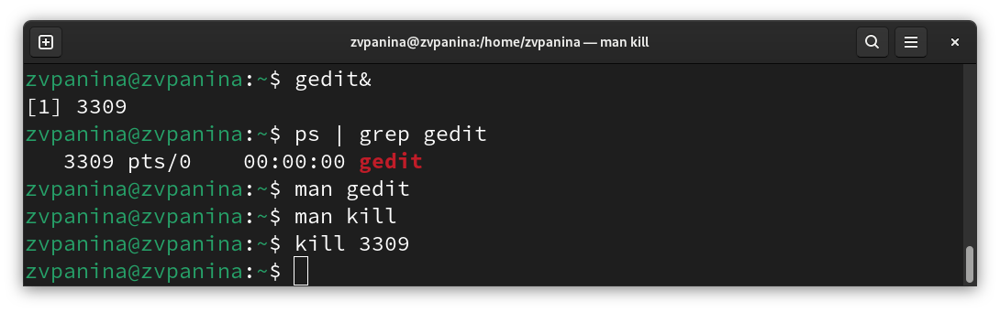{#fig:010 width=70%}

##

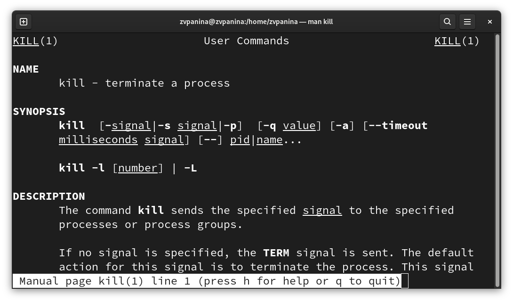{#fig:011 width=70%}

##

8. Получаю подробную информацию о командах df и du.

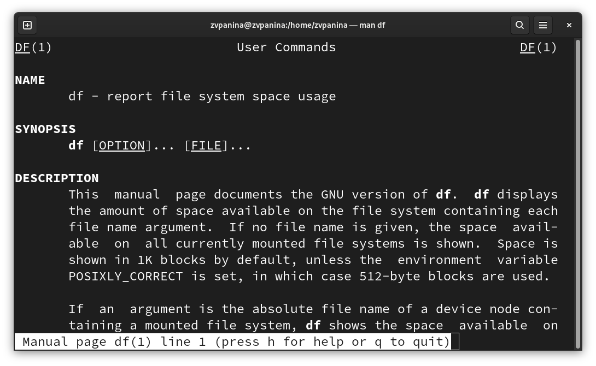{#fig:012 width=70%}

##

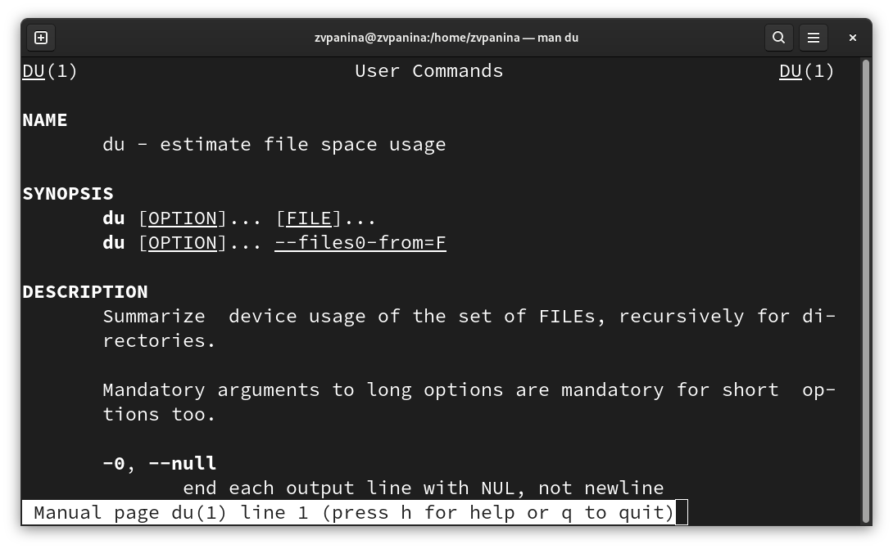{#fig:013 width=70%}

##

Выполняю команду df.

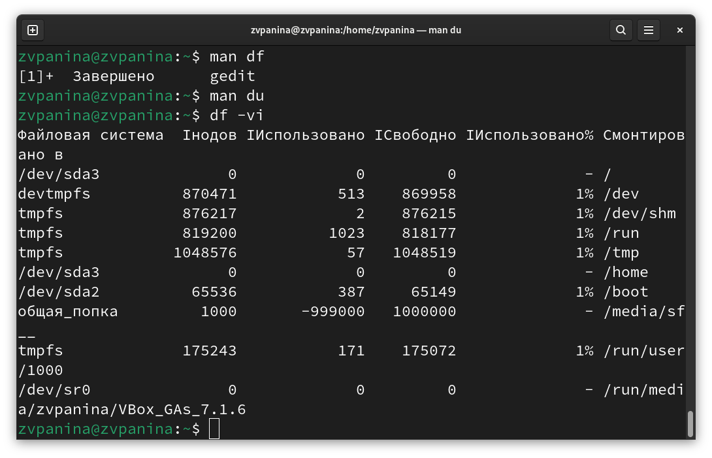{#fig:014 width=70%}

##

Выполняю команду du.

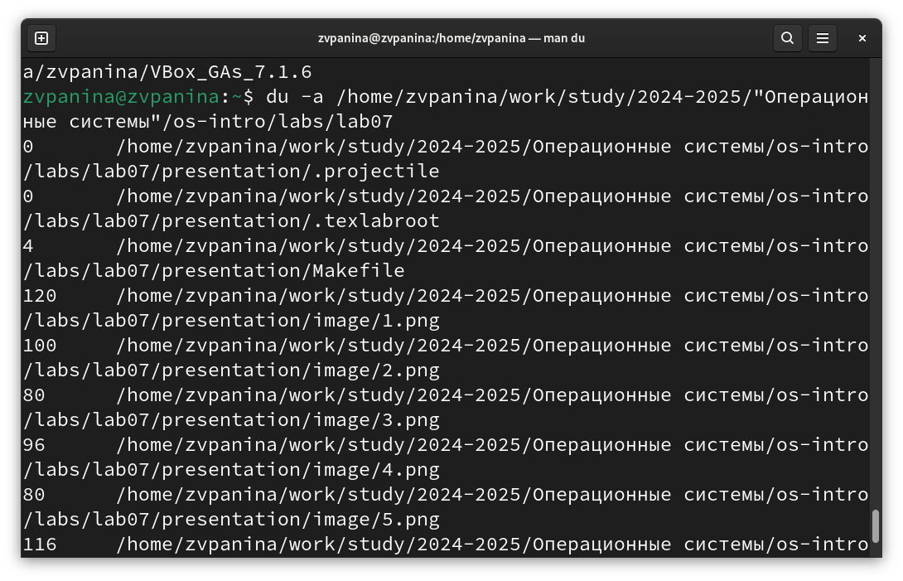{#fig:015 width=70%}

##

9. Воспользовавшись справкой команды find, вывожу имена всех директорий, имеющихся в моём домашнем каталоге.

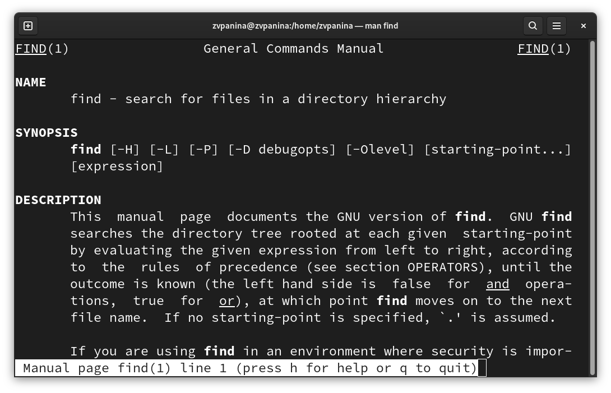{#fig:016 width=70%}

##

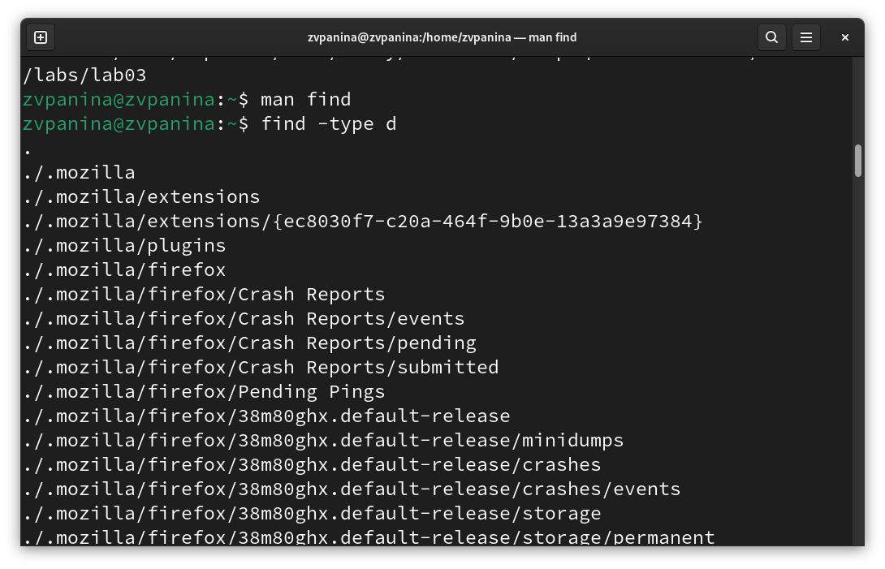{#fig:017 width=70%}

# Ответы на контрольные вопросы

1. Какие потоки ввода вывода вы знаете?
- В системе по умолчанию открыто три специальных потока: 
* stdin — стандартный поток ввода (по умолчанию: клавиатура), файловый дескриптор 0;
* stdout — стандартный поток вывода (по умолчанию: консоль), файловый дескриптор 1; 
* stderr — стандартный поток вывод сообщений об ошибках (по умолчанию: консоль), файловый дескриптор 2.

##

2. Объясните разницу между операцией > и >>.
- Этот знак > - перенаправление ввода/вывода, а >> - перенаправление в режиме добавления.

3. Что такое конвейер?
- Конвейер (pipe) служит для объединения простых команд или утилит в цепочки, в которых результат работы предыдущей команды передаётся последующей.

4. Что такое процесс? Чем это понятие отличается от программы?
- Главное отличие между программой и процессом заключается в том, что программа - это набор инструкций, который позволяет ЦПУ выполнять определенную задачу, в то время как процесс - это исполняемая программа.

##

5. Что такое PID и GID?
- PPID - (parent process ID) идентификатор родительского процесса. Процесс может порождать и другие процессы. UID, GID - реальные идентификаторы пользователя и его группы, запустившего данный процесс.

6. Что такое задачи и какая команда позволяет ими управлять?
- Запущенные фоном программы называются задачами (jobs). Ими можно управлять с помощью команды jobs, которая выводит список запущенных в данный момент задач.

##

7. Найдите информацию об утилитах top и htop. Каковы их функции?
- Команда htop похожа на команду top по выполняемой функции: они обе показывают информацию о процессах в реальном времени, выводят данные о потреблении системных ресурсов и позволяют искать, останавливать и управлять процессами. У обеих команд есть свои преимущества. Например, в программе htop реализован очень удобный поиск по процессам, а также их фильтрация. В команде top это не так удобно — нужно знать кнопку для вывода функции поиска. Зато в top можно разделять область окна и выводить информацию о процессах в соответствии с разными настройками. В целом top намного более гибкая в настройке отображения процессов.

##

8. Назовите и дайте характеристику команде поиска файлов. Приведите примеры использования этой команды.
- Команда find - это одна из наиболее важных и часто используемых утилит системы Linux. Это команда для поиска файлов и каталогов на основе специальных условий. Ее можно использовать в различных обстоятельствах, например, для поиска файлов по разрешениям, владельцам, группам, типу, размеру и другим подобным критериям.
Утилита find предустановлена по умолчанию во всех Linux дистрибутивах, поэтому вам не нужно будет устанавливать никаких дополнительных пакетов. Это очень важная находка для тех, кто хочет использовать командную строку наиболее эффективно.
Команда find имеет такой синтаксис: find [папка] [параметры] критерий шаблон [действие] Пример: find /etc -name "p*" -print

##

9. Можно ли по контексту (содержанию) найти файл? Если да, то как?
- find / -type f -exec grep -H 'текстДляПоиска' {} ;

10. Как определить объем свободной памяти на жёстком диске?
- С помощью команды df -h.

11. Как определить объем вашего домашнего каталога?
- С помощью команды du -s.

12. Как удалить зависший процесс?
- С помощью команды kill% номер задачи.

# Результаты

В ходе выполнения лабораторной работы я ознакомилась с инструментами поиска файлов и фильтрации текстовых данных. Приобрела практические навыки: по управлению процессами (и заданиями), по
проверке использования диска и обслуживанию файловых систем.
