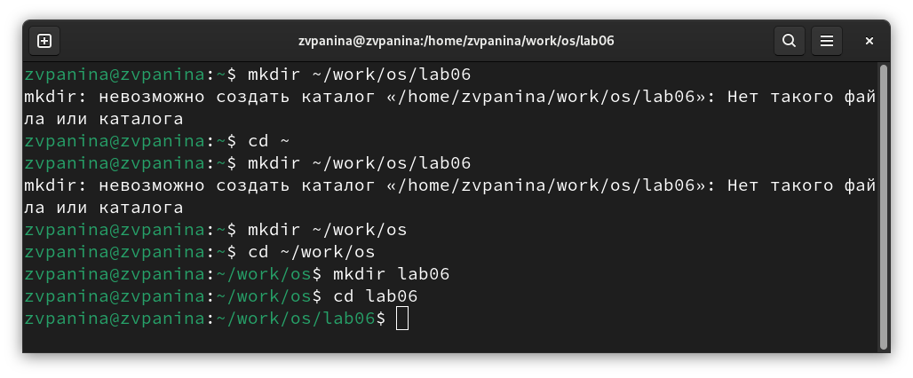
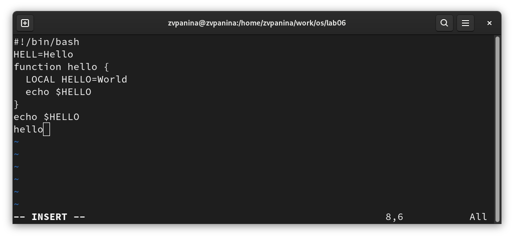
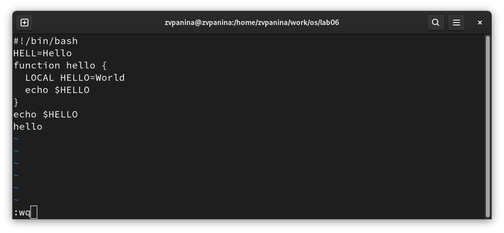
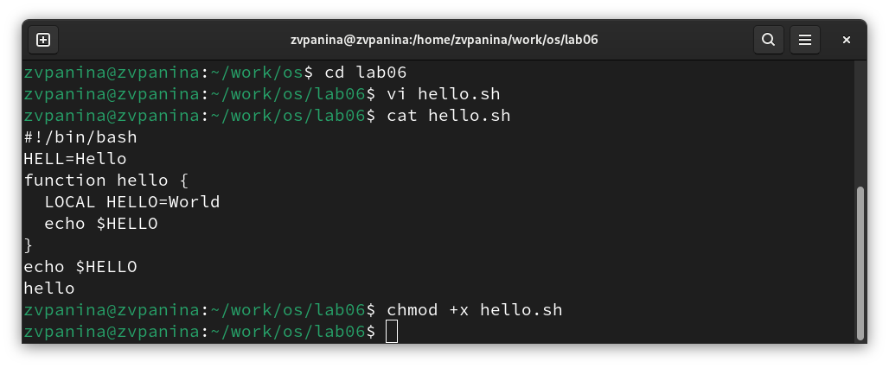
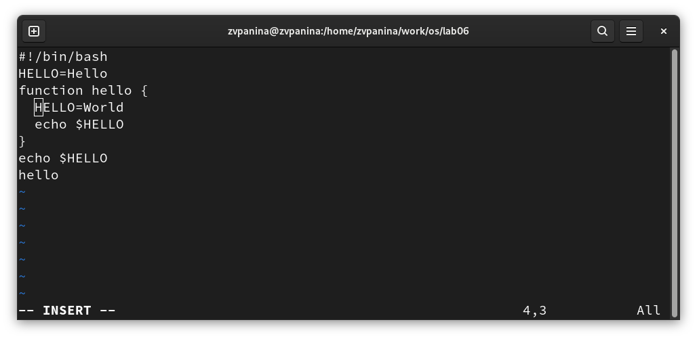
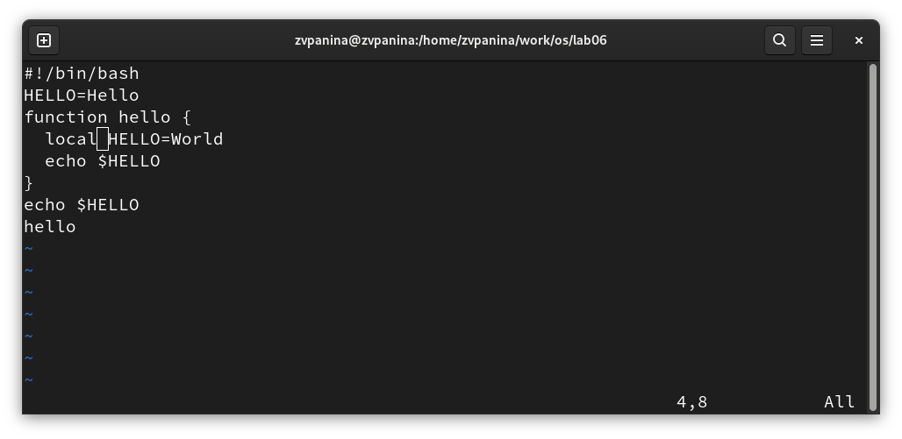
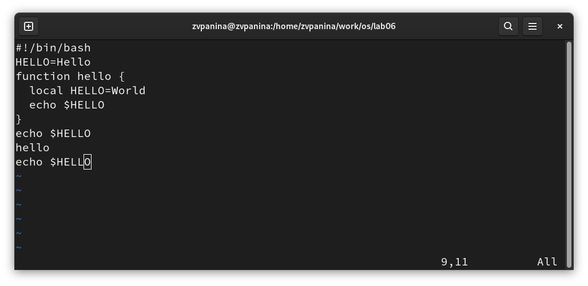
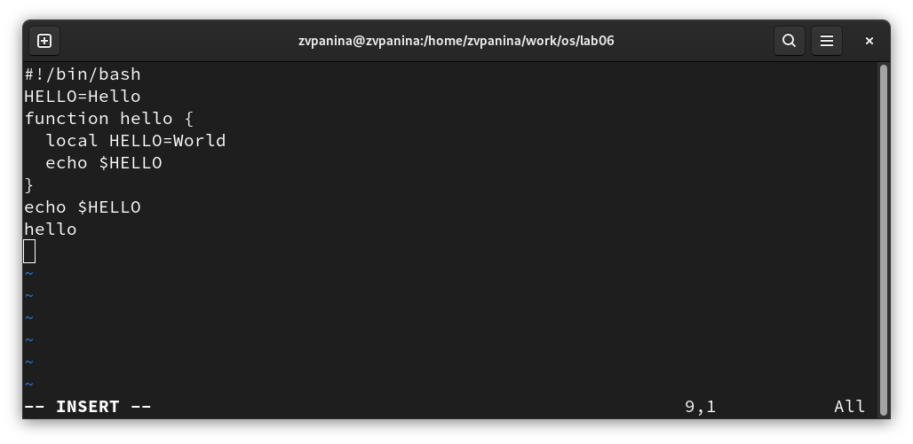
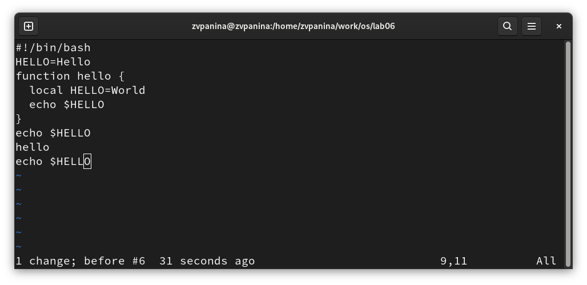
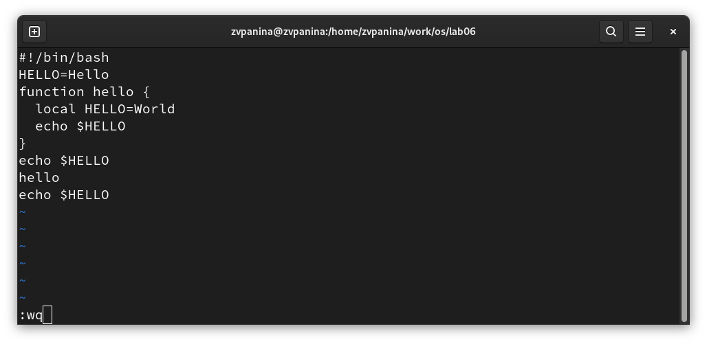

---
## Front matter
lang: ru-RU
title: Лабораторная работа №10
subtitle: Операционные системы
author:
  - Панина Ж. В.
institute:
  - Российский университет дружбы народов, Москва, Россия
date: 18 апреля 2025


## i18n babel
babel-lang: russian
babel-otherlangs: english

## Formatting pdf
toc: false
toc-title: Содержание
slide_level: 2
aspectratio: 169
section-titles: true
theme: metropolis
header-includes:
 - \metroset{progressbar=frametitle,sectionpage=progressbar,numbering=fraction}
---

# Информация

## Докладчик

:::::::::::::: {.columns align=center}
::: {.column width="70%"}

  * Панина Жанна Валерьевна
  * НКАбд-02-24, студ. билет № 1132246710
  * студент направления "Компьютерные и информационные науки"
  * Российский университет дружбы народов
  * [1132246710@pfur.ru](mailto:1132246710@pfur.ru)
  * <https://github.com/zvpanina/study_2024-2025_os-intro>

:::
::::::::::::::

# Вводная часть

## Актуальность

В современном мире операционные системы на базе Linux широко применяются в серверных решениях, системах администрирования и разработке программного обеспечения. Одним из важнейших инструментов взаимодействия с текстовой информацией в терминальной среде является текстовый редактор vi. Несмотря на его минималистичный интерфейс, vi остается мощным и универсальным средством для редактирования конфигурационных файлов, написания скриптов и других задач. Освоение vi является неотъемлемой частью подготовки квалифицированных специалистов в области информационных технологий.

## Объект и предмет исследования

### Объект исследования:

Операционная система Fedora Linux.

### Предмет исследования:

Функциональные возможности и особенности использования текстового редактора vi в терминальной среде Linux.

## Цели и задачи

Цель работы - познакомиться с операционной системой Linux. Получить практические навыки работы с редактором vi, установленным по умолчанию практически во всех дистрибутивах.

### Задачи:

#### Задание 1.Создание нового файла с использованием vi
1. Создайте каталог с именем ~/work/os/lab06.
2. Перейдите во вновь созданный каталог.
3. Вызовите vi и создайте файл hello.sh
4. Нажмите клавишу i и вводите следующий текст.
```
 #!/bin/bash
 HELL=Hello
 function hello {
 LOCAL HELLO=World
 echo $HELLO
 }
 echo $HELLO
 hello
 
```

##

5. Нажмите клавишу Esc для перехода в командный режим после завершения ввода текста.
6. Нажмите : для перехода в режим последней строки и внизу вашего экрана появится приглашение в виде двоеточия.
7. Нажмите w (записать) и q (выйти), а затем нажмите клавишу Enter для сохранения вашего текста и завершения работы.
8. Сделайте файл исполняемым
#### Задание 2. Редактирование существующего файла
1. Вызовите vi на редактирование файла vi ~/work/os/lab06/hello.sh
2. Установите курсор в конец слова HELL второй строки.
3. Перейдите в режим вставки и замените на HELLO. Нажмите Esc для возврата в командный режим.

##

4. Установите курсор на четвертую строку и сотрите слово LOCAL.
5. Перейдите в режим вставки и наберите следующий текст: local, нажмите Esc для возврата в командный режим.
6. Установите курсор на последней строке файла. Вставьте после неё строку, содержащую следующий текст: echo $HELLO.
7. Нажмите Esc для перехода в командный режим.
8. Удалите последнюю строку.
9. Введите команду отмены изменений u для отмены последней команды.
10. Введите символ : для перехода в режим последней строки. Запишите произведённые изменения и выйдите из vi.

## Материалы и методы

### Материалы:

- дистрибутив Fedora Linux, установленный на виртуальную машину в среде VirtualBox;
- встроенный в систему текстовый редактор vi

### Методы:

- практическое освоение команд и режимов работы vi;
- редактирование конфигурационных и текстовых файлов;
- анализ поведения редактора при различных действиях

# Теоретическое введение

В большинстве дистрибутивов Linux в качестве текстового редактора по умолчанию
устанавливается интерактивный экранный редактор vi (Visual display editor).
Редактор vi имеет три режима работы:
- командный режим — предназначен для ввода команд редактирования и навигации по редактируемому файлу;
- режим вставки — предназначен для ввода содержания редактируемого файла;
- режим последней (или командной) строки — используется для записи изменений в файл и выхода из редактора.

##

Для вызова редактора vi необходимо указать команду vi и имя редактируемого файла: vi <имя_файла>
При этом в случае отсутствия файла с указанным именем будет создан такой файл. Переход в командный режим осуществляется нажатием клавиши Esc . Для выхода из редактора vi необходимо перейти в режим последней строки: находясь в командном режиме, нажать Shift-; (по сути символ : — двоеточие), затем:
- набрать символы wq, если перед выходом из редактора требуется записать изменения в файл;
- набрать символ q (или q!), если требуется выйти из редактора без сохранения

# Выполнение лабораторной работы

1. Создаю каталог с именем ~/work/os/lab06, перехожу в него, вызываю vi и создаю файл hello.sh.

{#fig:001 width=70%}

##

2. Нажимаю клавишу i и ввожу следующий текст.

{#fig:002 width=70%}

##

3. Нажимаю клавишу Esc для перехода в командный режим после завершения ввода текста.

{#fig:003 width=70%}

##

4. Нажимаю : для перехода в режим последней строки и внизу экрана появляется приглашение в виде двоеточия.

{#fig:004 width=70%}

##

5. Нажимаю w (записать) и q (выйти), а затем нажимаю клавишу Enter для сохранения текста и завершения работы.

{#fig:005 width=70%}

##

6. Делаю файл исполняемым.

{#fig:006 width=70%}

##

7. Вызываю vi на редактирование файла vi ~/work/os/lab06/hello.sh, устанавливаю курсор в конец слова HELL второй строки. Перехожу в режим вставки и заменяю на HELLO.

{#fig:007 width=70%}

##

8. Устанавливаю курсор на четвертую строку и стираю слово LOCAL.

{#fig:008 width=70%}

##

9. Перехожу в режим вставки и набираю следующий текст: local, нажимаю Esc для возврата в командный режим.

{#fig:009 width=70%}

##

10. Устанавливаю курсор на последней строке файла. Вставляю после неё строку, содержащую следующий текст: echo $HELLO. Нажимаю Esc для перехода в командный режим.

{#fig:010 width=70%}

##

11. Удаляю последнюю строку.

{#fig:011 width=70%}

##

12. Ввожу команду отмены изменений u для отмены последней команды.

{#fig:012 width=70%}

##

13. Ввожу символ : для перехода в режим последней строки. Записываю произведённые изменения и выхожу из vi.

{#fig:013 width=70%}

# Ответы на контрольные вопросы

1. Дайте краткую характеристику режимам работы редактора vi.
- командный режим — предназначен для ввода команд редактирования и навигации по редактируемому файлу;
- режим вставки — предназначен для ввода содержания редактируемого файла;
- режим последней (или командной) строки — используется для записи изменений в файл и выхода из редактора.

2. Как выйти из редактора, не сохраняя произведённые изменения?
- Можно нажимать символ q (или q!), если требуется выйти из редактора без сохранения.

##

3. Назовите и дайте краткую характеристику командам позиционирования.
- 0 (ноль) — переход в начало строки;
- $ — переход в конец строки;
- G — переход в конец файла;
- n G — переход на строку с номером n.

4. Что для редактора vi является словом?
- Редактор vi предполагает, что слово - это строка символов, которая может включать в себя буквы, цифры и символы подчеркивания.

5. Каким образом из любого места редактируемого файла перейти в начало (конец) файла?
- С помощью G — переход в конец файла

##

6. Назовите и дайте краткую характеристику основным группам команд редактирования.
- Вставка текста – а — вставить текст после курсора; – А — вставить текст в конец строки; – i — вставить текст перед курсором; – n i — вставить текст n раз; – I — вставить текст в начало строки.
- Вставка строки – о — вставить строку под курсором; – О — вставить строку над курсором.
- Удаление текста – x — удалить один символ в буфер; – d w — удалить одно слово в буфер; – d $ — удалить в буфер текст от курсора до конца строки; – d 0 — удалить в буфер текст от начала строки до позиции курсора; – d d — удалить в буфер одну строку; – n d d — удалить в буфер n строк.
- Отмена и повтор произведённых изменений – u — отменить последнее изменение; – . — повторить последнее изменение.
- Копирование текста в буфер – Y — скопировать строку в буфер; – n Y — скопировать n строк в буфер; – y w — скопировать слово в буфер.
- Вставка текста из буфера – p — вставить текст из буфера после курсора; – P — вставить текст из буфера перед курсором.

##

- Замена текста – c w — заменить слово; – n c w — заменить n слов; – c $ — заменить текст от курсора до конца строки; – r — заменить слово; – R — заменить текст.
- Поиск текста – / текст — произвести поиск вперёд по тексту указанной строки символов текст; – ? текст — произвести поиск назад по тексту указанной строки символов текст.

7. Необходимо заполнить строку символами $. Каковы ваши действия?
- Перейти в режим вставки.

8. Как отменить некорректное действие, связанное с процессом редактирования?
- С помощью u — отменить последнее изменение

9. Назовите и дайте характеристику основным группам команд режима последней строки.
- Режим последней строки — используется для записи изменений в файл и выхода из редактора.

##

10. Как определить, не перемещая курсора, позицию, в которой заканчивается строка?
- $ — переход в конец строки

11. Выполните анализ опций редактора vi (сколько их, как узнать их назначение и т.д.).
Опции редактора vi позволяют настроить рабочую среду. Для задания опций используется команда set (в режиме последней строки): – : set all — вывести полный список опций; – : set nu — вывести номера строк; – : set list — вывести невидимые символы; – : set ic — не учитывать при поиске, является ли символ прописным или строчным.

12. Как определить режим работы редактора vi?
- В редакторе vi есть два основных режима: командный режим и режим вставки. По умолчанию работа начинается в командном режиме. В режиме вставки клавиатура используется для набора текста. Для выхода в командный режим используется клавиша Esc или комбинация Ctrl + c .

##

13. Переключение между режимами 
- Esc для выхода в командный. 
- i, a, o для входа в режим вставки. 
- R для режима замены. 
- : для последовательного режима.

# Результаты

В ходе выполнения лабораторной работы я получила практические навыки работы с редактором vi, установленным по умолчанию практически во всех дистрибутивах.
