---
## Front matter
lang: ru-RU
title: Лабораторная работа №11
subtitle: Операционные системы
author:
  - Панина Ж. В.
institute:
  - Российский университет дружбы народов, Москва, Россия
date: 24 апреля 2025


## i18n babel
babel-lang: russian
babel-otherlangs: english

## Formatting pdf
toc: false
toc-title: Содержание
slide_level: 2
aspectratio: 169
section-titles: true
theme: metropolis
header-includes:
 - \metroset{progressbar=frametitle,sectionpage=progressbar,numbering=fraction}
---

# Информация

## Докладчик

:::::::::::::: {.columns align=center}
::: {.column width="70%"}

  * Панина Жанна Валерьевна
  * НКАбд-02-24, студ. билет № 1132246710
  * студент направления "Компьютерные и информационные науки"
  * Российский университет дружбы народов
  * [1132246710@pfur.ru](mailto:1132246710@pfur.ru)
  * <https://github.com/zvpanina/study_2024-2025_os-intro>

:::
::::::::::::::

# Вводная часть

## Актуальность

Современные операционные системы семейства Linux широко применяются в области разработки программного обеспечения, администрирования серверов и научных исследований. Одним из важнейших инструментов для работы в командной строке является текстовый редактор. Emacs — один из самых мощных и гибких редакторов, поддерживающий расширения, автоматизацию задач и интеграцию с различными инструментами. Освоение Emacs позволяет эффективно работать в терминале, повышать производительность и углублять понимание взаимодействия с Unix-подобными системами. Это особенно актуально в условиях, когда возрастает потребность в использовании легковесных и кроссплатформенных средств разработки.

## Объект и предмет исследования

### Объект исследования:

Процессы работы с текстовым редактором в операционной системе Linux.

### Предмет исследования:

Функциональные возможности и особенности использования текстового редактора Emacs в терминальной среде Linux.

## Цели и задачи

Цель работы - познакомиться с операционной системой Linux. Получить практические навыки работы с редактором Emacs.

### Задачи:

1. Открыть emacs.
2. Создать файл lab07.sh с помощью комбинации Ctrl-x Ctrl-f
3. Наберите текст:
```
#!/bin/bash
 HELL=Hello
 function hello {
 LOCAL HELLO=World
 echo $HELLO
 }
 echo $HELLO
 hello
```
##

 4. Сохранить файл с помощью комбинации Ctrl-x Ctrl-s (C-x C-s).
 5. Проделать с текстом стандартные процедуры редактирования, каждое действие должно осуществляться комбинацией клавиш.
- Вырезать одной командой целую строку (С-k).
- Вставить эту строку в конец файла (C-y).
- Выделить область текста (C-space).
- Скопировать область в буфер обмена (M-w).
- Вставить область в конец файла.
- Вновь выделить эту область и на этот раз вырезать её (C-w).
- Отмените последнее действие (C-/).

##

 6. Научитесь использовать команды по перемещению курсора.
- Переместите курсор в начало строки (C-a).
- Переместите курсор в конец строки (C-e).
- Переместите курсор в начало буфера (M-<).
- Переместите курсор в конец буфера (M->).
 7. Управление буферами.
- Вывести список активных буферов на экран (C-x C-b).
- Переместитесь во вновь открытое окно (C-x) o со списком открытых буферов и переключитесь на другой буфер.
- Закройте это окно (C-x 0).
- Теперь вновь переключайтесь между буферами,но уже без вывода их списка на экран (C-x b).

##

 8. Управление окнами.
- Поделите фрейм на 4 части: разделите фрейм на два окна по вертикали (C-x 3), а затем каждое из этих окон на две части по горизонтали (C-x 2)
- В каждом из четырёх созданных окон откройте новый буфер (файл) и введите несколько строк текста.
 9. Режим поиска
- Переключитесь в режим поиска (C-s) и найдите несколько слов, присутствующих в тексте.
- Переключайтесь между результатами поиска, нажимая C-s.
- Выйдите из режима поиска, нажав C-g.
- Перейдите в режим поиска и замены (M-%), введите текст, который следует найти и заменить, нажмите
 Enter, затем введите текст для замены.После того как будут подсвечены результаты поиска, нажмите ! для подтверждения замены.
- Испробуйте другой режим поиска, нажав M-s o. Объясните,чем он отличается от обычного режима?

## Материалы и методы

### Материалы:

- Дистрибутив Fedora Linux, установленный на виртуальную машину в среде VirtualBox;
- Текстовый редактор Emacs (установленный из репозиториев);
- Документация и справочные материалы по Emacs (info emacs, онлайн-руководства).

### Методы:

- Практическая работа с командной строкой и Emacs;
- Выполнение типовых операций: редактирование текстов, навигация по буферам, работа с файлами;
- Изучение встроенных средств справки и настройки Emacs.

# Теоретическое введение

Буфер — объект, представляющий какой-либо текст. Буфер может содержать что угодно, например, результаты компиляции программы или встроенные подсказки. Практически всё взаимодействие с пользователем, в том числе интерактивное, происходит посредством буферов.
 Фрейм соответствует окну в обычном понимании этого слова. Каждый фрейм содержит область вывода и одно или несколько окон Emacs.
 Окно — прямоугольная область фрейма, отображающая один из буферов.
 Каждое окно имеет свою строку состояния, в которой выводится следующая информация: название буфера,его основной режим, изменялся ли текст буфера и как далеко вниз по буферу расположен курсор. 
 
##
 
Каждый буфер находится только в одном из возможных основных режимов.Существующие основные режимы включают режим Fundamental (наименее специализированный), режим Text, режим Lisp, режим С, режим Texinfo и другие. Под второстепенными режимами понимается список режимов, которые включены в данный момент в буфере выбранного окна.
 Область вывода — одна или несколько строк внизу фрейма, в которой Emacs выводит различные сообщения, а также запрашивает подтверждения и дополнительную информацию от пользователя.
 Минибуфер используется для ввода дополнительной информации и всегда отображается в области вывода.
 Точка вставки — место вставки (удаления) данных в буфере.

# Выполнение лабораторной работы

1. Открываю emacs и создаю файл lab07.sh с помощью комбинации Ctrl-x Ctrl-f.

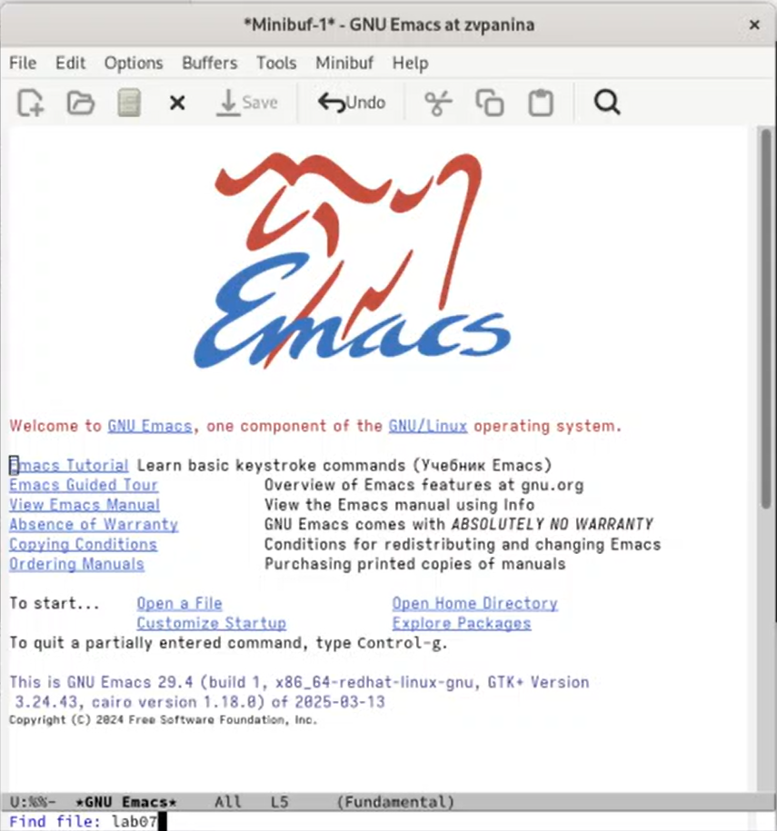{#fig:001 width=70%}

##

2. Набираю текст.

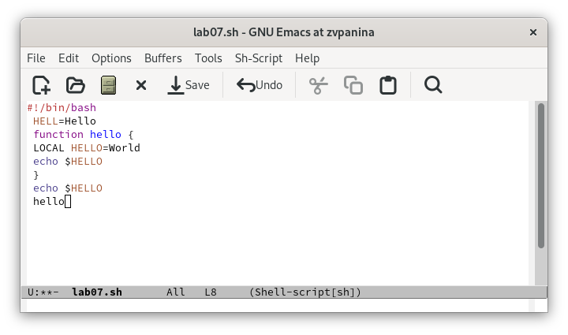{#fig:002 width=70%}

##

3. Сохраняю файл с помощью комбинации Ctrl-x Ctrl-s (C-x C-s). Внизу появилась запись Wrote.

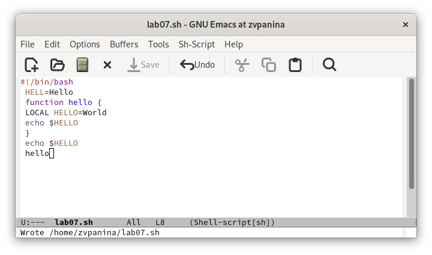{#fig:003 width=70%}

##

4. Проделываю с текстом стандартные процедуры редактирования. Вырезаю одной командой целую строку (С-k).

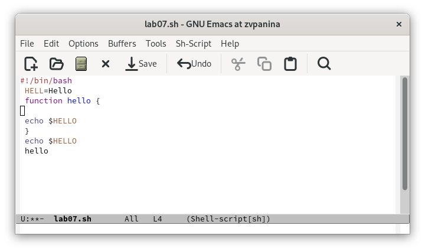{#fig:004 width=70%}

##

Вставляю эту строку в конец файла (C-y).

{#fig:005 width=70%}

##

Выделяю область текста (C-space). Перемещаю стрелками. Копирую область в буфер обмена (M-w).

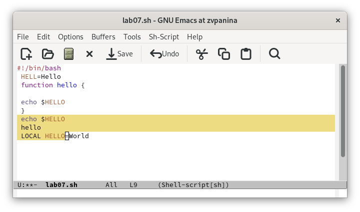{#fig:006 width=70%}

##

Вставляю область в конец файла.

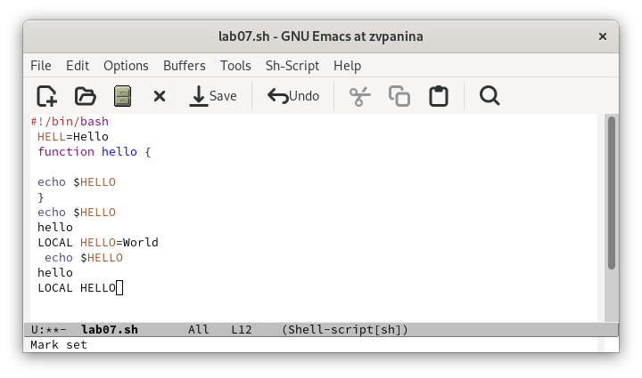{#fig:007 width=70%}

##

Вновь выделяю эту область и на этот раз вырезаю её (C-w).

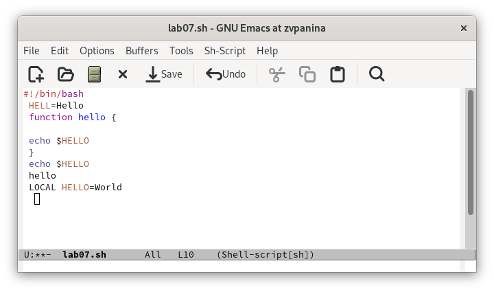{#fig:008 width=70%}

##

Отменяю последнее действие (C-/).

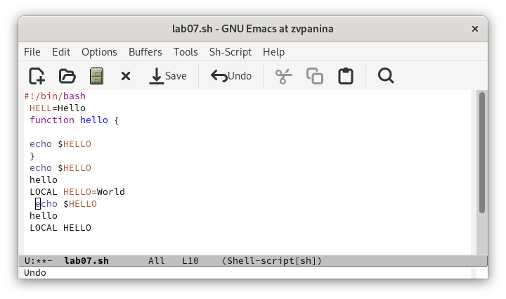{#fig:009 width=70%}

##

5. Использую **команды по перемещению курсора**. Перемещаю курсор в начало строки (C-a). 

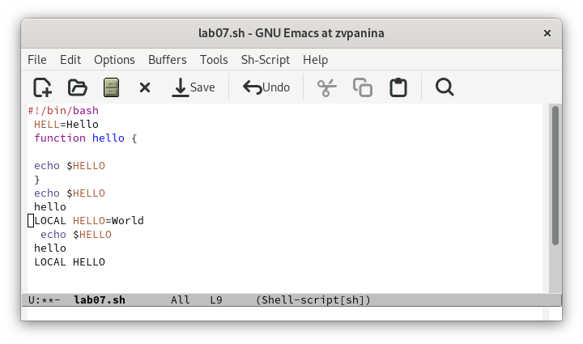{#fig:010 width=70%}

##

Перемещаю курсор в конец строки (C-e) 

{#fig:011 width=70%}

##

Перемещаю курсор в начало буфера (M-<).

{#fig:012 width=70%}

##

Перемещаю курсор в конец буфера (M->). 

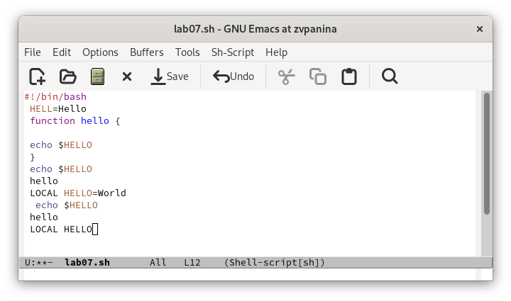{#fig:013 width=70%}

##

6. **Управление буферами.** Вывожу список активных буферов на экран (C-x C-b).

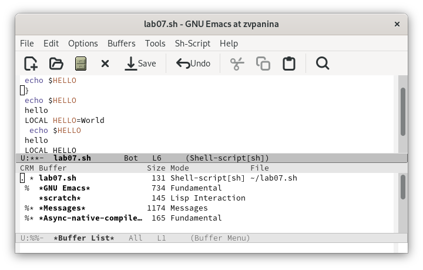{#fig:014 width=70%}

##

Перемещаюсь во вновь открытое окно (C-x) o со списком открытых буферов и переключаюсь на другой буфер.

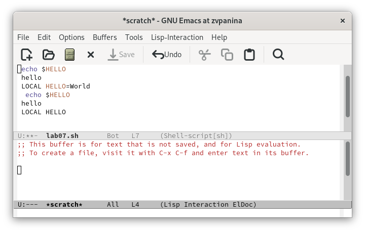{#fig:015 width=70%}

##

Закрываю это окно (C-x 0).

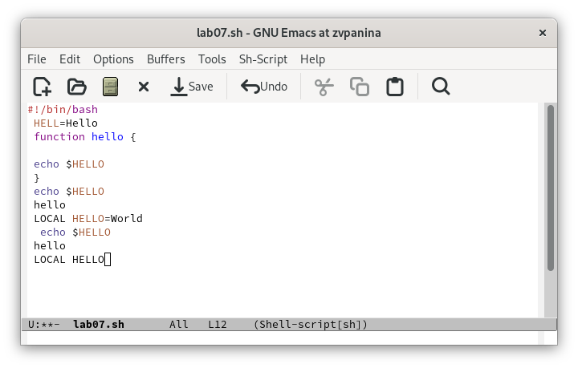{#fig:016 width=70%}

##

Теперь вновь переключаюсь между буферами,но уже без вывода их списка на экран (C-x b). 

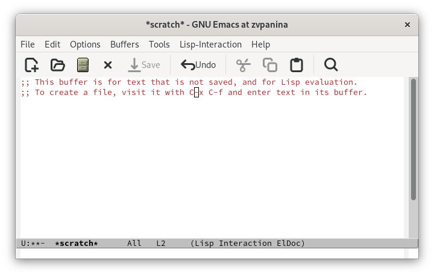{#fig:017 width=70%}

##

7. **Управление окнами.** Делю фрейм на 4 части: разделяю фрейм на два окна по вертикали (C-x 3), а затем каждое из этих окон на две части по горизонтали (C-x 2).

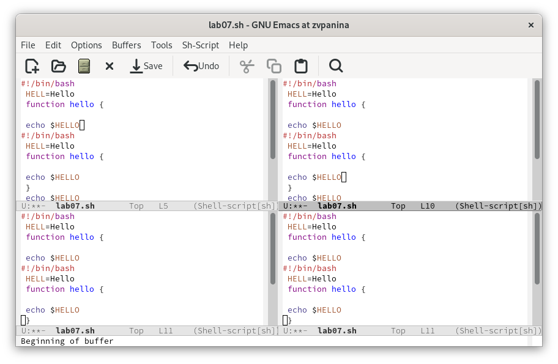{#fig:018 width=70%}

##

В каждом из четырёх созданных окон открыаю новый буфер и ввожу несколько строк текста. 

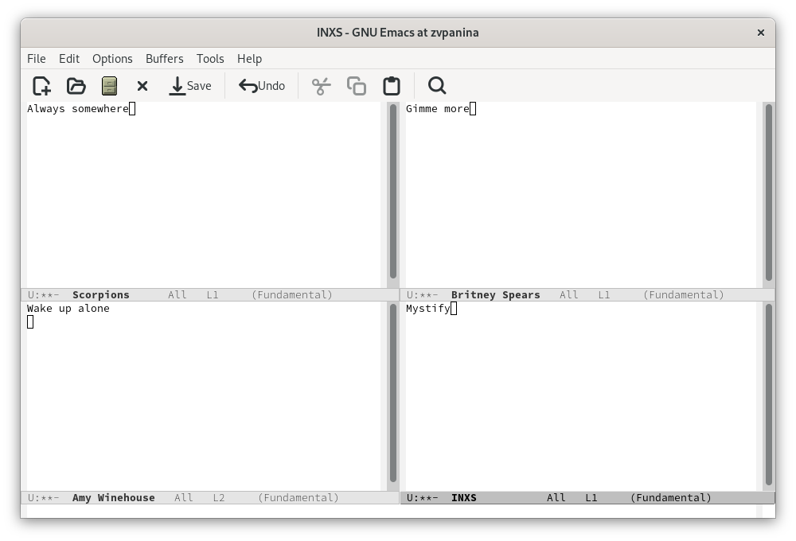{#fig:019 width=70%}

##

8. **Режим поиска.** Переключаюсь в режим поиска (C-s) и нахожу несколько слов, присутствующих в тексте. Переключаюсь между результатами поиска, нажимая C-s.

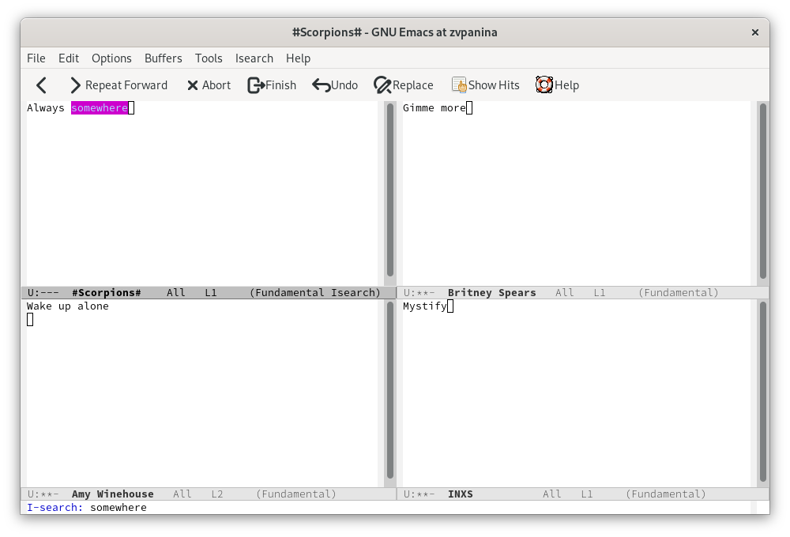{#fig:020 width=70%}

##

Выхожу из режима поиска, нажав C-g. Внизу написано Quit.

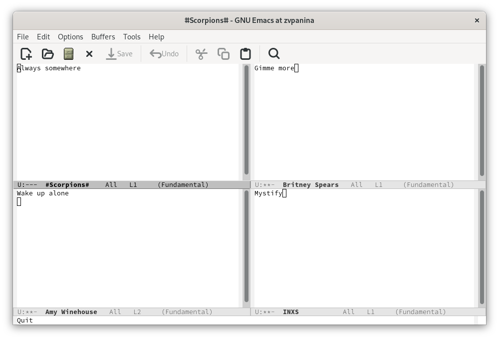{#fig:021 width=70%}

##

Перехожу в режим поиска и замены (M-%), ввожу текст, который следует найти и заменить.

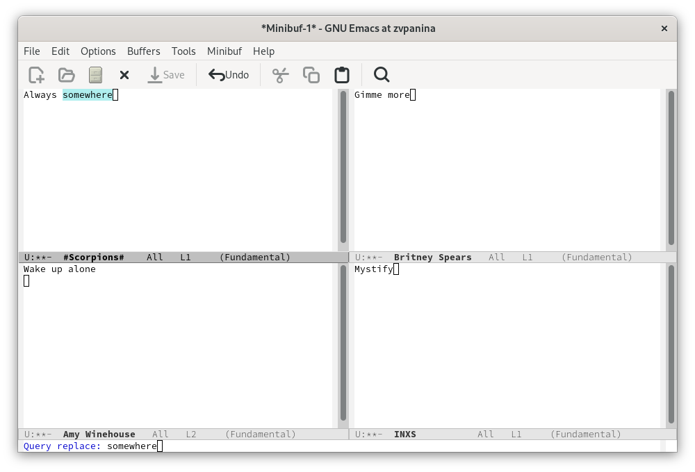{#fig:022 width=70%}

##

Нажимаю Enter, затем ввожу текст для замены.

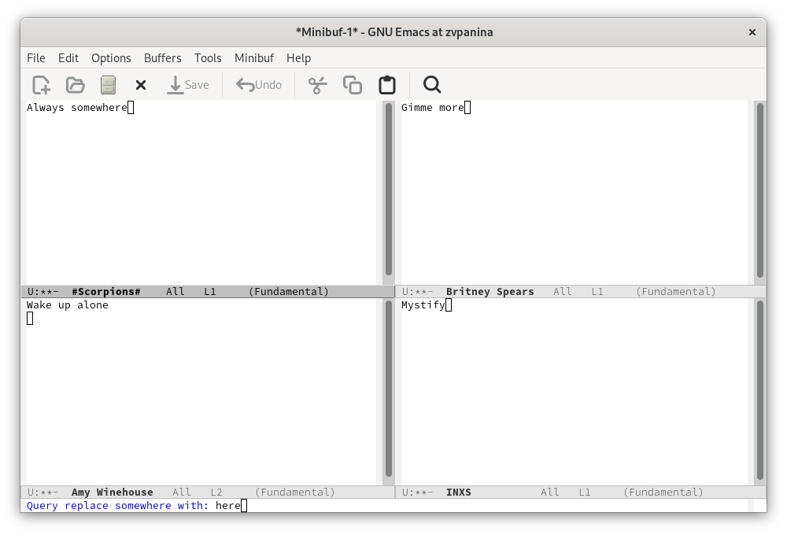{#fig:023 width=70%}

# Ответы на контрольные вопросы

1. Кратко охарактеризуйте редактор emacs.
- Emacs — один из наиболее мощных и широко распространённых редакторов, используемых в мире UNIX. Написан на языке высокого уровня Lisp.

2. Какие особенности данного редактора могут сделать его сложным для освоения новичком?
- Большое разнообразие сложных комбинаций клавиш, которые необходимы для редактирования файла и в принципе для работа с Emacs.

3. Своими словами опишите, что такое буфер и окно в терминологии emacs’а.
- Буфер - это объект в виде текста. Окно - это прямоугольная область, в которой отображен буфер.

##

4. Можно ли открыть больше 10 буферов в одном окне?
- Да, можно.

5. Какие буферы создаются по умолчанию при запуске emacs?
- Emacs использует буферы с именами, начинающимися с пробела, для внутренних целей. Отчасти он обращается с буферами с такими именами особенным образом -- например, по умолчанию в них не записывается информация для отмены изменений.

6. Какие клавиши вы нажмёте, чтобы ввести следующую комбинацию C-c | и C-c C-|?
- Ctrl + c, а потом | и Ctrl + c Ctrl + |

##

7. Как поделить текущее окно на две части?
- С помощью команды Ctrl + x 3 (по вертикали) и Ctrl + x 2 (по горизонтали).

8. В каком файле хранятся настройки редактора emacs?
- Настройки emacs хранятся в файле . emacs, который хранится в домашней дирректории пользователя. Кроме этого файла есть ещё папка . emacs.

9. Какую функцию выполняет клавиша и можно ли её переназначить?
- Выполняет фугкцию стереть, думаю можно переназначить.

10. Какой редактор вам показался удобнее в работе vi или emacs? Поясните почему.
- Для меня удобнее был редактор Emacs, так как у него есть более привычный интерфейс. 

# Результаты

В ходе выполнения лабораторной работы я получила практические навыки по работе с редактором Emacs.
