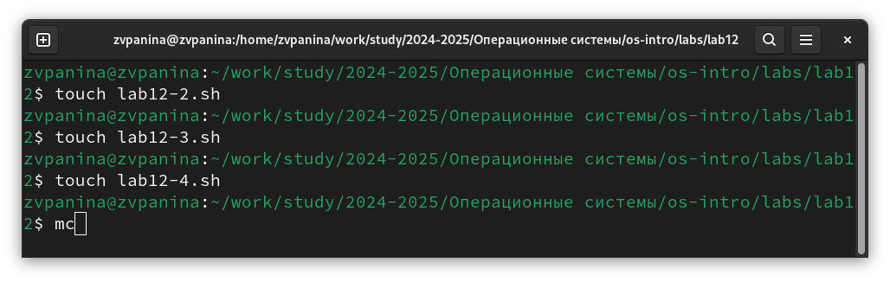
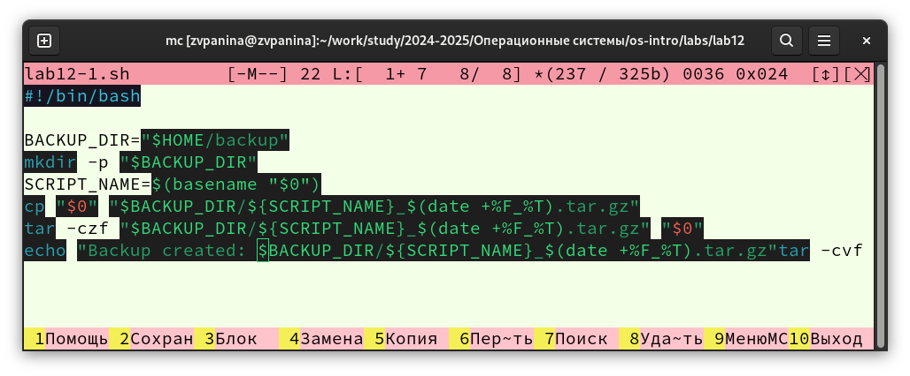
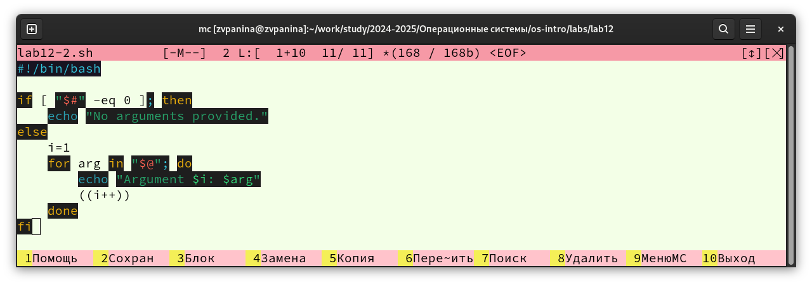
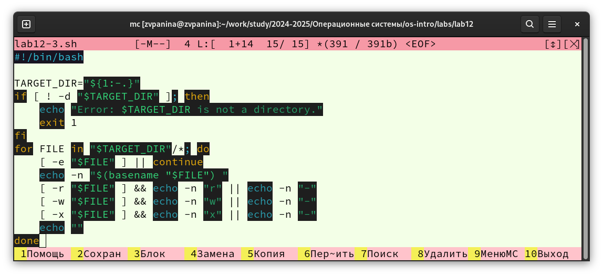
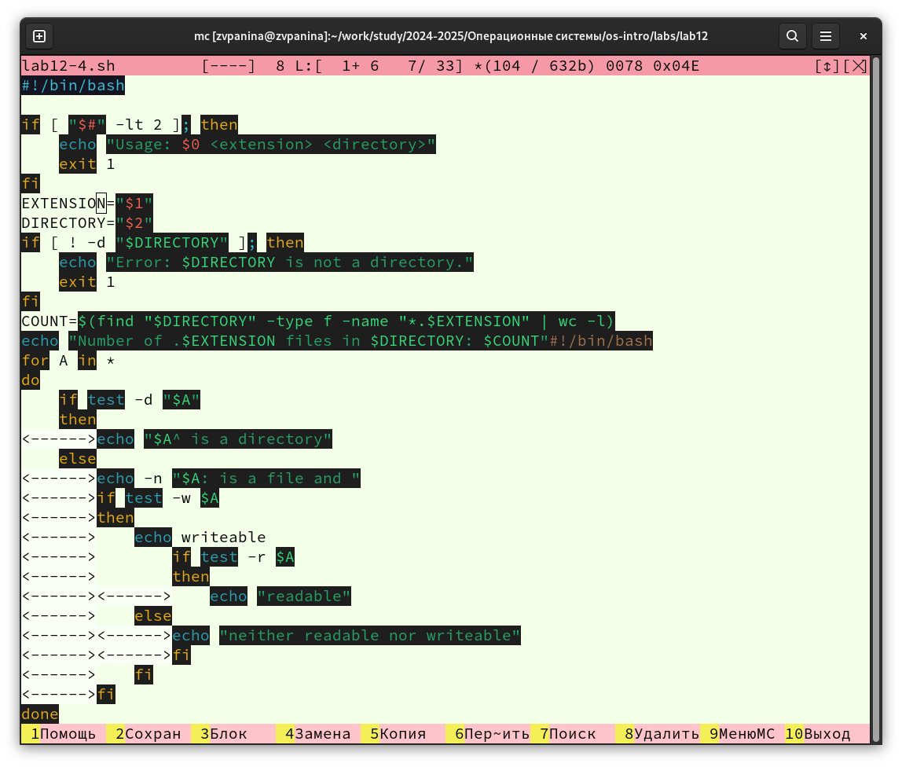
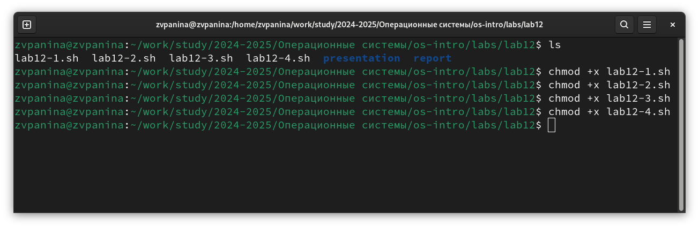
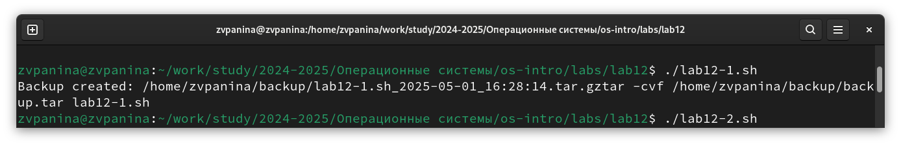
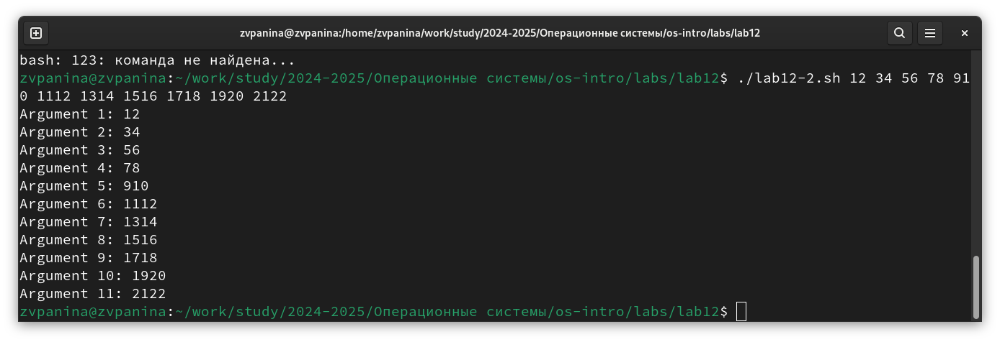
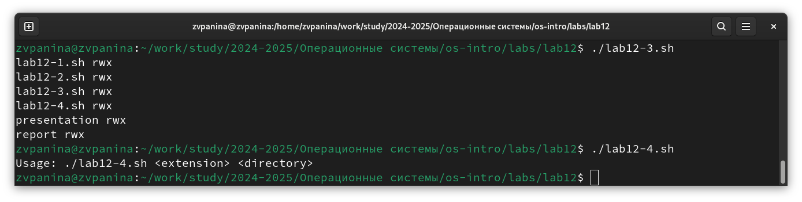

---
## Front matter
lang: ru-RU
title: Лабораторная работа №12
subtitle: Операционные системы
author:
  - Панина Ж. В.
institute:
  - Российский университет дружбы народов, Москва, Россия
date: 01 мая 2025

## i18n babel
babel-lang: russian
babel-otherlangs: english

## Formatting pdf
toc: false
toc-title: Содержание
slide_level: 2
aspectratio: 169
section-titles: true
theme: metropolis
header-includes:
 - \metroset{progressbar=frametitle,sectionpage=progressbar,numbering=fraction}
---

# Информация

## Докладчик

:::::::::::::: {.columns align=center}
::: {.column width="70%"}

  * Панина Жанна Валерьевна
  * НКАбд-02-24, студ. билет № 1132246710
  * студент направления "Компьютерные и информационные науки"
  * Российский университет дружбы народов
  * [1132246710@pfur.ru](mailto:1132246710@pfur.ru)
  * <https://github.com/zvpanina/study_2024-2025_os-intro>

:::
::::::::::::::

# Вводная часть

## Актуальность

Современные операционные системы семейства UNIX/Linux широко применяются в серверных решениях, научных и инженерных задачах, а также в образовательной и профессиональной среде. Умение писать скрипты оболочки (shell-скрипты) позволяет автоматизировать рутинные операции, управлять системой, настраивать окружение и создавать гибкие инструменты администрирования. Изучение основ программирования в оболочке является важной частью подготовки специалиста в области информационных технологий.

## Объект и предмет исследования

### Объект исследования:

Операционная система UNIX/Linux и её командная оболочка (bash).

### Предмет исследования:

Средства и технологии программирования в командной оболочке, включая создание и выполнение shell-скриптов, использование управляющих конструкций и встроенных команд.

## Цели и задачи

Цель работы - изучить основы программирования в оболочке ОС UNIX/Linux. Научиться писать небольшие командные файлы.

### Задачи:

1. Написать скрипт, который при запуске будет делать резервную копию самого себя (то есть файла, в котором содержится его исходный код) в другую директорию backup в вашем домашнем каталоге. При этом файл должен архивироваться одним из архиваторов на выбор zip, bzip2 или tar. Способ использования команд архивации необходимо узнать, изучив справку.
2. Написать пример командного файла, обрабатывающего любое произвольное число аргументов командной строки, в том числе превышающее десять. Например, скрипт может последовательно распечатывать значения всех переданных аргументов.

## 

3. Написать командный файл — аналог команды ls (без использования самой этой команды и команды dir). Требуется, чтобы он выдавал информацию о нужном каталоге и выводил информацию о возможностях доступа к файлам этого каталога.
4. Написать командный файл, который получает в качестве аргумента командной строки формат файла (.txt, .doc, .jpg, .pdf и т.д.) и вычисляет количество таких файлов в указанной директории. Путь к директории также передаётся в виде аргумента командной строки.

## Материалы и методы

### Материалы:

ОС Fedora, командная оболочка bash, редактор mc.

### Методы:

Практическое выполнение лабораторных заданий в терминале; написание и отладка shell-скриптов; применение управляющих конструкций (условий, циклов); запуск утилит и анализ их работы.

# Теоретическое введение

Командный процессор (командная оболочка, интерпретатор команд shell) — это программа, позволяющая пользователю взаимодействовать с операционной системой компьютера. В операционных системах типа UNIX/Linux наиболее часто используются следующие реализации командных оболочек:
- оболочка Борна (Bourne shell или sh) — стандартная командная оболочка UNIX/Linux, содержащая базовый, но при этом полный набор функций;
- С-оболочка (или csh) — надстройка на оболочкой Борна, использующая С-подобный синтаксис команд с возможностью сохранения истории выполнения команд;
- оболочка Корна (или ksh) — напоминает оболочку С, но операторы управления программой совместимы с операторами оболочки Борна;

##

- BASH — сокращение от Bourne Again Shell (опять оболочка Борна), в основе своей совмещает свойства оболочек С и Корна (разработка компании Free Software Foundation).
POSIX (Portable Operating System Interface for Computer Environments) — набор стандартов описания интерфейсов взаимодействия операционной системы и прикладных программ. Стандарты POSIX разработаны комитетом IEEE (Institute of Electrical and Electronics Engineers) для обеспечения совместимости различных UNIX/Linux-подобных операционных систем и переносимости прикладных программ на уровне исходного кода. POSIX-совместимые оболочки разработаны на базе оболочки Корна.

# Выполнение лабораторной работы

1. Создаю четыре файла .sh для скриптов и открываю mc для редактирования

{#fig:001 width=70%}

##

2. Пишу первый скрипт, который при запуске будет делать резервную копию самого себя (то есть файла, в котором содержится его исходный код) в другую директорию backup в домашнем каталоге. При этом файл должен архивироваться одним из архиваторов на выбор zip, bzip2 или tar.

{#fig:002 width=70%}

##

3. Пишу пример командного файла, обрабатывающего любое произвольное число аргументов командной строки, в том числе превышающее десять. Скрипт последовательно распечатывает значения всех переданных аргументов.  

{#fig:003 width=70%}

##

4. Пишу командный файл — аналог команды ls (без использования самой этой команды и команды dir). Требуется, чтобы он выдавал информацию о нужном каталоге и выводил информацию о возможностях доступа к файлам этого каталога. 

{#fig:004 width=70%}

##

5. Пишу командный файл, который получает в качестве аргумента командной строки формат файла (.txt, .doc, .jpg, .pdf и т.д.) и вычисляет количество таких файлов в указанной директории.

{#fig:005 width=70%}

##

6. Добавляю для каждого файла право на исполнение.

{#fig:006 width=70%}

##

7. Поочерёдно запускаю каждый из четырёх файлов. Проверяю, что всё верно работает.

{#fig:007 width=70%}

##

{#fig:008 width=70%}

##

{#fig:009 width=70%}

# Ответы на контрольные вопросы

### Объясните понятие командной оболочки. Приведите примеры командных оболочек. Чем они отличаются?
Командные процессоры или оболочки - это программы, позволяющие пользователю взаимодействовать с компьютером. Их можно рассматривать как настоящие интерпретируемые языки, которые воспринимают команды пользователя и обрабатывают их. Поэтому командные процессоры также называют интерпретаторами команд. На языках оболочек можно писать программы и выполнять их подобно любым другим программам. UNIX обладает большим количеством оболочек. Наиболее популярными являются следующие четыре оболочки: –оболочка Борна (Bourne) - первоначальная командная оболочка UNIX: базовый, но полный набор функций; –С-оболочка - добавка университета Беркли к коллекции оболочек: она надстраивается над оболочкой Борна, используя С-подобный синтаксис команд, и сохраняет историю выполненных команд; –оболочка Корна - напоминает оболочку С, но операторы управления программой совместимы с операторами оболочки Борна; –BASH - сокращение от Bourne Again Shell (опять оболочка Борна), в основе своей совмещает свойства оболочек С и Корна.

##

### Что такое POSIX? POSIX 
(Portable Operating System Interface for Computer Environments)- интерфейс переносимой операционной системы для компьютерных сред. Представляет собой набор стандартов, подготовленных институтом инженеров по электронике и радиотехники (IEEE), который определяет различные аспекты построения операционной системы. POSIX включает такие темы, как программный интерфейс, безопасность, работа с сетями и графический интерфейс. POSIX-совместимые оболочки являются будущим поколением оболочек UNIX и других ОС. Windows NT рекламируется как система, удовлетворяющая POSIX-стандартам. POSIX-совместимые оболочки разработаны на базе оболочки Корна; фонд бесплатного программного обеспечения (Free Software Foundation) работает над тем, чтобы и оболочку BASH сделать POSIX-совместимой.

##

### Как определяются переменные и массивы в языке программирования bash? 
Kомандный процессор bash обеспечивает возможность использования переменных типа строка символов. Имена переменных могут быть выбраны пользователем. Пользователь имеет возможность присвоить переменной значение некоторой строки символов. Например, команда mark=/usr/andy/bin присваивает значение строки символов /usr/andy/bin переменной mark типа строка символов. Значение, присвоенное некоторой переменной, может быть впоследствии использовано. Для этого в соответствующем месте командной строки должно быть употреблено имя этой переменной, которому предшествует метасимвол Напримеркоманда {имя переменной} например, использование команд b=/tmp/andy-ls -l myfile > ${b}ls приведет к переназначению стандартного вывода команды ls с терминала на файл /tmp/andy-ls , а использование команды ls -l>$bls приведет к подстановке в командную строку значения переменной bls. Если переменной bls не было предварительно присвоено никакого значения, то ее значением является символ пробел. Оболочка bash позволяет создание массивов. Для создания массива используется команда set с флагом -A. За флагом следует имя переменной, а затем список значений, разделенных пробелом. Например,set -A states Delaware Michigan "New Jersey" Далее можно сделать добавление в массив, например, states[49]=Alaska. Индексация массивов начинается с нулевого элемента.

##

### Каково назначение операторов let и read? 
Команда let является показателем того, что последующие аргументы представляют собой выражение, подлежащее вычислению. Простейшее выражение - это единичный терм (term), обычно целочисленный. Целые числа можно записывать как последовательность цифр или в любом базовом формате. Этот формат — radix#number, где radix (основание системы счисления) - любое число не более 26. Для большинства команд основания систем счисления это - 2 (двоичная), 8 (восьмеричная) и 16 (шестнадцатеричная). Простейшими математическими выражениями являются сложение (+), вычитание (-), умножение (*), целочисленное деление (/) и целочисленный остаток (%). Команда let берет два операнда и присваивает их переменной.

##

### Какие арифметические операции можно применять в языке программирования bash?
Оператор Синтаксис Результат ! !ехр Если ехр равно 0, возвращает 1; иначе 0 
!= ехр1 !=ехр2 Если ехр1 не равно ехр2, возвращает 1; иначе 0 
% ехр1%ехр2 Возвращает остаток от деления ехр1 на ехр2 %= var=%exp Присваивает остаток от деления var на ехр переменной var & ехр1&ехр2 Возвращает побитовое AND выражений ехр1 и ехр2 && ехр1&&ехр2 Если и ехр1 и ехр2 не равны нулю, возвращает 1; иначе 0 &= var &= ехр Присваивает var побитовое AND перемен- ных var и выражения ехр * ехр1 * ехр2 Умножает ехр1 на ехр2 *= var *= ехр Умножает ехр на значение var и присваивает результат переменной var + ехр1 + ехр2 Складывает ехр1 и ехр2 += var += ехр Складывает ехр со значением var и результат присваивает var - -exp Операция отрицания exp (называется унарный минус) - expl - exp2 Вычитает exp2 из exp1 -= var -= exp Вычитает exp из значения var и присваи- вает результат var / exp / exp2 Делит exp1 на exp2 /= var /= exp Делит var на exp и присваивает результат var < expl < exp2

##

Если exp1 меньше, чем exp2, возвращает 1, иначе возвращает 0 « exp1« exp2 Сдвигает exp1 влево на exp2 бит «= var «= exp Побитовый сдвиг влево значения var на exp <= expl <= exp2 Если exp1 меньше, или равно exp2, возвра- щает 1; иначе возвращает 0 = var = exp Присваивает значение exp переменной va == exp1==exp2 Если exp1 равно exp2. Возвращает 1; иначе возвращает 0 > exp1 > exp2 1 если exp1 больше, чем exp2; иначе 0 >= exp1 >= exp2 1 если exp1 больше, или равно exp2; иначе 0 » exp » exp2 Сдвигает exp1 вправо на exp2 бит »= var »=exp Побитовый сдвиг вправо значения var на exp ^ exp1 ^ exp2 Исключающее OR выражений exp1 и exp2 ^= var ^= exp Присваивает var побитовое исключающее OR var и exp | exp1 | exp2 Побитовое OR выражений exp1 и exp2 |= var |= exp Присваивает var «исключающее OR» пе- ременой var и выражения exp || exp1 || exp2 1 если или exp1 или exp2 являются нену- левыми значениями; иначе 0 ~ ~exp Побитовое дополнение до exp.

### Что означает операция (( ))? 
Условия оболочки bash.

##

### Какие стандартные имена переменных Вам известны? 
Имя переменной (идентификатор) — это строка символов, которая отличает эту переменную от других объектов программы (идентифицирует переменную в программе). При задании имен переменным нужно соблюдать следующие правила: § первым символом имени должна быть буква. Остальные символы — буквы и цифры (прописные и строчные буквы различаются). Можно использовать символ «_»; § в имени нельзя использовать символ «.»; § число символов в имени не должно превышать 255; § имя переменной не должно совпадать с зарезервированными (служебными) словами языка. Var1, PATH, trash, mon, day, PS1, PS2 Другие стандартные переменные: –HOME — имя домашнего каталога пользователя. Если команда cd вводится без аргументов, то происходит переход в каталог, указан- ный в этой переменной . –IFS — последовательность символов, являющихся разделителями в командной строке. Это символы пробел, табуляция и перевод строки(new line). –MAIL — командный процессор каждый раз перед выводом на экран промптера проверяет содержимое файла, имя которого указано в этой переменной, и если содержимое этого файла изменилось с момента последнего ввода из него, то перед тем как вывести на терминал промптер, командный процессор выводит на терминал сообщение You have mail (у Вас есть почта). 

##

- TERM — тип используемого терминала. –LOGNAME — содержит регистрационное имя пользователя, которое устанавливается автоматически при входе в систему. В командном процессоре Си имеется еще несколько стандартных переменных. Значение всех переменных можно просмотреть с помощью команды set.

### Что такое метасимволы?
Такие символы, как ’ < > * ? | \ " & являются метасимволами и имеют для командного процессора специальный смысл.

### Как экранировать метасимволы? 
Снятие специального смысла с метасимвола называется экранированием метасимвола. Экранирование может быть осуществлено с помощью предшествующего метасимволу символа, который, в свою очередь, является метасимволом. Для экранирования группы метасимволов, ее нужно заключить в одинарные кавычки. Строка, заключенная в двойные кавычки, экранирует все метасимволы, кроме $, ’ , , ". Например,–echo выведет на экран символ,–echo ab’|’cdвыдаст строку ab*|*cd.

##

### Как создавать и запускать командные файлы?
Последовательность команд может быть помещена в текстовый файл. Такой файл называется командным. Далее этот файл можно выполнить по команде bash командный__файл [аргументы] Чтобы не вводить каждый раз последовательности символов bash, необходимо изменить код защиты этого командного файла, обеспечив доступ к этому файлу по выполнению. Это может быть сделано с помощью команды chmod +x имя_файла Теперь можно вызывать свой командный файл на выполнение просто, вводя его имя с терминала так, как будто он является выполняемой программой. Командный процессор распознает, что в Вашем файле на самом деле хранится не выполняемая программа, а программа, написанная на языке программирования оболочки, и осуществит ее интерпретацию.

##

### Как определяются функции в языке программирования bash? 
Группу команд можно объединить в функцию. Для этого существует ключевое слово function, после которого следует имя функции и список команд, заключенных в фигурные скобки. Удалить функцию можно с помощью команды unset c флагом-f. Команда typeset имеет четыре опции для работы с функциями: -f — перечисляет определенные на текущий момент функции; –ft — при последующем вызове функции инициирует ее трассировку; –fx — экспортирует все перечисленные функции в любые дочерние программы оболочек; –fu — обозначает указанные функции как автоматически загружаемые. Автоматически загружаемые функции хранятся в командных файлах, а при их вызове оболочка просматривает переменную FPATH, отыскивая файл с одноименными именами функций, загружает его и вызывает эти функции.

### Каким образом можно выяснить, является файл каталогом или обычным файлом?
ls -lrt Если есть d, то является файл каталогом

##

### Каково назначение команд set, typeset и unset? 
Используется команда set с флагом -A. За флагом следует имя переменной, а затем список значений, разделенных пробелом. Например, set -A states Delaware Michigan "New Jersey" Далее можно сделать добавление в массив, например, states[49]=Alaska . Индексация массивов начинается с нулевого элемента. В командном процессоре Си имеется еще несколько стандартных переменных. Значение всех переменных можно просмотреть с помощью команды set. Наиболее распространенным является сокращение, избавляющееся от слова let в программах оболочек. Если объявить переменные целыми значениями, любое присвоение автоматически трактуется как арифметическое. Используйте typeset -i для объявления и присвоения переменной, и при последующем использовании она становится целой. Или можете использовать ключевое слово integer (псевдоним для typeset -l) и объявлять переменные целыми. Таким образом, выражения типа х=y+z воспринимаются как арифметические. Группу команд можно объединить в функцию. Для этого существует ключевое слово function , после которого следует имя функции и список команд, заключенных в фигурные скобки. Удалить функцию можно с помощью команды unset c флагом -f .

##

Команда typeset имеет четыре опции для работы с функциями: – -f — перечисляет определенные на текущий момент функции; – -ft — при последующем вызове функции инициирует ее трассировку; – -fx — экспортирует все перечисленные функции в любые дочерние программы оболочек; – -fu — обозначает указанные функции как автоматически загружаемые. Автоматически загружаемые функции хранятся в командных файлах, а при их вызове оболочка просматривает переменную FPATH , отыскивая файл с одноименными именами функций, загружает его и вызывает эти функции. В переменные mon и day будут считаны соответствующие значения, введенные с клавиатуры, а переменная trash нужна для того, чтобы отобрать всю избыточно введенную информацию и игнорировать ее. Изъять переменную из программы можно с помощью команды unset.

### Как передаются параметры в командные файлы?
Символ $ является метасимволом командного процессора. Он используется, в частности, для ссылки на параметры, точнее, для получения их значений в командном файле. В командный файл можно передать до девяти параметров. При использовании где-либо в командном файле комбинации символов $i, где 0 < 𝑖 < 10, вместо нее будет осуществлена подстановка значения параметра с порядковым номером i, т.е. аргумента командного файла

##

с порядковым номером i. 
Использование комбинации символов $0 приводит к подстановке вместо нее имени данного командного файла. Пример: пусть к командному файлу where имеется доступ по выполнению и этот командный файл содержит следующий конвейер: who | grep $1 Если Вы введете с терминала команду: where andy, то в случае, если пользователь, зарегистрированный в ОС UNIX под именем andy, в данный момент работает в ОС UNIX, на терминал будет выведена строка, содержащая номер терминала, используемого указанным пользователем. Если же в данный момент этот пользователь не работает в ОС UNIX, то на терминал не будет выведено ничего. Команда grep производит контекстный поиск в тексте, поступающем со стандартного ввода, для нахождения в этом тексте строк, содержащих последовательности символов, переданные ей в качестве аргументов, и выводит результаты своей работы на стандартный вывод. 

##

В этом примере команда grep используется как фильтр, обеспечивающий ввод со стандартного ввода и вывод всех строк, содержащих последовательность символов andy, на стандартный вывод. В ходе интерпретации этого файла командным процессором вместо комбинации символов $1 осуществляется подстановка значения первого и единственного параметра andy. Если предположить, что пользователь, зарегистрированный в ОС UNIX под именем andy, в данный момент работает в ОС UNIX, то на терминале Вы увидите примерно следующее: $ where andy andy ttyG Jan 14 09:12 $ Определим функцию, которая изменяет каталог и печатает список файлов: $ function clist { > cd $1 > ls > }. Теперь при вызове команды clist каталог будет изменен каталог и выведено его содержимое.

### Назовите специальные переменные языка bash и их назначение.

- $* — отображается вся командная строка или параметры оболочки;
- $? — код завершения последней выполненной команды;
- $$ — уникальный идентификатор процесса, в рамках которого выполняется командный процессор;
- $! — номер процесса, в рамках которого выполняется последняя вызванная на выполнение в командном режиме команда;

##

- $- — значение флагов командного процессора;
- ${#} — возвращает целое число — количество слов, которые были результатом $;
- ${#name} — возвращает целое значение длины строки в переменной name;
- ${name[n]} — обращение к n-ному элементу массива;
- ${name[*]} — перечисляет все элементы массива, разделенные пробелом;
- ${name[@]} — то же самое, но позволяет учитывать символы пробелы в самих переменных;
- ${name:-value} — если значение переменной name не определено, то оно будет заменено на указанное value;
- ${name:value} — проверяется факт существования переменной;

##

- ${name=value} — если name не определено, то ему присваивается значение value;
- ${name?value} — останавливает выполнение, если имя переменной не определено, и выводит value, как сообщение об ошибке;
это выражение работает противоположно {name-value}. Если переменная определена, то подставляется value;
- ${name#pattern} — представляет значение переменной name с удаленным самым коротким левым образцом (pattern);
- ${#name[*]} и ${#name[@]} — эти выражения возвращают количество элементов в массиве name.
- $# вместо нее будет осуществлена подстановка числа параметров, указанных в командной строке при вызове данного командного файла на выполнение.

# Результаты

В ходе выполнения лабораторной работы я изучила основы программирования в оболочке ОС UNIX/Linux, научилась писать небольшие командные файлы.
