---
## Front matter
lang: ru-RU
title: Первый этап индивидуального проекта
subtitle: Операционные системы
author:
  - Панина Ж. В.
institute:
  - Российский университет дружбы народов, Москва, Россия
date: 07 марта 2025

## i18n babel
babel-lang: russian
babel-otherlangs: english

## Formatting pdf
toc: false
toc-title: Содержание
slide_level: 2
aspectratio: 169
section-titles: true
theme: metropolis
header-includes:
 - \metroset{progressbar=frametitle,sectionpage=progressbar,numbering=fraction}
---

# Информация

## Докладчик

:::::::::::::: {.columns align=center}
::: {.column width="70%"}

  * Панина Жанна Валерьевна
  * НКАбд-02-24, студ. билет № 1132246710
  * студент направления "Компьютерные и информационные науки"
  * Российский университет дружбы народов
  * [1132246710@pfur.ru](mailto:1132246710@pfur.ru)
  * <https://github.com/zvpanina/study_2024-2025_os-intro>

:::
::::::::::::::

# Вводная часть

## Актуальность

В эпоху цифровизации и активного развития интернет-технологий персональный сайт становится важным инструментом для самопрезентации, профессионального роста и взаимодействия с аудиторией. Создание и размещение персонального сайта позволяет не только продемонстрировать свои навыки, проекты и достижения, но и получить практический опыт работы с современными веб-технологиями. Использование GitHub Pages для размещения сайта является актуальным решением, так как этот сервис предоставляет бесплатную и удобную платформу для публикации статических веб-страниц. Кроме того, работа с GitHub Pages тесно связана с использованием системы контроля версий Git, которая является стандартом в современной разработке программного обеспечения. Освоение этих инструментов особенно важно для студентов и начинающих разработчиков, так как они широко применяются в профессиональной среде.

## Объект и предмет исследования

### Объект исследования:

Объектом исследования является процесс создания и размещения заготовки для персонального сайта на платформе GitHub Pages. В рамках работы рассматриваются этапы настройки репозитория, подготовки веб-страниц и их публикации в интернете.

### Предмет исследования:

- Система контроля версий Git и её интеграция с платформой GitHub.
- Сервис GitHub Pages и его возможности для размещения веб-сайтов.
- Процесс настройки репозитория и публикации сайта.

## Цели и задачи

Цель работы - размещение на GitHub pages заготовки для персонального сайта.

### Задачи:

1. Установить необходимое программное обеспечение
2. Скачать шаблон темы сайта
3. Разместить шаблон на хостинге git
4. Установить параметр для URLs сайта
5. Разместить заготовку сайта на GitHub pages

## Материалы и методы
### Материалы:
- Платформа GitHub для создания репозитория и использования сервиса GitHub Pages.
- Локальная среда разработки (текстовый редактор, например, Visual Studio Code, или IDE с поддержкой веб-технологий).
- Заготовка для персонального сайта, включающая HTML-страницы, CSS-стили и, при необходимости, JavaScript-скрипты.
- Документация по Git, GitHub и GitHub Pages.
### Методы:
- Анализ возможностей GitHub Pages для размещения статических сайтов
- Изучение базовых принципов работы с Git и GitHub
- Ознакомление с основными веб-технологиями
- Создание репозитория на GitHub для персонального сайта

# Теоретическое введение

В современном мире интернет-технологий персональный сайт является важным инструментом для самопрезентации, профессионального развития и обмена информацией. Создание и размещение персонального сайта позволяет не только продемонстрировать свои навыки и достижения, но и предоставляет возможность получить практический опыт работы с современными веб-технологиями и инструментами разработки.

Одним из наиболее популярных и доступных способов размещения статических сайтов является использование GitHub Pages — сервиса, предоставляемого платформой GitHub. Этот сервис позволяет бесплатно размещать веб-страницы, используя репозитории GitHub. GitHub Pages поддерживает HTML, CSS, JavaScript и другие технологии, что делает его идеальным выбором для размещения персональных сайтов, портфолио или документации.

# Выполнение первого этапа проекта

1. Предварительно я создала в домашнем каталоге папку bin. С репозитория hugo скачиваю версию hugo_extended_0.145.0_Linux-64bit.tar.gz. Открываю файл и перемещаю установочный файл Hugo в папку bin, а также внутри неё создаю папку blog.

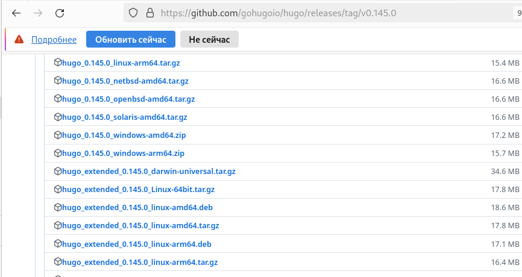{#fig:001 width=70%}

##

2. На основе репозитория theme-academic-cv создаю новый репозиторий под названием blog.

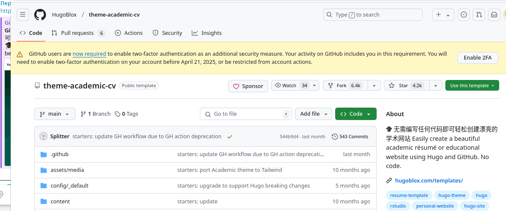{#fig:002 width=70%}

##

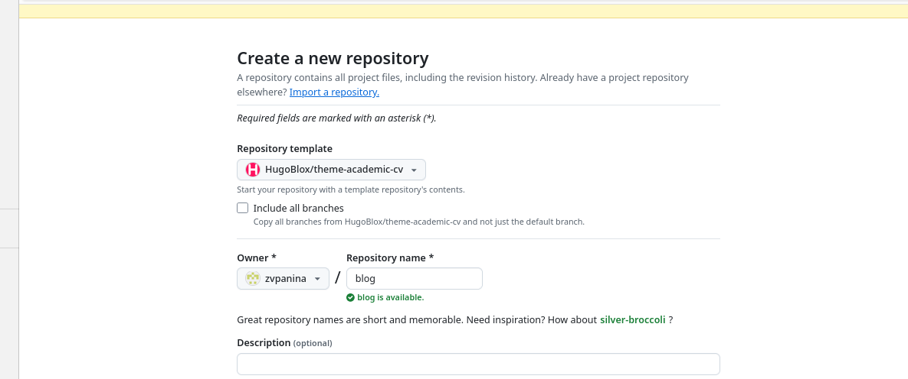{#fig:003 width=70%}

##

3. Клонирую репозиторий в папку blog.

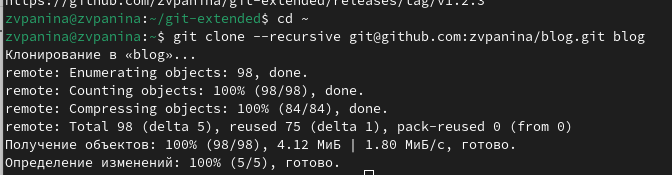{#fig:004 width=70%}

##

4. Перейдя в режим суперпользователя, устанавливаю go hugo.

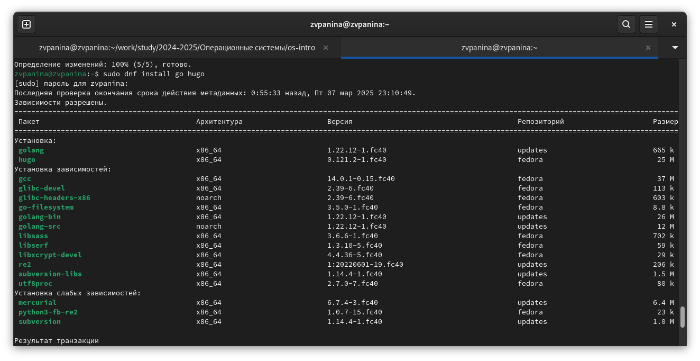{#fig:005 width=70%}

##

5. Скачиваю пакеты данных.

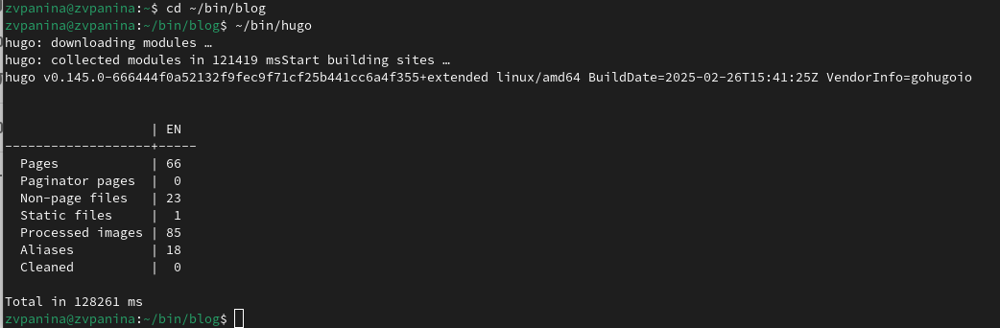{#fig:006 width=70%}

##

6. Открываем ~/bin/blog в mc и удаляем каталог public.

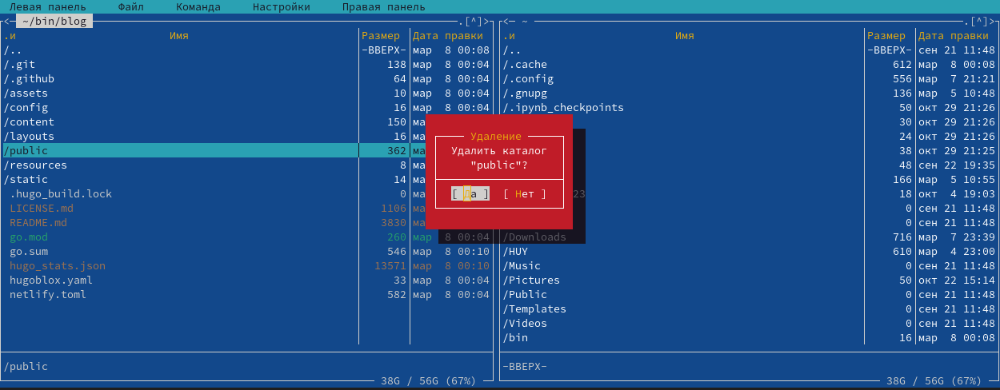{#fig:007 width=70%}

##

7. Запускаю исполняемый файл. Перейдя по ссылке, получаю шаблон сайта на локальном хосте.

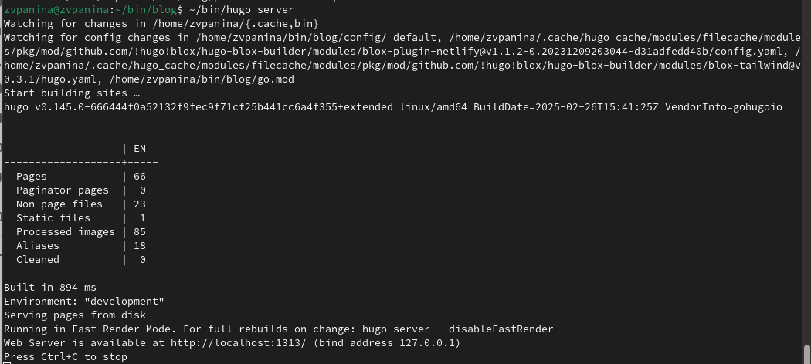{#fig:008 width=70%}

##

8. Захожу на GitHub и создаю новый репозиторий github.io.

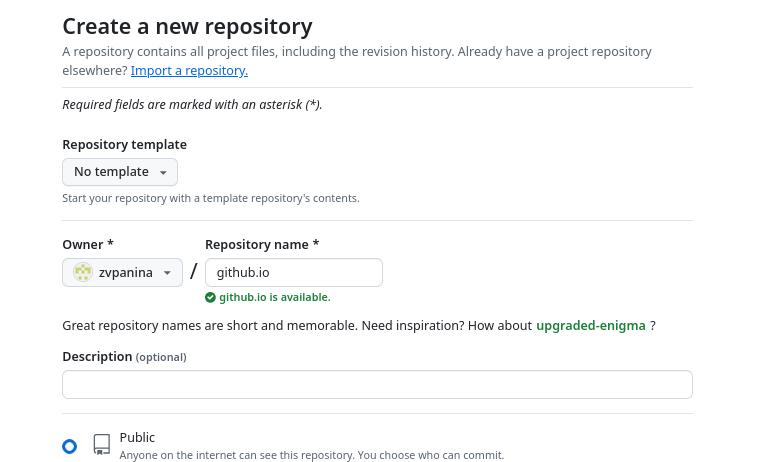{#fig:009 width=70%}

##

9. Клонирую его в github.io.

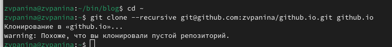{#fig:010 width=70%}

##

10. Перехожу в него и переключаюсь на новую ветку main.

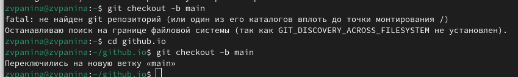{#fig:011 width=70%}

##

11. Создаю файл README.md и делаю коммит в этот репозиторий.

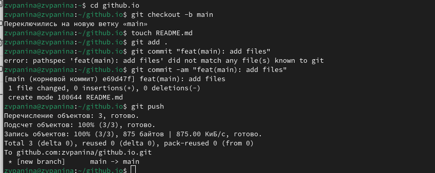{#fig:012 width=70%}

##

12. Перехожу в каталог ~/bin/blog и добавляю подраздел в ветку main.

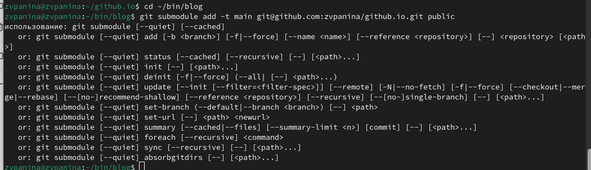{#fig:013 width=70%}

##

13. Запускаю файл ~/bin/hugo.

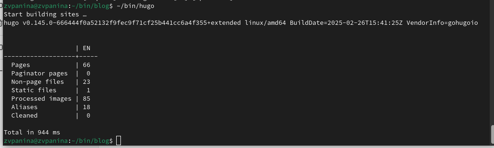{#fig:014 width=70%}

##

14. Перехожу в public/ и делаю коммит подраздела в репозиторий.

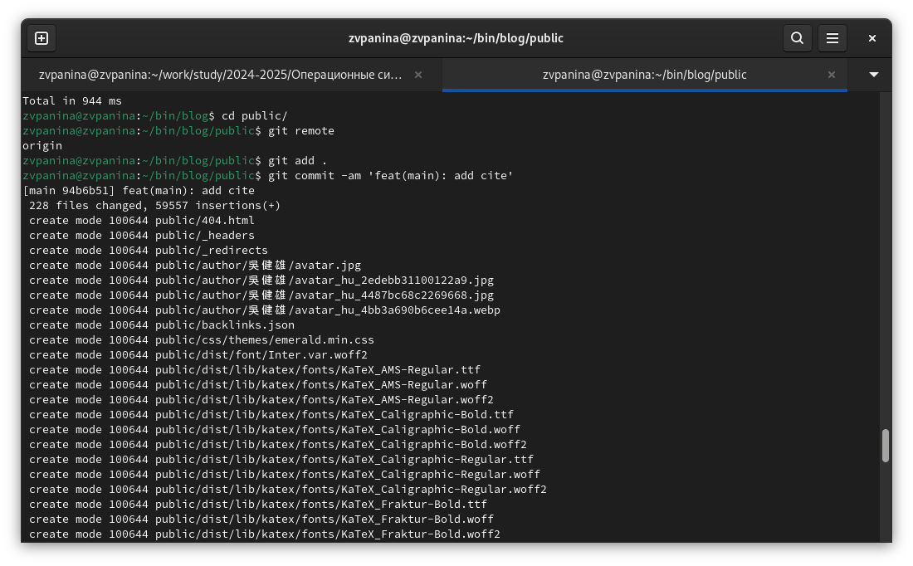{#fig:015 width=70%}

##

Завершаю коммит.

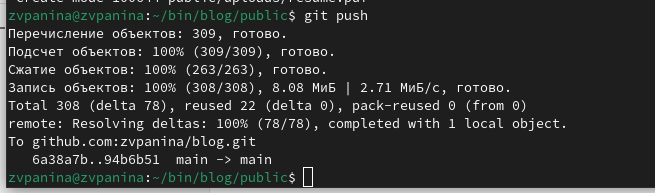{#fig:016 width=70%}

##

После этого захожу на GitHub и проверяю. Все файлы выложены.

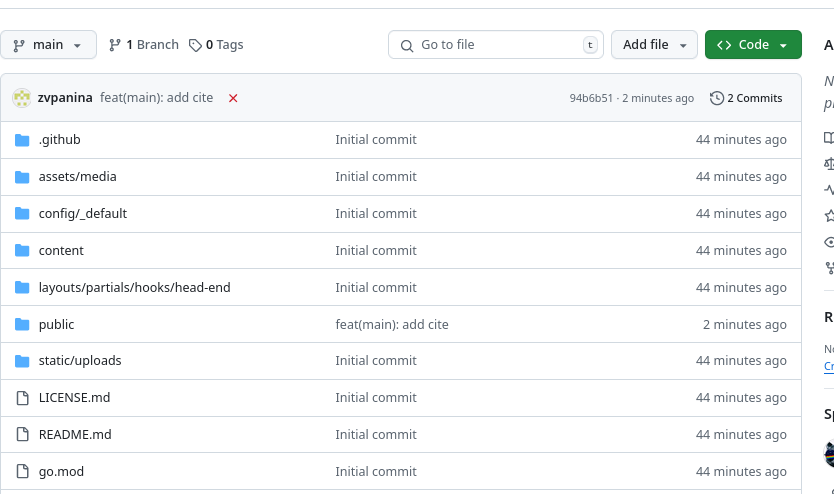{#fig:017 width=70%}

# Результаты

Я выполнила задание, разместив на GitHub pages заготовки для персонального сайта.

