---
## Front matter
title: "Отчёт по 1 этапу индивидуального проекта"
subtitle: "Дисциплина: Операционные системы"
author: "Панина Жанна Валерьевна"

## Generic otions
lang: ru-RU
toc-title: "Содержание"

## Bibliography
bibliography: bib/cite.bib
csl: pandoc/csl/gost-r-7-0-5-2008-numeric.csl

## Pdf output format
toc: true # Table of contents
toc-depth: 2
lof: true # List of figures
lot: true # List of tables
fontsize: 12pt
linestretch: 1.5
papersize: a4
documentclass: scrreprt
## I18n polyglossia
polyglossia-lang:
  name: russian
  options:
	- spelling=modern
	- babelshorthands=true
polyglossia-otherlangs:
  name: english
## I18n babel
babel-lang: russian
babel-otherlangs: english
## Fonts
mainfont: IBM Plex Serif
romanfont: IBM Plex Serif
sansfont: IBM Plex Sans
monofont: IBM Plex Mono
mathfont: STIX Two Math
mainfontoptions: Ligatures=Common,Ligatures=TeX,Scale=0.94
romanfontoptions: Ligatures=Common,Ligatures=TeX,Scale=0.94
sansfontoptions: Ligatures=Common,Ligatures=TeX,Scale=MatchLowercase,Scale=0.94
monofontoptions: Scale=MatchLowercase,Scale=0.94,FakeStretch=0.9
mathfontoptions:
## Biblatex
biblatex: true
biblio-style: "gost-numeric"
biblatexoptions:
  - parentracker=true
  - backend=biber
  - hyperref=auto
  - language=auto
  - autolang=other*
  - citestyle=gost-numeric
## Pandoc-crossref LaTeX customization
figureTitle: "Рис."
tableTitle: "Таблица"
listingTitle: "Листинг"
lofTitle: "Список иллюстраций"
lotTitle: "Список таблиц"
lolTitle: "Листинги"
## Misc options
indent: true
header-includes:
  - \usepackage{indentfirst}
  - \usepackage{float} # keep figures where there are in the text
  - \floatplacement{figure}{H} # keep figures where there are in the text
---

# Цель работы

Размещение на GitHub pages заготовки для персонального сайта.

# Задание

1. Установить необходимое программное обеспечение
2. Скачать шаблон темы сайта
3. Разместить шаблон на хостинге git
4. Установить параметр для URLs сайта
5. Разместить заготовку сайта на GitHub pages

# Теоретическое введение

В современном мире интернет-технологий персональный сайт является важным инструментом для самопрезентации, профессионального развития и обмена информацией. Создание и размещение персонального сайта позволяет не только продемонстрировать свои навыки и достижения, но и предоставляет возможность получить практический опыт работы с современными веб-технологиями и инструментами разработки.

Одним из наиболее популярных и доступных способов размещения статических сайтов является использование GitHub Pages — сервиса, предоставляемого платформой GitHub. Этот сервис позволяет бесплатно размещать веб-страницы, используя репозитории GitHub. GitHub Pages поддерживает HTML, CSS, JavaScript и другие технологии, что делает его идеальным выбором для размещения персональных сайтов, портфолио или документации.

# Выполнение первого этапа проекта

1. Предварительно я создала в домашнем каталоге папку bin. С репозитория hugo скачиваю версию hugo_extended_0.145.0_Linux-64bit.tar.gz. (рис. [-@fig:001]). Открываю файл и перемещаю установочный файл Hugo в папку bin, а также внутри неё создаю папку blog.

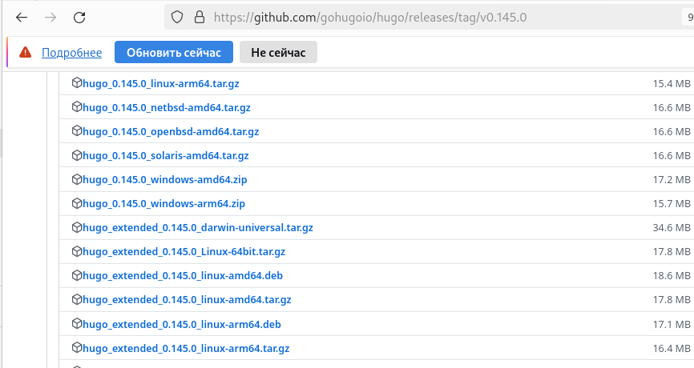{#fig:001 width=70%}

2. На основе репозитория theme-academic-cv (рис. [-@fig:002]) создаю новый репозиторий под названием blog (рис. [-@fig:003]) .

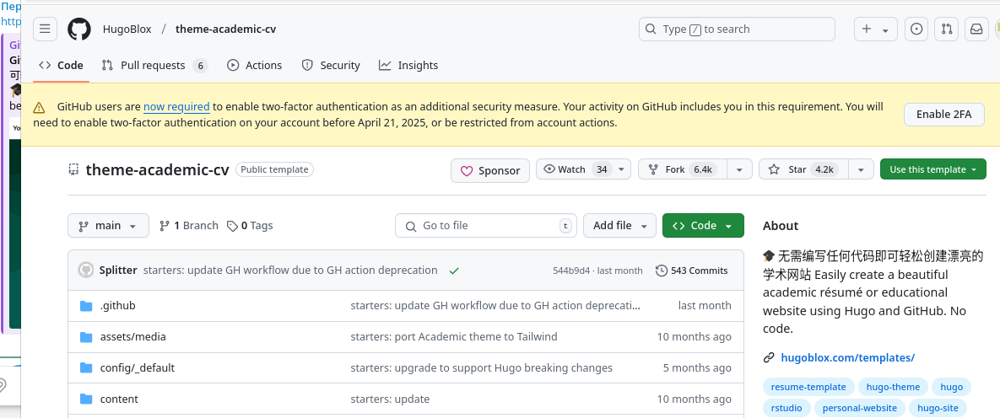{#fig:002 width=70%}

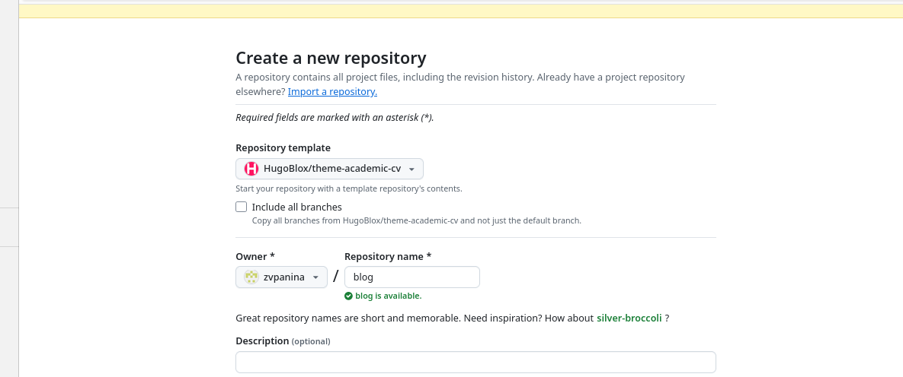{#fig:003 width=70%}

3. Клонирую репозиторий в папку blog (рис. [-@fig:004]) .

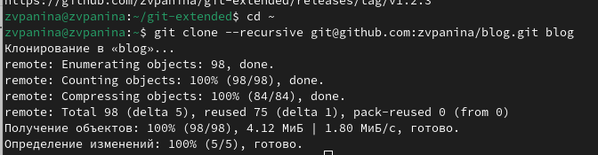{#fig:004 width=70%}

4. Перейдя в режим суперпользователя, устанавливаю go hugo (рис. [-@fig:005]) .

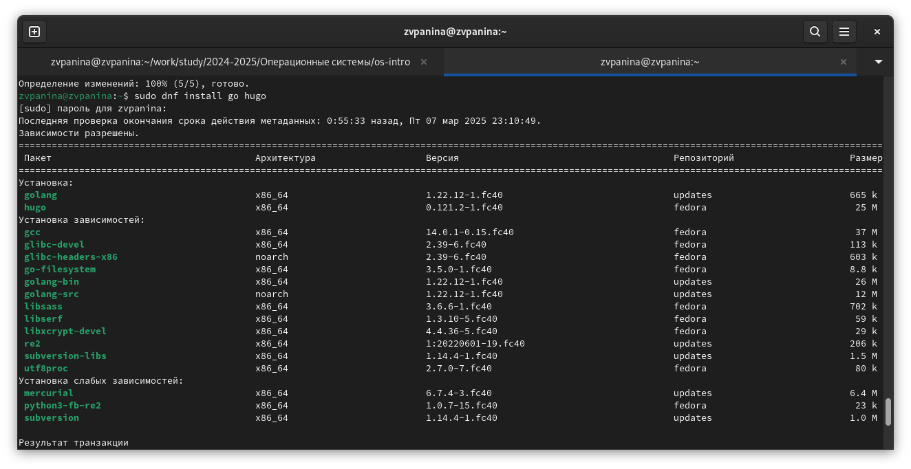{#fig:005 width=70%}

5. Скачиваю пакеты данных (рис. [-@fig:006]) .

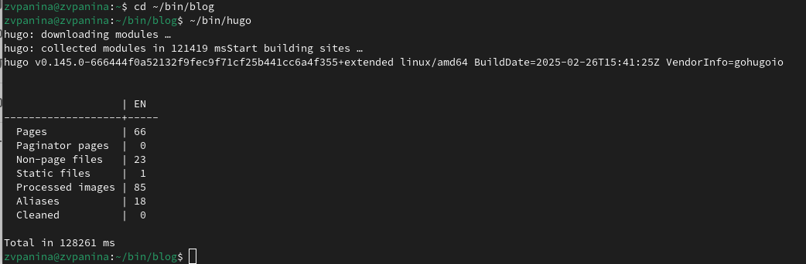{#fig:006 width=70%}

6. Открываем ~/bin/blog в mc и удаляем каталог public (рис. [-@fig:007]) .

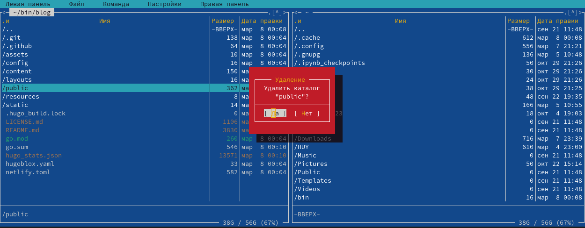{#fig:007 width=70%}

7. Запускаю исполняемый файл (рис. [-@fig:008]). Перейдя по ссылке, получаю шаблон сайта на локальном хосте.

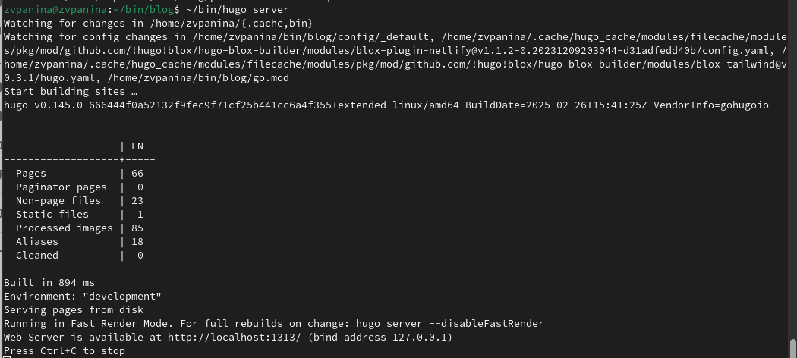{#fig:008 width=70%}

8. Захожу на GitHub и создаю новый репозиторий github.io (рис. [-@fig:009]).

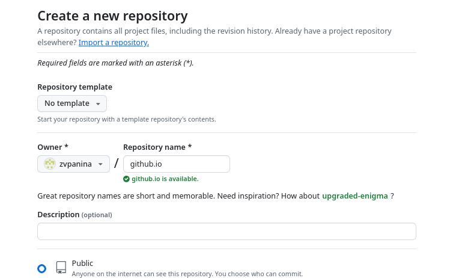{#fig:009 width=70%}

9. Клонирую его в github.io (рис. [-@fig:010]).

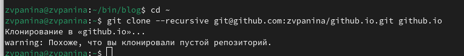{#fig:010 width=70%}

10. Перехожу в него и переключаюсь на новую ветку main (рис. [-@fig:011]).

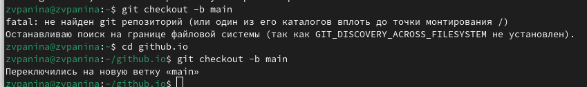{#fig:011 width=70%}

11. Создаю файл README.md и делаю коммит в этот репозиторий (рис. [-@fig:012]).

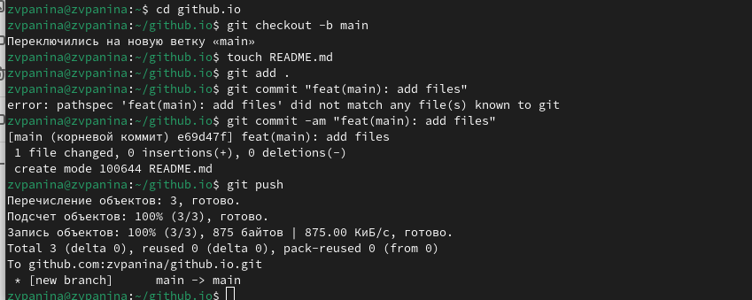{#fig:012 width=70%}

12. Перехожу в каталог ~/bin/blog и добавляю подраздел в ветку main (рис. [-@fig:013]).

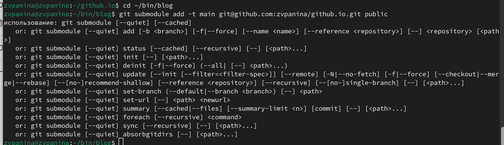{#fig:013 width=70%}

13. Запускаю файл ~/bin/hugo (рис. [-@fig:014]).

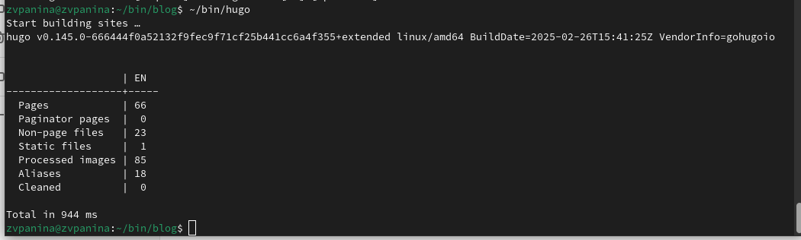{#fig:014 width=70%}

14. Перехожу в public/ и делаю коммит подраздела в репозиторий (рис. [-@fig:015]).

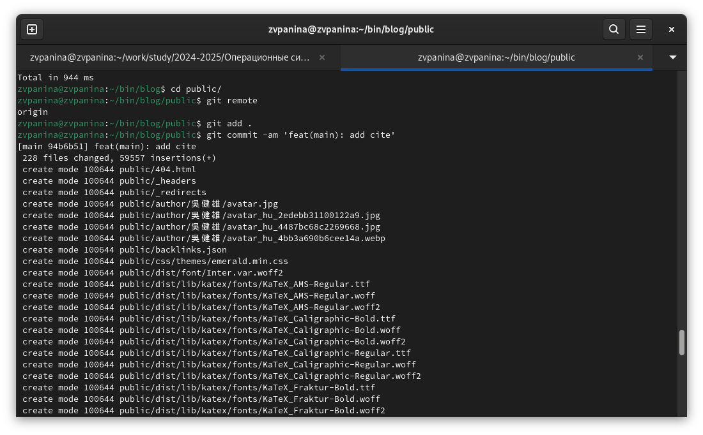{#fig:015 width=70%}

Завершаю коммит (рис. [-@fig:016]).

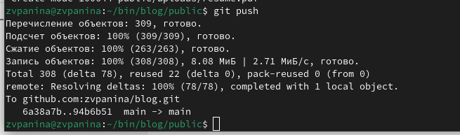{#fig:016 width=70%}

После этого захожу на GitHub и проверяю. Все файлы выложены (рис. [-@fig:017]).

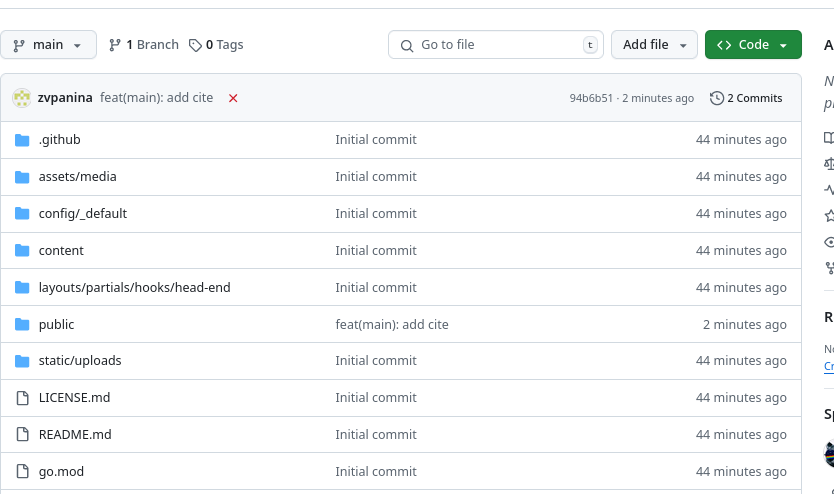{#fig:017 width=70%}

# Выводы

Я выполнила задание, разместив на GitHub pages заготовки для персонального сайта.

# Список литературы{.unnumbered}

::: {#refs}
:::
