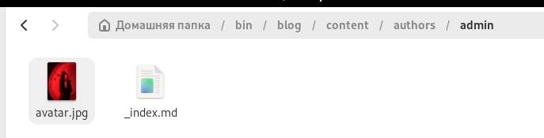
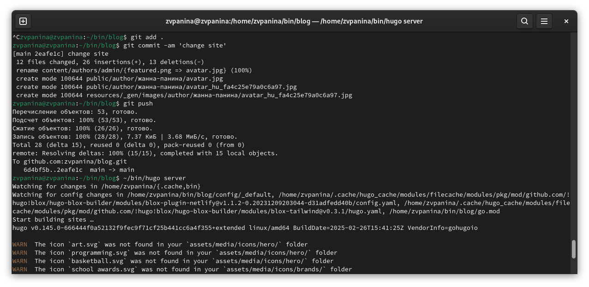
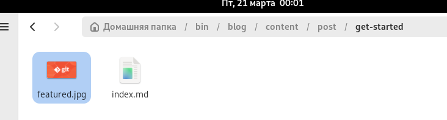
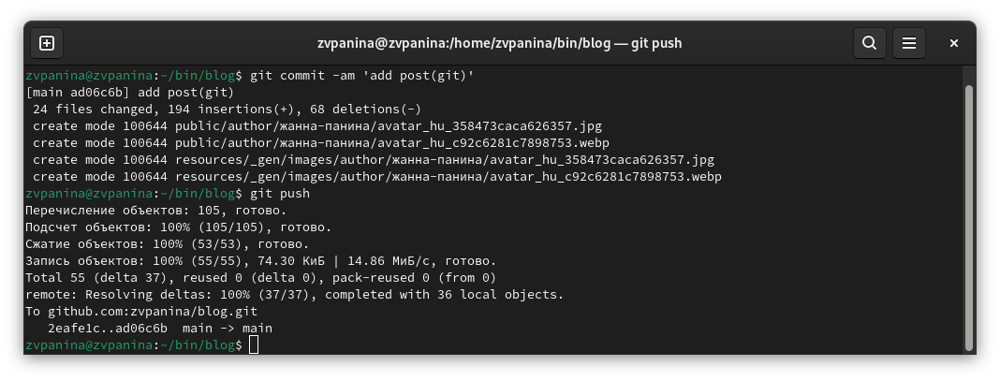
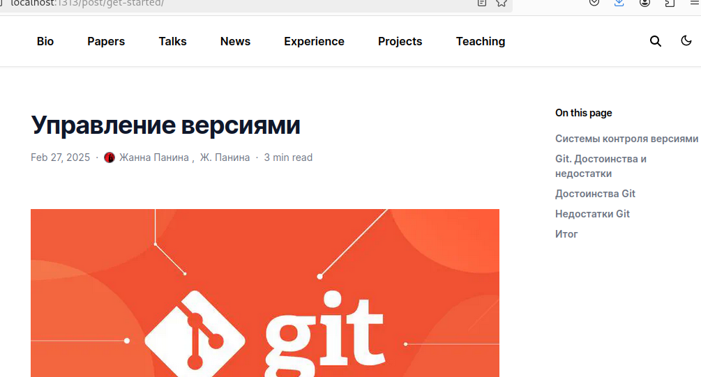
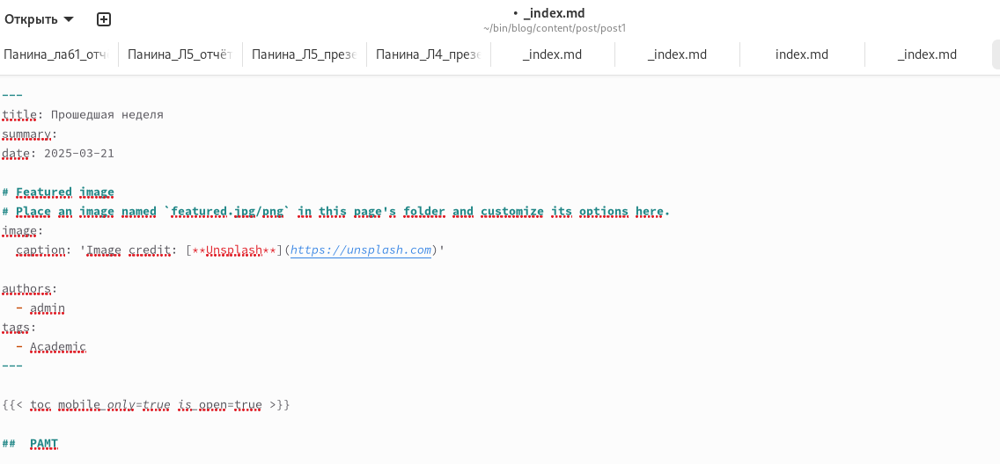
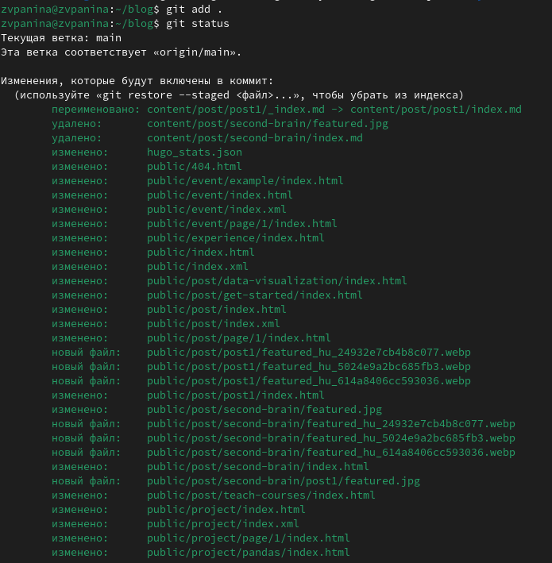
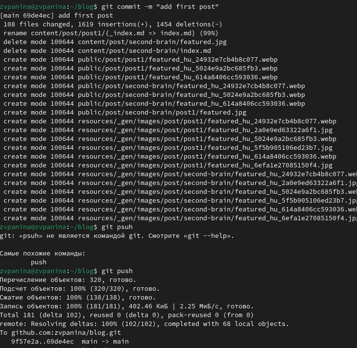
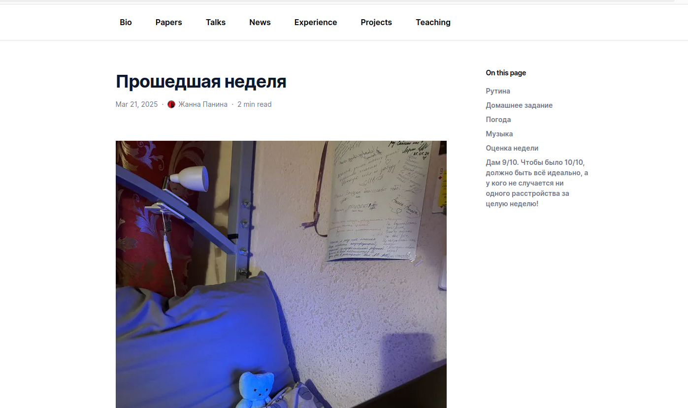

---
## Front matter
lang: ru-RU
title: Второй этап индивидуального проекта
subtitle: Операционные системы
author:
  - Панина Ж. В.
institute:
  - Российский университет дружбы народов, Москва, Россия
date: 22 марта 2025

## i18n babel
babel-lang: russian
babel-otherlangs: english

## Formatting pdf
toc: false
toc-title: Содержание
slide_level: 2
aspectratio: 169
section-titles: true
theme: metropolis
header-includes:
 - \metroset{progressbar=frametitle,sectionpage=progressbar,numbering=fraction}
---

# Информация

## Докладчик

:::::::::::::: {.columns align=center}
::: {.column width="70%"}

  * Панина Жанна Валерьевна
  * НКАбд-02-24, студ. билет № 1132246710
  * студент направления "Компьютерные и информационные науки"
  * Российский университет дружбы народов
  * [1132246710@pfur.ru](mailto:1132246710@pfur.ru)
  * <https://github.com/zvpanina/study_2024-2025_os-intro>

:::
::::::::::::::

# Вводная часть

## Актуальность

В современном цифровом мире личный сайт является важным инструментом самопрезентации, профессионального роста и взаимодействия с аудиторией. Разработка и поддержка собственного веб-ресурса позволяют продемонстрировать навыки веб-разработки, создать персональный бренд и упростить доступ к информации о себе.

## Объект и предмет исследования

### Объект исследования:

Процесс создания и редактирования персонального веб-сайта.

### Предмет исследования:

Методы и инструменты веб-разработки, используемые для модификации сайта и интеграции персональных данных.

## Цели и задачи

Цель работы - продолжить работу с сайтом, редактировать его в соответствии с требованиями, добавить данные о себе на сайт.

### Задачи:

1. Разместить фотографию владельца сайта.
2. Разместить краткое описание владельца сайта (Biography).
3. Добавить информацию об интересах (Interests).
4. Добавить информацию от образовании (Education).
5. Сделать пост по прошедшей неделе.
6. Добавить пост на тему по выбору: Управление версиями. Git. Непрерывная интеграция и непрерывное развертывание (CI/CD).

## Материалы и методы

### Материалы:

HTML, инструменты для управления версиями (Git, GitHub), графический контент и текстовые данные.

### Методы исследования: 

- Анализ требований к сайту
- Разработка и редактирование кода
- Использование систем контроля версий
- Тестирование и отладка
- Оптимизация интерфейса и структуры сайта для удобства пользователей

# Выполнение индивидуального проекта

1. Добавляю свою фотографию в нужный каталог.

{#fig:001 width=70%} 

##

2. В файле index.md заполняю данные о себе. Добавляю информацию об образовании, интересах и наградах.

{#fig:002 width=70%} 

##

3. Отправляю изменения на глобальный репозиторий и запускаю сайт, чтобы проверить.

{#fig:003 width=70%} 

##

4. Проверяю изменения на сайте. Появилось моё фото и информация обо мне.

{#fig:004 width=70%} 

##

5. Начинаю редактировать файл для поста по выбору.

{#fig:005 width=70%} 

##

6. Добавляю фотографию к посту в нужный каталог.

{#fig:006 width=70%} 

##

7. Отправляю изменения на глобальный репозиторий и запускаю сайт, чтобы проверить.

{#fig:007 width=70%} 

##

8. Проверяю изменения на сайте. Пост выложен.

{#fig:008 width=70%} 

##

9. Начинаю редактировать файл для поста о прошедшей неделе.

{#fig:009 width=70%} 

##

10. Добавляю фотографию к посту в нужный каталог.

{#fig:010 width=70%} 

##

11. Отправляю изменения на глобальный репозиторий и запускаю сайт, чтобы проверить.

{#fig:011 width=70%} 

##

{#fig:012 width=70%} 

##

12. Проверяю изменения на сайте. Пост выложен.

{#fig:013 width=70%} 

## Результаты

В ходе выполнения второго этапа индивидуального проекта я продолжила работу с сайтом, отредактировала его в соответствии с требованиями, добавила данные о себе на сайт.
