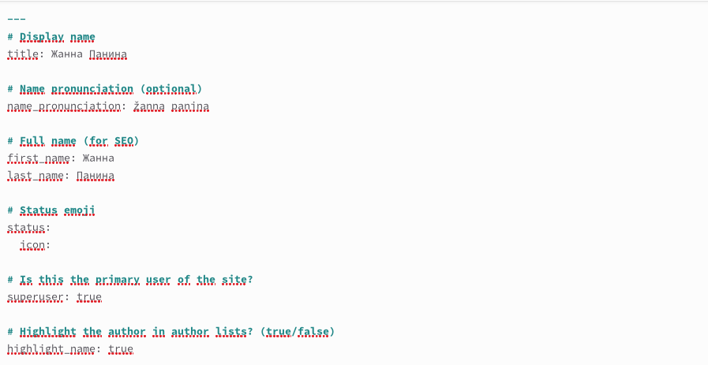
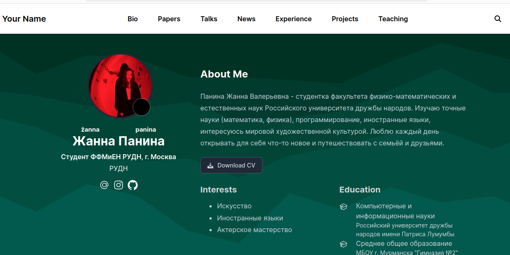
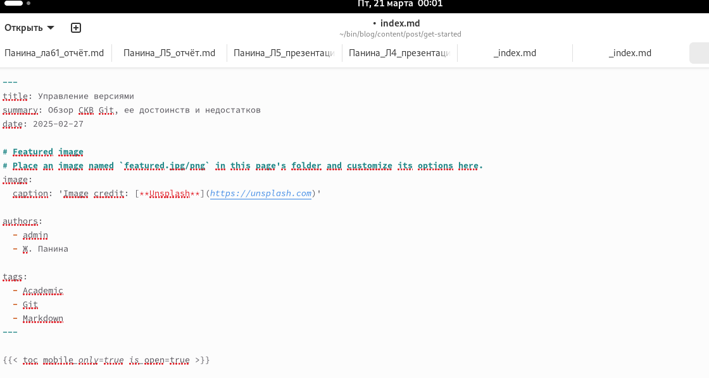
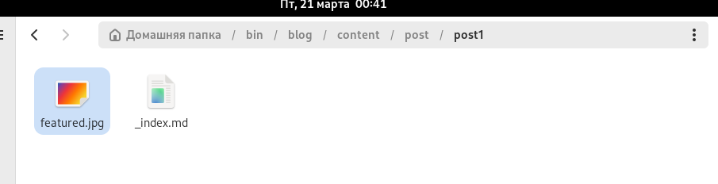

---
## Front matter
title: "Отчет по второму этапу индивидуального проекта"
subtitle: "Операционные системы"
author: "Панина Жанна Валерьевна"

## Generic otions
lang: ru-RU
toc-title: "Содержание"

## Bibliography
bibliography: bib/cite.bib
csl: pandoc/csl/gost-r-7-0-5-2008-numeric.csl

## Pdf output format
toc: true # Table of contents
toc-depth: 2
lof: true # List of figures
lot: true # List of tables
fontsize: 12pt
linestretch: 1.5
papersize: a4
documentclass: scrreprt
## I18n polyglossia
polyglossia-lang:
  name: russian
  options:
	- spelling=modern
	- babelshorthands=true
polyglossia-otherlangs:
  name: english
## I18n babel
babel-lang: russian
babel-otherlangs: english
## Fonts
mainfont: IBM Plex Serif
romanfont: IBM Plex Serif
sansfont: IBM Plex Sans
monofont: IBM Plex Mono
mathfont: STIX Two Math
mainfontoptions: Ligatures=Common,Ligatures=TeX,Scale=0.94
romanfontoptions: Ligatures=Common,Ligatures=TeX,Scale=0.94
sansfontoptions: Ligatures=Common,Ligatures=TeX,Scale=MatchLowercase,Scale=0.94
monofontoptions: Scale=MatchLowercase,Scale=0.94,FakeStretch=0.9
mathfontoptions:
## Biblatex
biblatex: true
biblio-style: "gost-numeric"
biblatexoptions:
  - parentracker=true
  - backend=biber
  - hyperref=auto
  - language=auto
  - autolang=other*
  - citestyle=gost-numeric
## Pandoc-crossref LaTeX customization
figureTitle: "Рис."
tableTitle: "Таблица"
listingTitle: "Листинг"
lofTitle: "Список иллюстраций"
lotTitle: "Список таблиц"
lolTitle: "Листинги"
## Misc options
indent: true
header-includes:
  - \usepackage{indentfirst}
  - \usepackage{float} # keep figures where there are in the text
  - \floatplacement{figure}{H} # keep figures where there are in the text
---

# Цель работы

Продолжить работу с сайтом, редактировать его в соответствии с требованиями, добавить данные о себе на сайт.

# Задание

1. Разместить фотографию владельца сайта.
2. Разместить краткое описание владельца сайта (Biography).
3. Добавить информацию об интересах (Interests).
4. Добавить информацию от образовании (Education).
5. Сделать пост по прошедшей неделе.
6. Добавить пост на тему по выбору: Управление версиями. Git. Непрерывная интеграция и непрерывное развертывание (CI/CD).

# Выполнение индивидуального проекта

1. Добавляю свою фотографию в нужный каталог (рис. [-@fig:001]).

{#fig:001 width=70%} 

2. В файле index.md заполняю данные о себе. Добавляю информацию об образовании, интересах и наградах. (рис. [-@fig:002]).

{#fig:002 width=70%} 

3. Отправляю изменения на глобальный репозиторий и запускаю сайт, чтобы проверить (рис. [-@fig:003]).

{#fig:003 width=70%} 

4. Проверяю изменения на сайте (рис. [-@fig:004]). Появилось моё фото и информация обо мне.

{#fig:004 width=70%} 

5. Начинаю редактировать файл для поста по выбору (рис. [-@fig:005]).

{#fig:005 width=70%} 

6. Добавляю фотографию к посту в нужный каталог (рис. [-@fig:006]).

{#fig:006 width=70%} 

7. Отправляю изменения на глобальный репозиторий и запускаю сайт, чтобы проверить (рис. [-@fig:007]).

{#fig:007 width=70%} 

8. Проверяю изменения на сайте (рис. [-@fig:008]). Пост выложен.

{#fig:008 width=70%} 

9. Начинаю редактировать файл для поста о прошедшей неделе (рис. [-@fig:009]).

{#fig:009 width=70%} 

10. Добавляю фотографию к посту в нужный каталог (рис. [-@fig:010]).

{#fig:010 width=70%} 

11. Отправляю изменения на глобальный репозиторий и запускаю сайт, чтобы проверить (рис. [-@fig:011])

{#fig:011 width=70%} 

(рис. [-@fig:012]).

{#fig:012 width=70%} 

12. Проверяю изменения на сайте (рис. [-@fig:013]). Пост выложен.

{#fig:013 width=70%} 

# Выводы

В ходе выполнения второго этапа индивидуального проекта я продолжила работу с сайтом, отредактировала его в соответствии с требованиями, добавила данные о себе на сайт.

# Список литературы{.unnumbered}
 

::: {#refs}
:::
