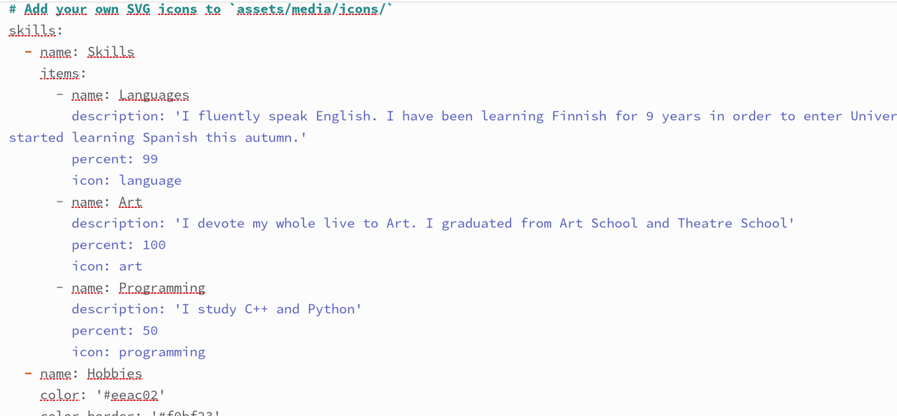
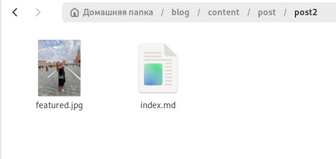
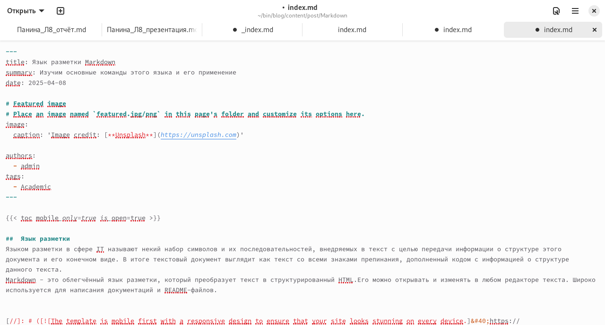
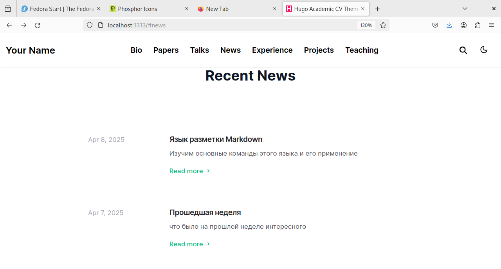

---
## Front matter
lang: ru-RU
title: Третий этап индивидуального проекта
subtitle: Операционные системы
author:
  - Панина Ж. В.
institute:
  - Российский университет дружбы народов, Москва, Россия
date: 08 апреля 2025

## i18n babel
babel-lang: russian
babel-otherlangs: english

## Formatting pdf
toc: false
toc-title: Содержание
slide_level: 2
aspectratio: 169
section-titles: true
theme: metropolis
header-includes:
 - \metroset{progressbar=frametitle,sectionpage=progressbar,numbering=fraction}
---

# Информация

## Докладчик

:::::::::::::: {.columns align=center}
::: {.column width="70%"}

  * Панина Жанна Валерьевна
  * НКАбд-02-24, студ. билет № 1132246710
  * студент направления "Компьютерные и информационные науки"
  * Российский университет дружбы народов
  * [1132246710@pfur.ru](mailto:1132246710@pfur.ru)
  * <https://github.com/zvpanina/study_2024-2025_os-intro>

:::
::::::::::::::

# Вводная часть

## Актуальность

В современном цифровом мире личный сайт является важным инструментом самопрезентации, профессионального роста и взаимодействия с аудиторией. Разработка и поддержка собственного веб-ресурса позволяют продемонстрировать навыки веб-разработки, создать персональный бренд и упростить доступ к информации о себе.

## Объект и предмет исследования

### Объект исследования:

Процесс создания и редактирования персонального веб-сайта.

### Предмет исследования:

Методы и инструменты веб-разработки, используемые для модификации сайта и интеграции персональных данных.

## Цели и задачи

Цель работы - продолжить работу с сайтом, редактировать его в соответствии с требованиями, добавить данные о себе на сайт, а также пост по прошедшей неделе и пост по выбору.

# Задание

1. Добавить информацию о навыках (Skills).
2. Добавить информацию об опыте (Experience).
3. Добавить информацию о достижениях (Accomplishments).
4. Сделать пост по прошедшей неделе.
5. Добавить пост на тему по выбору: Легковесные языки разметки. Языки разметки. LaTeX. Язык разметки Markdown.

## Материалы и методы

### Материалы:

HTML, инструменты для управления версиями (Git, GitHub), графический контент и текстовые данные.

### Методы исследования: 

- Анализ требований к сайту
- Разработка и редактирование кода
- Использование систем контроля версий
- Тестирование и отладка
- Оптимизация интерфейса и структуры сайта для удобства пользователей

# Выполнение индивидуального проекта

1. В файле index.md добавляю данные о своих достижениях, навыках и опыте.

{#fig:001 width=70%} 

##

2. Начинаю редактировать файл для поста о прошедшей неделе.

{#fig:002 width=70%}

##

3. Добавляю фотографию к посту в нужный каталог.

{#fig:003 width=70%} 

##

4. Начинаю редактировать файл для поста по выбору.

{#fig:004 width=70%} 

##

5. Добавляю фотографию к посту в нужный каталог.

{#fig:005 width=70%}

##

6. Запускаю сайт командой server, чтобы проверить изменения.

{#fig:006 width=70%} 

##

7. Проверяю изменения на сайте. Оба поста выложены.

{#fig:007 width=70%} 

##

8. Отправляю изменения на глобальный репозиторий.

{#fig:008 width=70%} 

## Результаты

В ходе выполнения третьего этапа индивидуального проекта я продолжила работу с сайтом, отредактировала его в соответствии с требованиями, добавила данные о себе на сайт.
