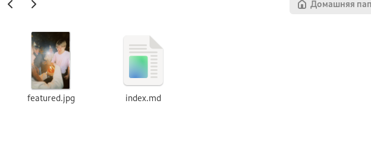
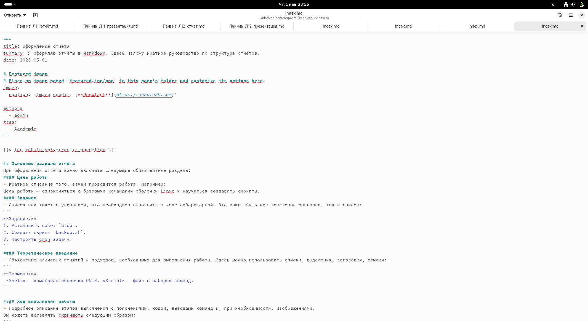
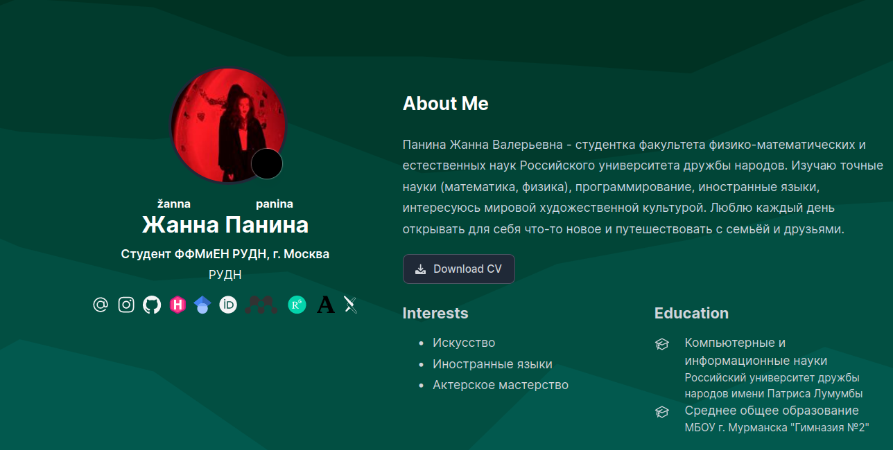
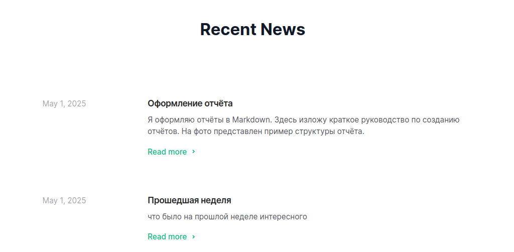

---
## Front matter
lang: ru-RU
title: Четвёртый этап индивидуального проекта
subtitle: Операционные системы
author:
  - Панина Ж. В.
institute:
  - Российский университет дружбы народов, Москва, Россия
date: 01 мая 2025

## i18n babel
babel-lang: russian
babel-otherlangs: english

## Formatting pdf
toc: false
toc-title: Содержание
slide_level: 2
aspectratio: 169
section-titles: true
theme: metropolis
header-includes:
 - \metroset{progressbar=frametitle,sectionpage=progressbar,numbering=fraction}
---

# Информация

## Докладчик

:::::::::::::: {.columns align=center}
::: {.column width="70%"}

  * Панина Жанна Валерьевна
  * НКАбд-02-24, студ. билет № 1132246710
  * студент направления "Компьютерные и информационные науки"
  * Российский университет дружбы народов
  * [1132246710@pfur.ru](mailto:1132246710@pfur.ru)
  * <https://github.com/zvpanina/study_2024-2025_os-intro>

:::
::::::::::::::

# Вводная часть

## Актуальность

В современном образовательном и научном процессе наличие персонального сайта с актуальной и верифицируемой информацией повышает академическую прозрачность, способствует формированию цифрового портфолио и облегчает коммуникацию с научным сообществом. Добавление ссылок на научные и библиометрические ресурсы (например, arXiv, Google Scholar, ResearchGate) позволяет оперативно делиться результатами исследований, демонстрировать участие в научной деятельности и поддерживать академическую репутацию.

## Объект и предмет исследования

### Объект исследования:

Процесс разработки и наполнения персонального сайта на основе статической генерации с использованием системы Hugo

### Предмет исследования:

Технические и содержательные аспекты интеграции научных и информационных компонентов (ссылки, посты, иконки, структура контента) в структуру сайта.

## Цели и задачи

Цель работы - продолжить работу с сайтом, добавить к сайту ссылки на научные и библиометрические ресурсы, а также пост по прошедшей неделе и пост по выбору.

# Задание

1. Зарегистрироваться на соответствующих ресурсах и разместить на них ссылки на сайте:
- eLibrary : https://elibrary.ru/;
- Google Scholar : https://scholar.google.com/;
- ORCID : https://orcid.org/;
- Mendeley : https://www.mendeley.com/;
- ResearchGate : https://www.researchgate.net/;
- Academia.edu : https://www.academia.edu/;
- arXiv : https://arxiv.org/;
- github : https://github.com/.
2. Сделать пост по прошедшей неделе.
3. Добавить пост на тему по выбору:
Оформление отчёта; Создание презентаций; Работа с библиографией.

## Материалы и методы исследования

### Материалы:

- Сайт проекта, созданный с помощью Hugo;
- SVG-иконки и логотипы научных платформ;
- Markdown-файлы для постов и контента;
- Личные научные профили на arXiv, ResearchGate и др.

### Методы: 

- Работа с системой шаблонов Hugo;
- Вёрстка и структурирование контента с использованием Markdown;
- Интеграция внешних ссылок и медиа;
- Поиск и адаптация векторных иконок;
- Тестирование отображения сайта на разных устройствах.

# Выполнение индивидуального проекта

1. Регистрируюсь на указанных ресурсах и файле index.md добавляю ссылки на них.

{#fig:001 width=70%} 

##

2. Начинаю редактировать файл для поста о прошедшей неделе.

{#fig:002 width=70%} 

##

Добавляю фотографию к посту в нужный каталог.

{#fig:003 width=70%} 

##

3. Начинаю редактировать файл для поста по выбору.

{#fig:004 width=70%} 

##

Добавляю фотографию к посту в нужный каталог.

{#fig:005 width=70%}

##

4. Запускаю сайт командой server, чтобы проверить изменения.

{#fig:006 width=70%} 

##

Проверяю изменения на сайте. Так теперь выглядит биография с ссылками. Оба поста выложены.

{#fig:007 width=70%} 

##

{#fig:008 width=70%} 

##

5. Отправляю изменения на глобальный репозиторий.

{#fig:009 width=70%} 

## Результаты

В ходе выполнения четвёртого этапа индивидуального проекта я продолжила работу с сайтом, добавила к сайту ссылки на научные и библиометрические ресурсы, а также пост по прошедшей неделе и пост по выбору.
