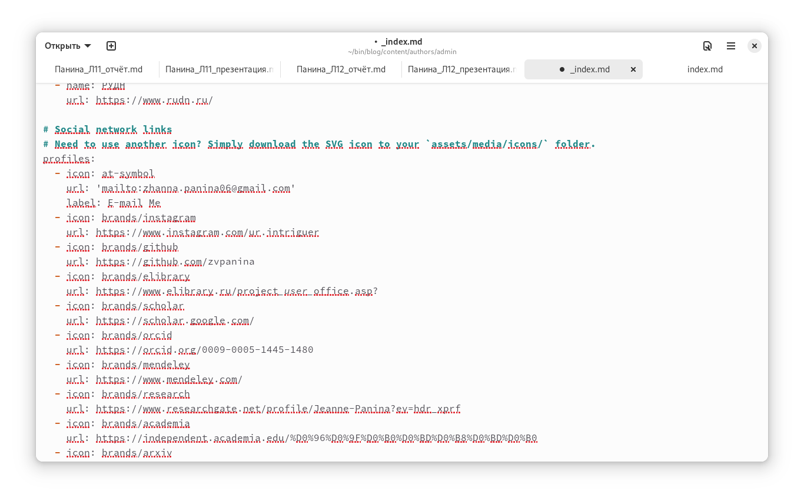
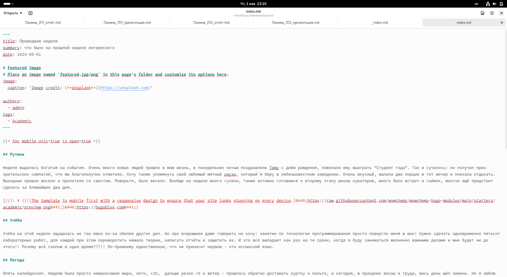
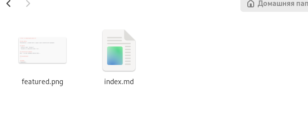
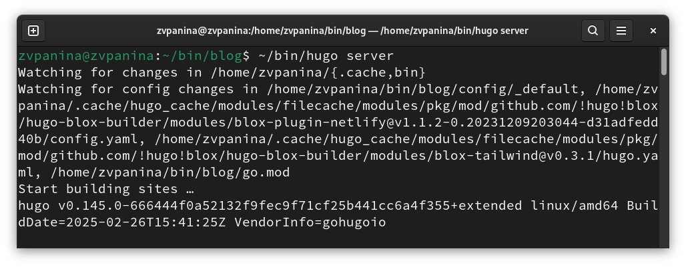
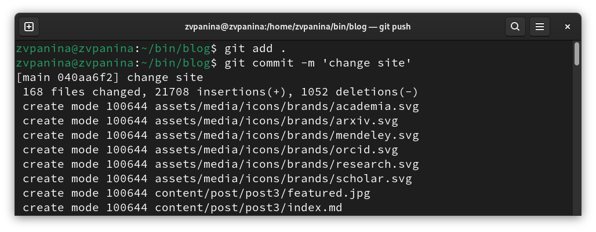

---
## Front matter
title: "Отчет по четвёртому этапу индивидуального проекта"
subtitle: "Операционные системы"
author: "Панина Жанна Валерьевна"

## Generic otions
lang: ru-RU
toc-title: "Содержание"

## Bibliography
bibliography: bib/cite.bib
csl: pandoc/csl/gost-r-7-0-5-2008-numeric.csl

## Pdf output format
toc: true # Table of contents
toc-depth: 2
lof: true # List of figures
lot: true # List of tables
fontsize: 12pt
linestretch: 1.5
papersize: a4
documentclass: scrreprt
## I18n polyglossia
polyglossia-lang:
  name: russian
  options:
	- spelling=modern
	- babelshorthands=true
polyglossia-otherlangs:
  name: english
## I18n babel
babel-lang: russian
babel-otherlangs: english
## Fonts
mainfont: IBM Plex Serif
romanfont: IBM Plex Serif
sansfont: IBM Plex Sans
monofont: IBM Plex Mono
mathfont: STIX Two Math
mainfontoptions: Ligatures=Common,Ligatures=TeX,Scale=0.94
romanfontoptions: Ligatures=Common,Ligatures=TeX,Scale=0.94
sansfontoptions: Ligatures=Common,Ligatures=TeX,Scale=MatchLowercase,Scale=0.94
monofontoptions: Scale=MatchLowercase,Scale=0.94,FakeStretch=0.9
mathfontoptions:
## Biblatex
biblatex: true
biblio-style: "gost-numeric"
biblatexoptions:
  - parentracker=true
  - backend=biber
  - hyperref=auto
  - language=auto
  - autolang=other*
  - citestyle=gost-numeric
## Pandoc-crossref LaTeX customization
figureTitle: "Рис."
tableTitle: "Таблица"
listingTitle: "Листинг"
lofTitle: "Список иллюстраций"
lotTitle: "Список таблиц"
lolTitle: "Листинги"
## Misc options
indent: true
header-includes:
  - \usepackage{indentfirst}
  - \usepackage{float} # keep figures where there are in the text
  - \floatplacement{figure}{H} # keep figures where there are in the text
---

# Цель работы

Продолжить работу с сайтом, добавить к сайту ссылки на научные и библиометрические ресурсы, а также пост по прошедшей неделе и пост по выбору.

# Задание

1. Зарегистрироваться на соответствующих ресурсах и разместить на них ссылки на сайте:
- eLibrary : https://elibrary.ru/;
- Google Scholar : https://scholar.google.com/;
- ORCID : https://orcid.org/;
- Mendeley : https://www.mendeley.com/;
- ResearchGate : https://www.researchgate.net/;
- Academia.edu : https://www.academia.edu/;
- arXiv : https://arxiv.org/;
- github : https://github.com/.
2. Сделать пост по прошедшей неделе.
3. Добавить пост на тему по выбору:
- Оформление отчёта.
- Создание презентаций.
- Работа с библиографией.

# Выполнение индивидуального проекта

1. Регистрируюсь на указанных ресурсах и файле index.md добавляю ссылки на них (рис. [-@fig:001]).

{#fig:001 width=70%} 

2. Начинаю редактировать файл для поста о прошедшей неделе (рис. [-@fig:002]).

{#fig:002 width=70%} 

Добавляю фотографию к посту в нужный каталог (рис. [-@fig:003]).

{#fig:003 width=70%} 

3. Начинаю редактировать файл для поста по выбору (рис. [-@fig:004]).

{#fig:004 width=70%} 

Добавляю фотографию к посту в нужный каталог (рис. [-@fig:005]).

{#fig:005 width=70%}

4. Запускаю сайт командой server, чтобы проверить изменения (рис. [-@fig:006]).

{#fig:006 width=70%} 

Проверяю изменения на сайте. Так теперь выглядит биография с ссылками (рис. [-@fig:007]). Оба поста выложены (рис. [-@fig:008]).

{#fig:007 width=70%} 

{#fig:008 width=70%} 

5. Отправляю изменения на глобальный репозиторий (рис. [-@fig:009]).

{#fig:009 width=70%} 

# Выводы

В ходе выполнения четвёртого этапа индивидуального проекта я продолжила работу с сайтом, добавила к сайту ссылки на научные и библиометрические ресурсы, а также пост по прошедшей неделе и пост по выбору.

# Список литературы{.unnumbered}
 

::: {#refs}
:::
