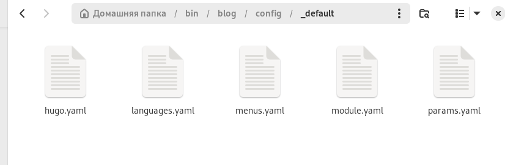
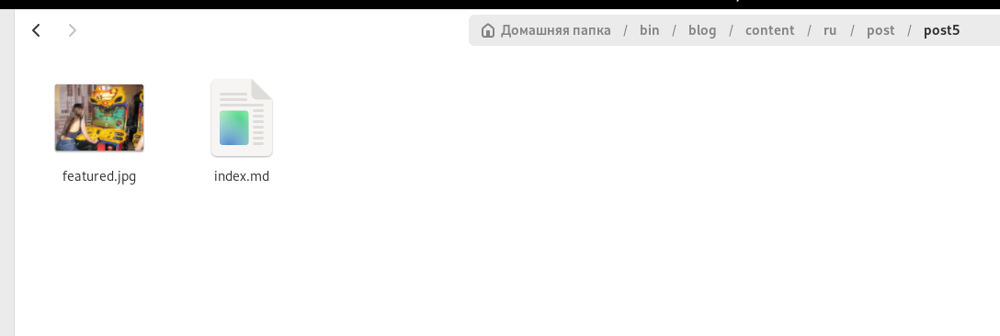
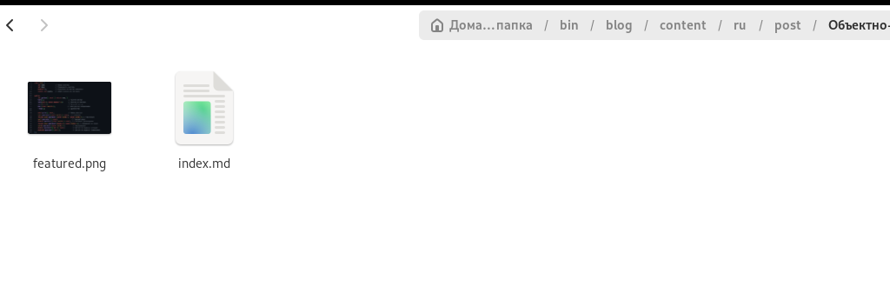
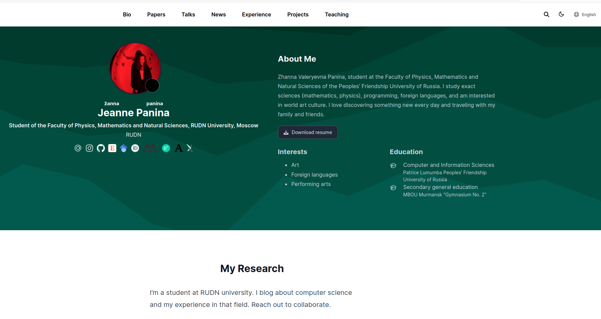
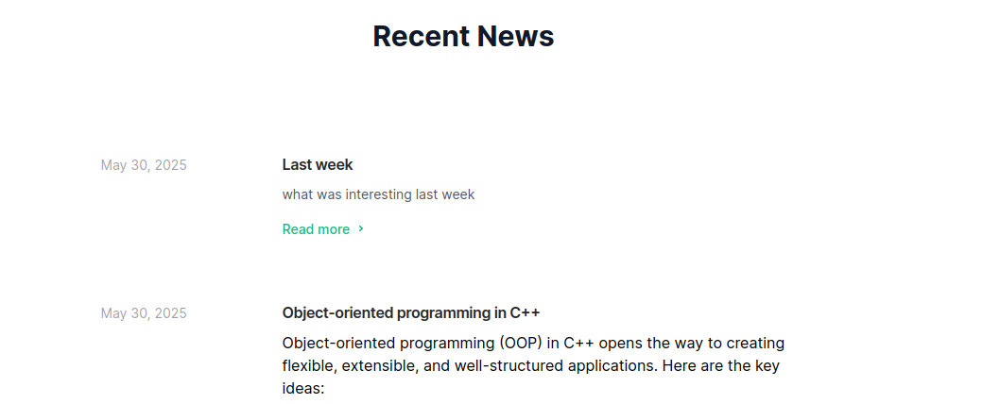

---
## Front matter
lang: ru-RU
title: Шестой этап индивидуального проекта
subtitle: Операционные системы
author:
  - Панина Ж. В.
institute:
  - Российский университет дружбы народов, Москва, Россия
date: 31 мая 2025

## i18n babel
babel-lang: russian
babel-otherlangs: english

## Formatting pdf
toc: false
toc-title: Содержание
slide_level: 2
aspectratio: 169
section-titles: true
theme: metropolis
header-includes:
 - \metroset{progressbar=frametitle,sectionpage=progressbar,numbering=fraction}
---

# Информация

## Докладчик

:::::::::::::: {.columns align=center}
::: {.column width="70%"}

  * Панина Жанна Валерьевна
  * НКАбд-02-24, студ. билет № 1132246710
  * студент направления "Компьютерные и информационные науки"
  * Российский университет дружбы народов
  * [1132246710@pfur.ru](mailto:1132246710@pfur.ru)
  * <https://github.com/zvpanina/study_2024-2025_os-intro>

:::
::::::::::::::

# Вводная часть

## Актуальность

В условиях стремительного развития цифровых технологий персональные сайты становятся важным инструментом самопрезентации, хранения портфолио и ведения блога. Многоязычность сайта существенно расширяет его аудиторию и способствует лучшей коммуникации с пользователями из разных стран. Создание персонального сайта с поддержкой русского и английского языков позволяет не только продемонстрировать навыки веб-разработки, но и адаптировать цифровое пространство под глобальные стандарты информационной доступности.

## Объект и предмет исследования

### Объект исследования:

Персональный сайт как средство цифровой самопрезентации и коммуникации.

### Предмет исследования:

Технологические и языковые аспекты реализации многоязычного веб-сайта на примере персонального сайта студента.

## Цели и задачи

Продолжить работу с сайтом, разместить двуязычный сайт на Github, а также сделать пост по прошедшей неделе и пост по выбору.

# Задачи

 1. Сделать поддержку английского и русского языков.
 2. Разместить элементы сайта на обоих языках.
 3. Разместить контент на обоих языках.
 4. Сделать пост по прошедшей неделе.
 5. Добавить пост на тему по выбору (на двух языках).

## Материалы и методы исследования

### Материалы:

- Фреймворк Hugo
- Markdown-файлы контента
- Структура шаблонов (layouts, partials)
- Контент на русском и английском языках
- CSS/HTML

### Методы: 

- Метод проектирования пользовательского интерфейса
- Метод ручной и автоматизированной вёрстки контента
- Метод лингвистической адаптации информации
- Метод тестирования и локализации сайта
- Сравнительный анализ отображения элементов интерфейса на разных языках

# Выполнение индивидуального проекта

1. Редактирую .yaml файлы для поддержки русского и английского языков.

{#fig:001 width=70%} 

##

В папке /blog/content создаю две папки - en и ru. Помещаю в них все ранее созданные посты и файлы в двух вариантах. Всё, что было написано на русском языке, я перевела на английский, и наоборот.

{#fig:002 width=70%} 

##

{#fig:003 width=70%} 

##

2. Начинаю редактировать файл для поста о прошедшей неделе.

{#fig:004 width=70%} 

##

Добавляю фотографию к посту в нужный каталог.

{#fig:005 width=70%} 

##

3. Начинаю редактировать файл для поста по выбору.

{#fig:006 width=70%} 

##

Добавляю фотографию к посту в нужный каталог.

{#fig:007 width=70%}

##

То же самое делаю в английском варианте.

{#fig:008 width=70%} 

##

{#fig:009 width=70%} 

##

4. Запускаю сайт командой server, чтобы проверить изменения.

{#fig:010 width=70%} 

##

Проверяю изменения на сайте. В правом верхнем углу появилась кнопка с выбором языка. Так выглядит страница в английском варианте. 

{#fig:011 width=70%} 

##

Также выложены оба поста.

{#fig:012 width=70%} 

##

5. Отправляю изменения на глобальный репозиторий.

{#fig:013 width=70%} 

## Результаты

В ходе выполнения пятого этапа индивидуального проекта я продолжила работу с сайтом, добавила поддержку английского и русского языков, а также пост по прошедшей неделе и пост по выбору.
