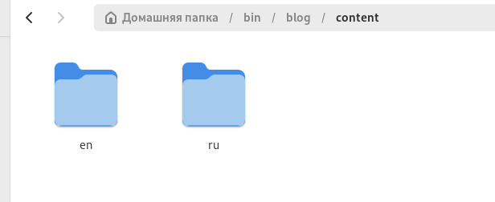
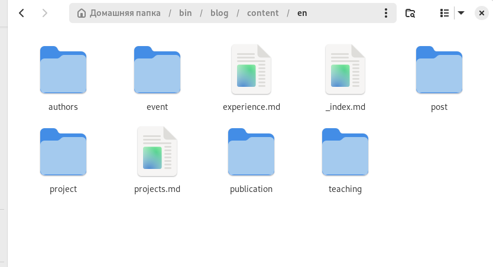
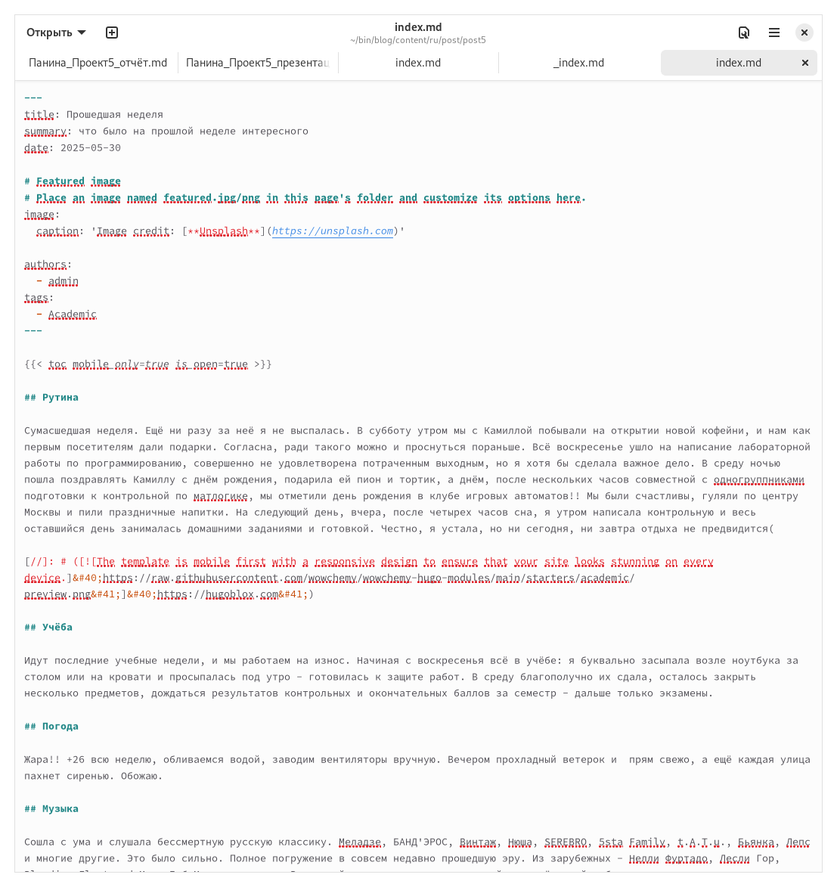
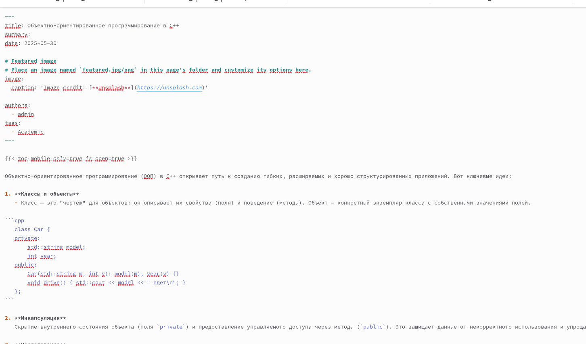
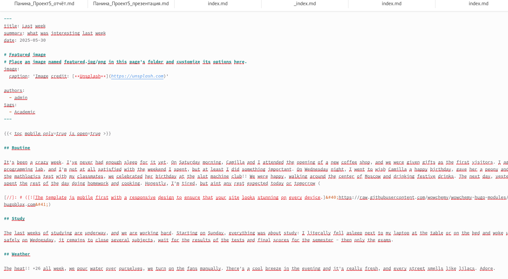
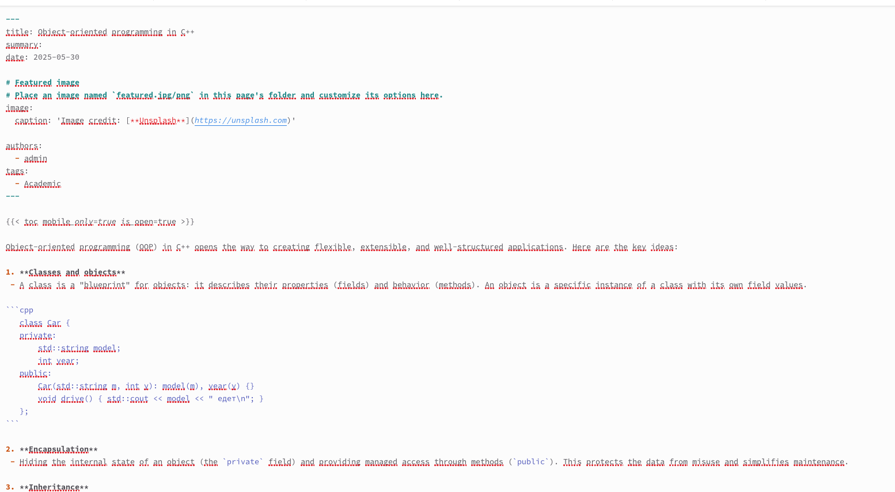
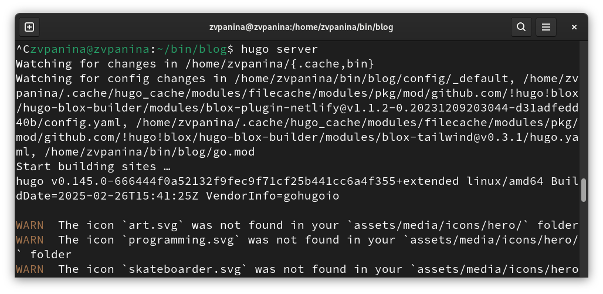
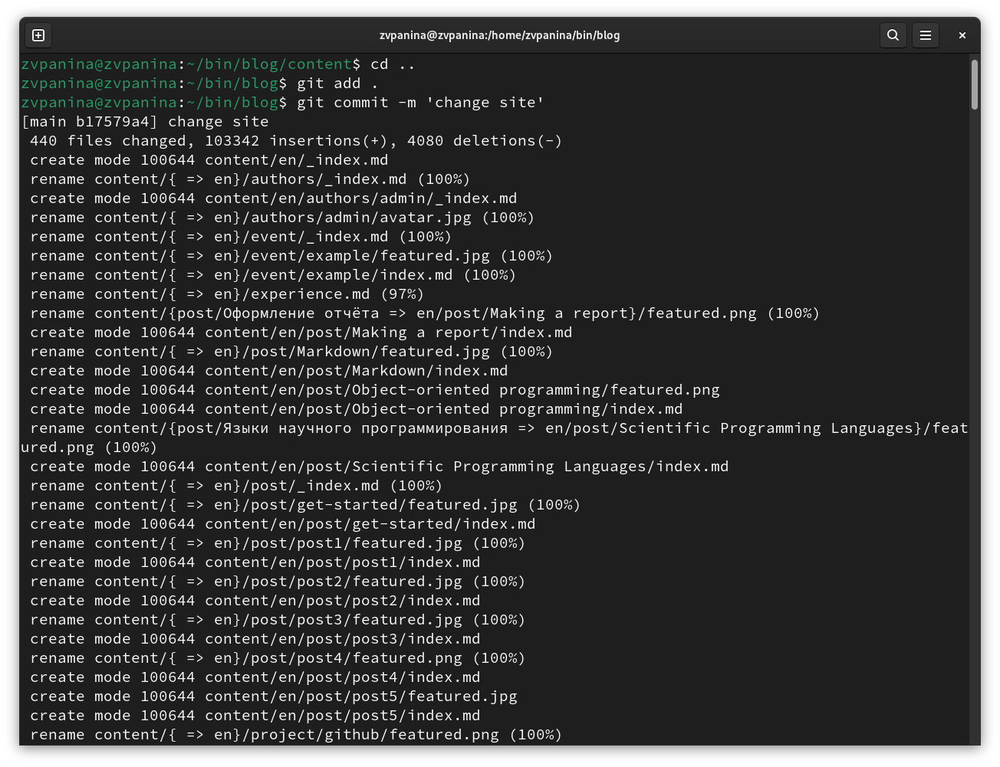

---
## Front matter
title: "Отчет по шестому этапу индивидуального проекта"
subtitle: "Операционные системы"
author: "Панина Жанна Валерьевна"

## Generic otions
lang: ru-RU
toc-title: "Содержание"

## Bibliography
bibliography: bib/cite.bib
csl: pandoc/csl/gost-r-7-0-5-2008-numeric.csl

## Pdf output format
toc: true # Table of contents
toc-depth: 2
lof: true # List of figures
lot: true # List of tables
fontsize: 12pt
linestretch: 1.5
papersize: a4
documentclass: scrreprt
## I18n polyglossia
polyglossia-lang:
  name: russian
  options:
	- spelling=modern
	- babelshorthands=true
polyglossia-otherlangs:
  name: english
## I18n babel
babel-lang: russian
babel-otherlangs: english
## Fonts
mainfont: IBM Plex Serif
romanfont: IBM Plex Serif
sansfont: IBM Plex Sans
monofont: IBM Plex Mono
mathfont: STIX Two Math
mainfontoptions: Ligatures=Common,Ligatures=TeX,Scale=0.94
romanfontoptions: Ligatures=Common,Ligatures=TeX,Scale=0.94
sansfontoptions: Ligatures=Common,Ligatures=TeX,Scale=MatchLowercase,Scale=0.94
monofontoptions: Scale=MatchLowercase,Scale=0.94,FakeStretch=0.9
mathfontoptions:
## Biblatex
biblatex: true
biblio-style: "gost-numeric"
biblatexoptions:
  - parentracker=true
  - backend=biber
  - hyperref=auto
  - language=auto
  - autolang=other*
  - citestyle=gost-numeric
## Pandoc-crossref LaTeX customization
figureTitle: "Рис."
tableTitle: "Таблица"
listingTitle: "Листинг"
lofTitle: "Список иллюстраций"
lotTitle: "Список таблиц"
lolTitle: "Листинги"
## Misc options
indent: true
header-includes:
  - \usepackage{indentfirst}
  - \usepackage{float} # keep figures where there are in the text
  - \floatplacement{figure}{H} # keep figures where there are in the text
---

# Цель работы

Продолжить работу с сайтом, разместить двуязычный сайт на Github, а также сделать пост по прошедшей неделе и пост по выбору.

# Задание

 1. Сделать поддержку английского и русского языков.
 2. Разместить элементы сайта на обоих языках.
 3. Разместить контент на обоих языках.
 4. Сделать пост по прошедшей неделе.
 5. Добавить пост на тему по выбору (на двух языках).

# Выполнение индивидуального проекта

1. Редактирую .yaml файлы для поддержки русского и английского языков (рис. [-@fig:001]).

{#fig:001 width=70%} 

В папке /blog/content создаю две папки - en и ru (рис. [-@fig:002]). Помещаю в них все ранее созданные посты и файлы в двух вариантах. Всё, что было написано на русском языке, я перевела на английский, и наоборот (рис. [-@fig:003]).

{#fig:002 width=70%} 

{#fig:003 width=70%} 

2. Начинаю редактировать файл для поста о прошедшей неделе (рис. [-@fig:004]).

{#fig:004 width=70%} 

Добавляю фотографию к посту в нужный каталог (рис. [-@fig:005]).

{#fig:005 width=70%} 

3. Начинаю редактировать файл для поста по выбору (рис. [-@fig:006]).

{#fig:006 width=70%} 

Добавляю фотографию к посту в нужный каталог (рис. [-@fig:007]).

{#fig:007 width=70%}

То же самое делаю в английском варианте (рис. [-@fig:008], рис. [-@fig:009]).

{#fig:008 width=70%} 

{#fig:009 width=70%} 

4. Запускаю сайт командой server, чтобы проверить изменения (рис. [-@fig:010]).

{#fig:010 width=70%} 

Проверяю изменения на сайте. В правом верхнем углу появилась кнопка с выбором языка. Так выглядит страница в английском варианте (рис. [-@fig:011]). Также выложены оба поста (рис. [-@fig:012]).

{#fig:011 width=70%} 

{#fig:012 width=70%} 

5. Отправляю изменения на глобальный репозиторий (рис. [-@fig:013]).

{#fig:013 width=70%} 

# Выводы

В ходе выполнения пятого этапа индивидуального проекта я продолжила работу с сайтом, добавила поддержку английского и русского языков, а также пост по прошедшей неделе и пост по выбору.

# Список литературы{.unnumbered}
 

::: {#refs}
:::
